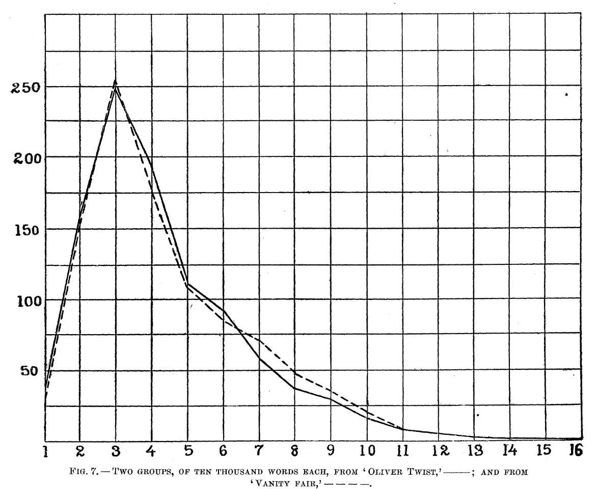

--- 
title: "PS9594A: Computational Text Analysis"
author: "Dr. Sebastián Vallejo Vera | Western University"
date: "`r Sys.Date()`"
site: bookdown::bookdown_site
documentclass: book
bibliography: [book.bib, packages.bib]
# url: your book url like https://bookdown.org/yihui/bookdown
# cover-image: path to the social sharing image like images/cover.jpg
description: "Code, exercises, and slides for PS9594A: Computational Text Analysis"
link-citations: yes
github-repo: svallejovera/cpa_uwo
---

# "Computational Text Analysis"{.unnumbered}

&nbsp;

Welcome to the site for the course PS9594A: "Computational Text Analysis" at Western University, taught by Sebastián Vallejo Vera. In each week, you will find the code, exercises, and slides for the corresponding topic. 

Before you start, check the required software and packages below. Also, don't forget to read the [Syllabus](https://svallejovera.github.io/files/9594A__Computational_Text_Analysis.pdf) and check Perusall for the readings for the course. This site will be corrected/updated throughout the semester.

## Software and Packages

For the first part of this course (Weeks 1 - 5), we will be mainly using R. For the second part of the this course (Weeks 6 - 11), we will use a combination of R and Python. I will assume that you are familiar with R language, RStudio, and R packages. If you are not, please come to office hours and I can help you out[^1]. In R, these are the main packages you will need to have installed:

- tidyverse (we will be piping)
- tidylog (helps keep track of what your are pipins)
- tidytext (great for working with text)
- quanteda (stands for "Quantitative Analysis of Textual Data")
  - quanteda.textstats (to obtain stats from our dfm)
  - quanteda.textplots (to obtain plots from our dfm stats)
  - quanteda.dictionaries (to use dictionaries with quanteda)
- gutenbergr (to download texts from [Project Gutenberg](https://www.gutenberg.org/))
- wesanderson (to make things pretty)
- stm (to run Structural Topic Models)

## Datasets

Throughout the class, we will be using a number of sample datasets. Access to these datasets will be provided directly on the code. For your Final Essay, you can use one of the following datasets (or, even better, you can use your own):

- Data from Ventura et al. (2021) - "Connective Effervescence and Streaming Chat During Political Debates": [Link to replication material](https://dataverse.harvard.edu/dataset.xhtml?persistentId=doi:10.7910/DVN/EWEJZN)
- Data from Project Gutenberg: `gutenbergr`
- Open-ended question from the 2021 Canadian Election Study survey: [Link to replication material](https://dataverse.harvard.edu/dataset.xhtml?persistentId=doi:10.7910/DVN/XBZHKC)
- Open-ended questions from ANES surveys: [Link to ANES homepage](https://electionstudies.org/)

## Acknowledgments 

The organization of the first part of this course (Weeks 1 - 5) and the format of the assignments are borrowed from Christopher Barrie's excellent course on ["Computational Text Analysis"](https://cjbarrie.github.io/CTA-ED/), a syllabus from the prolific [Tiago Ventura](https://www.venturatiago.com/), and Grimmer, Roberts, and Stewart's excellent book, ["Text as data: A new framework for machine learning and the social sciences"](https://press.princeton.edu/books/paperback/9780691207551/text-as-data). The code used throughout the course is a patchwork of my own code, but my own code borrows heavily from the internet (but that's true for all code). I try my best to give credit to the original authors of the code (when and if possible).

[^1]: It might even be faster to get one of your classmates or colleagues to help you out.

<!--chapter:end:index.Rmd-->

# Week 1: A Primer on Using Text as Data

## Slides{.unnumbered}

- 1 Introduction to CTA ([link](https://github.com/svallejovera/cpa_uwo/blob/main/slides/1%20Introduction%20to%20CTA.pptx) or in Perusall) 
- 2 Why Computational Text Analysis ([link](https://github.com/svallejovera/cpa_uwo/blob/main/slides/2%20Why%20Computational%20Text%20Analysis.pptx) or in Perusall)

## Setup

For this first example, we will replicate (and extend) Mendenhall's (1887) and Mendenhall's (1901) studies of word-length distribution. 

```{r curve, echo=FALSE,fig.align = 'center', out.width = "65%", fig.cap = "From Mendenhall (1987) - The Characteristic Curves of Composition."}

```

First we load the packages that we'll be using:

```{r, warning = F, message = F}
library(tidyverse) # for wrangling data
library(tidylog) # to know what we are wrangling
library(tidytext) # for 'tidy' manipulation of text data
library(wesanderson) # to prettify
library(gutenbergr) # to get some books
library(kableExtra) # for displaying data in html format (relevant for formatting this worksheet mainly)
```

## Get Data

Mendenhall (1887) argued that "every writer makes use of a vocabulary which is peculiar to himself, and the character of which does not materially change from year to
year during his productive," and that one of these characteristics was the length of words. Mendenhall (1901) takes this further, and suggests that, given this assumption, Shakespeare and Bacon were *not* the same person[^2].

Let's get a corpus--a collection of documents--that we can analyze. We can search the Gutenberg repository and create a corpus with some selected work. 

```{r, warning = F, message = F}
gutenberg_metadata %>%
  filter(author == "Wilde, Oscar")
```

## Word Length in Wilde's Corpus

That's a lot of Wilde! Let's focus on four plays: "The Importance of Being Earnest", "A Woman of No Importance", "Lady Windermere's Fan", and "An Ideal Husband". We can download all of these plays using their ID number:

```{r, warning = F, message = F}
wilde <- gutenberg_download(c(790,844, 854, 885), 
                            meta_fields = c("title","author"))
print(n=25,wilde[c(51:75),])
```

The unit of analysis is something like a line. We are interested in each word---also known as token---and their lengths *in each play*. We will clean some of the unwanted text---text that will only add noise to our analysis---and then count the number of words.

```{r}
wilde <- wilde %>%
  # Some housekeeping 
  mutate(title = ifelse(str_detect(title,"Importance of Being"),"The Importance of Being Earnest", title)) %>%
  # Filter out all empty rows
  filter(text != "") %>%
  # This is a play. The name of each character before they speak 
  filter(str_detect(text,"[A-Z]{3,}")==FALSE)

print(n=25,wilde[c(51:75),])
```

Now, we can change our unit of analysis to the **token**:

```{r}
wilde_words <- wilde %>%
  # take the column text and divide it by words
  unnest_tokens(word, text) %>%
  # Remove some characters that add noise
  mutate(word = str_remove_all(word, "\\_")) 

wilde_words
```

That's a lot of words! We will now create a column for word length, and then count the number of words by length (by play!). 

```{r}
wilde_words_ct <- wilde_words %>%
  # Length of each word
  mutate(word_length = str_length(word)) %>%
  # Group by word_length and count how many 
  group_by(word_length,title) %>%
  mutate(total_word_length = n()) %>%
  # Keep relevant
  distinct(word_length,title,.keep_all=T) %>%
  select(word_length,title,author,total_word_length)
```

Let's see the distribution by play:

```{r}
wilde_words_ct %>%
  ggplot(aes(y=total_word_length,x=word_length,color=title)) +
  geom_point(alpha=0.8) +
  geom_line(alpha=0.8) +
  scale_color_manual(values = wes_palette("Royal2")) +
  theme_minimal() +
  theme(legend.position = "right") +
  labs(x="Length", y = "Total Number of Words", color = "")

```

This is a problem. *Why?*

Here is a solution (proposed by Mendenhall):

```{r}
wilde_words %>%
  group_by(title) %>%
  slice_sample(n=10000) %>%
  mutate(word_length = str_length(word),
         median_word_length = median(word_length)) %>%
  group_by(word_length,title) %>%
  mutate(total_word_length = n()) %>%
  distinct(word_length,title,.keep_all=T) %>%
  select(word_length,title,author,total_word_length,median_word_length) %>%
  ggplot(aes(y=total_word_length,x=word_length,color=title)) +
  geom_point(alpha=0.8) +
  geom_line(alpha=0.8) +
  geom_vline(aes(xintercept = median_word_length,color=title,linetype = title))+
  scale_color_manual(values = wes_palette("Royal2")) +
  theme_minimal() +
  theme(legend.position = "right") +
  labs(x="Length", y = "Total Number of Words", color = "", linetype = "",
       caption = "Note: Line type shows median word length.")

```

Would you look at that. Mendenhall was into something: an author has a mark in terms of word length distribution. For Wilde, there is no observable change across time (each play was published in different years). But, what happens when we compare Wilde's mark with Shakespeare's? Let's choose four plays (at random) by Shakespeare: A Midsummer Night's Dream, The Merchant of Venice, Much Ado about Nothing, and The Tempest.

## Comparing Shakespeare and Wilde

```{r}
shakes <- gutenberg_download(c(1520,2242,2243,2235),
                             meta_fields = c("title","author"))
print(n=25,shakes[c(51:75),])
```

This text is cleaner than Wilde's corpus, so we will leave it as is. Also, it is harder to systematically remove the name of the person speaking. **Is this a problem? Why? Why not?** 

We can put together both corpora and see differences in the distributions of word length. 

```{r}
shakes_words <- shakes %>%
  # Filter out all empty rows
  filter(text != "") %>%
  # This is a play. The name of each character before they speak 
  filter(str_detect(text,"[A-Z]{3,}")==FALSE) %>%
  # take the column text and divide it by words
  unnest_tokens(word, text) 

# Bind both word dfs
words <- rbind.data.frame(shakes_words,wilde_words)

# Count words etc.
words %>%
  group_by(title,author) %>%
  slice_sample(n=10000) %>%
  mutate(word_length = str_length(word),
         median_word_length = median(word_length)) %>%
  group_by(word_length,title,author) %>%
  mutate(total_word_length = n()) %>%
  distinct(word_length,title,.keep_all=T) %>%
  select(word_length,title,author,total_word_length,median_word_length) %>%
  ggplot(aes(y=total_word_length,x=word_length,color=author,group=title)) +
  geom_point(alpha=0.8) +
  geom_line(alpha=0.8) +
  scale_color_manual(values = wes_palette("Royal2")) +
  # facet_wrap(~author, ncol = 2)+
  theme_minimal() +
  theme(legend.position = "bottom") +
  labs(x="Length", y = "Total Number of Words", color = "", linetype = "",
       caption = "Note: Median word length is 4 for both authors.")
```

Are there any differences? What can we conclude from the evidence? What are the limitations of this approach? Are there alternative approaches to study what Mendenhall was getting at? 

## Exercise (Optional)

1. Extend the current analysis to other authors or to more works from the same author.
2. Are there better ways to compare the distribution of word length? Are there changes across time? Are there differences between different types of works (e.g., fiction vs. non-fiction, prose vs. poetry)?

## Final Words

As will be often the case, we won't be able to cover every single feature that the different packages have to offer, or how some objects that we create look like, or what else we can do with them. My advise is that you go home and explore the code in detail. Try applying the code to a different corpus and come next class with questions (or just show off what you were able to do). 

[^2]: These studies were published in Science and Popular Science Monthly!


<!--chapter:end:01-week1.Rmd-->

# Week 2: Tokenization and Word Frequency

## Slides{.unnumbered}

- 3 Tokenization and Word Frequency ([link](https://github.com/svallejovera/cpa_uwo/blob/main/slides/3%20Tokenization%20and%20Word%20Frequency.pptx) or in Perusall) 

## Setup

As always, we first load the packages that we'll be using:

```{r, warning = F, message = F}
library(tidyverse) # for wrangling data
library(tidylog) # to know what we are wrangling
library(tidytext) # for 'tidy' manipulation of text data
library(quanteda) # tokenization power house
library(quanteda.textstats)
library(quanteda.textplots)
library(wesanderson) # to prettify
library(readxl) # to read excel
library(kableExtra) # for displaying data in html format (relevant for formatting this worksheet mainly)
```

## Get Data:

For this example, we will be using small corpus of song lyrics. 

```{r}
sample_lyrics <- read_excel("data/lyrics_sample.xlsx")
head(sample_lyrics)
```

Ok, so we have different artists, from different genres and year...

```{r, echo=FALSE}
table(sample_lyrics$artist)
```

And we have the lyrics in the following form:

```{r, echo=FALSE}
sample_lyrics$lyrics[4]
```

## Cleaning the Text

Much like music, text comes in different forms and qualities. From the Regex workshop, you might remember that there are special characters that can signal, for example, a new line (`\n`), or carriage return (`\r`). For this example, we can get rid of them [^3]. Before working with text, always check the state of your documents once loaded into your program of choice. 

```{r}
sample_lyrics <- sample_lyrics %>%
  mutate(lyrics_clean = str_replace_all(lyrics,"\\n", "\\."),
         lyrics_clean = str_replace_all(lyrics_clean,"\\r", "\\.")) %>%
  select(-lyrics)

sample_lyrics$lyrics_clean[4]
```

## Tokenization

Our goal is to create a document-feature matrix, from which we will later extract information about word frequency. To do that, we start by crating a `corpus` object, from the `quanteda` package. 

```{r}
corpus_lyrics <- corpus(sample_lyrics,
                     text_field = "lyrics_clean",
                     unique_docnames = TRUE)

summary(corpus_lyrics)
```

Looks good. Now we can tokenize our corpus (and reduce complexity). One benefit of creating a corpus object first is that we maintain all the metadata for every document when we tokenize. This will come in handy in the future. 

```{r}
lyrics_toks <- tokens(corpus_lyrics,
                   remove_numbers = TRUE, # Thinks about this
                   remove_punct = TRUE, # Remove punctuation!
                   remove_url = TRUE) # Might be helpful
lyrics_toks[c(4,14)]
```

We got rid of the punctuation. Now let's remove stop words, high and low frequency words, and stem the remaining tokens. Here I am cheating, though. I know that high and low frequency words because I checked my `dfm` (see next code chunk). 

```{r}
lyrics_toks <- tokens_remove(lyrics_toks,
                          # you can change or add stopwords depending on the 
                          # language(s) of the documents
                          c(stopwords(language = "en"),
                            # Now is high frequency... there are many low
                            # frequency tokens. We will check these later
                            "now"),
                          padding = F)

lyrics_toks_stem <- tokens_wordstem(lyrics_toks, language = "en")

lyrics_toks[c(4,14)]
lyrics_toks_stem[c(4,14)]
```

We can compare the stemmed output and the non-stemmed output. Why did 'future' become 'futur'? Because we are assuming that, for *our* purposes, 'future=futuristic'. This is for the researcher to decide. And finally, we can create our document-feature matrix (`dfm`). 

```{r}
lyrics_dfm <- dfm(lyrics_toks)
lyrics_dfm_stem <- dfm(lyrics_toks_stem)

head(lyrics_dfm_stem)
```

Note that once we create the `dfm` object, all the tokens become lowercase. Now we can check what are the 15 most frequent tokens. 

```{r}
lyrics_dfm_stem %>%
  textstat_frequency(n=30) %>%
  ggplot(aes(x = reorder(feature,frequency),y=frequency,fill = (frequency), color = (frequency))) +
  geom_col(alpha=0.5) +
  coord_flip() +
  scale_x_reordered() +
  scale_color_distiller(palette = "PuOr") +
  scale_fill_distiller(palette = "PuOr") +
  theme_minimal() + 
  labs(x="",y="Frequency",color = "", fill = "") +
  theme(legend.position="none") 
```

Does not tell us much, but I used the previous code to check for low-information tokens that I might want to remove from my analysis. We can also see how many tokens appear only once:

```{r}
only_once <- lyrics_dfm_stem %>%
  textstat_frequency() %>%
  filter(frequency == 1)
length(only_once$feature)
```

More interesting for text analysis is to count words over time/space. In this case, our 'space' can be the artist. 

```{r}
lyrics_dfm_stem %>%
  textstat_frequency(n=15, groups = c(artist)) %>%
  ggplot(aes(x = reorder_within(feature,frequency,group),y=frequency,fill = group, color = group)) +
  geom_col(alpha = 0.5) +
  coord_flip() +
  facet_wrap(~group, scales = "free") +
  scale_x_reordered() +
  scale_color_brewer(palette = "PuOr") +
  scale_fill_brewer(palette = "PuOr") +
  theme_minimal() + 
  labs(x="",y="",color = "", fill = "") +
  theme(legend.position="none") 

```

Interesting. Not a lot of overlap (apart from a token from Megan Thee Stallion and Rage Against the Machine). However, it would be great if we could measure the importance of a word relative to how much it appears across documents (one way to denominate). Enter TF-IDF: "Term-Frequency / Inverse-Document-frequency". TF-IDF weighting up-weights relatively rare words that do not appear in all documents. Using term frequency and inverse document frequency allows us to find words that are characteristic for one document within a collection of documents.  

```{r}
lyrics_dfm_tfidf <- dfm_tfidf(lyrics_dfm_stem)

lyrics_dfm_tfidf %>%
  textstat_frequency(n=15, groups = c(artist), force=T) %>%
  ggplot(aes(x = reorder_within(feature,frequency,group),y=frequency,fill = group, color = group)) +
  geom_col(alpha = 0.5) +
  coord_flip() +
  facet_wrap(~group, scales = "free") +
  scale_x_reordered() +
  scale_color_brewer(palette = "PuOr") +
  scale_fill_brewer(palette = "PuOr") +
  theme_minimal() + 
  labs(x="",y="TF-IDF",color = "", fill = "") +
  theme(legend.position="none") 

```

If we are building a dictionary, for example, we might want to include words with high TF-IDF values. Another way to think about TF-IDF is in terms of predictive power. Words that are common to all documents do not have any predictive power and receive a TD-IDF value of 0. Words that appear, but only in relatively few document, have greater predictive power and receive a TD-IDF > 0. Very rare words are also penalized, since these might provide only specific information about one document (i.e., high prediction for one document but no information about the rest). As you will read in Chapter 6/7 in Grimmer et al., the idea is to find the right balance. 

Another useful tool (and concept) is keyness. Keyness is a two-by-two association score for features that occur differentially across different categories. We can estimate which features are associated more with one category (in this case, one artist), compared to the other. Let's compare Megan Thee Stallion and Taylor Swift.

```{r}
lyrics_dfm_ts_mts <- dfm_subset(lyrics_dfm_stem, year > 2006)

lyrics_key <- textstat_keyness(lyrics_dfm_ts_mts, 
                              target = lyrics_dfm_ts_mts$artist == "Taylor Swift")
textplot_keyness(lyrics_key)
```

Similar to what we would have implied from the TF-IDF graphs. Notice that stemming does not always works are expected. Taylor Swift sings about "shake, shake, shake" and Megan Thee Stallion sings about "shaking". However, both words appear as distinct features from both artists. 

## Word Frequency Across Artist

We can do something similar to what we did last week to look at word frequencies. Rather than creating a `dfm`, we can use the dataset as is, and get some information. For example, the average number of tokens by artist.

```{r}
sample_lyrics %>%
  # take the column lyrics_clean and divide it by words
  # this uses a similar tokenizer to quanteda
  unnest_tokens(word, lyrics_clean) %>%
  group_by(song) %>%
  mutate(total_tk_song = n()) %>%
  distinct(song,.keep_all=T) %>% 
  group_by(artist) %>%
  mutate(mean_tokens = mean(total_tk_song)) %>%
  ggplot(aes(x=song,y=total_tk_song,fill=artist,color=artist)) +
  geom_col(alpha=.8) +
  geom_hline(aes(yintercept = mean_tokens, color = artist), linetype = "dashed")+
  scale_color_manual(values = wes_palette("Royal2")) +
  scale_fill_manual(values = wes_palette("Royal2")) +
  facet_wrap(~artist, scales = "free_x", nrow = 1) + 
  theme_minimal() +
  theme(legend.position="none",
        axis.text.x = element_text(angle = 90, size = 5,vjust = 0.5, hjust=1)) +
  labs(x="", y = "Total Tokens", color = "", fill = "",
       caption = "Note: Mean token length in dashed line.")


```

Alternatively, we can estimate the frequency of a specific token by song. 

```{r}
lyrics_totals <- sample_lyrics %>%
  # take the column lyrics_clean and divide it by words
  # this uses a similar tokenizer to quanteda
  unnest_tokens(word, lyrics_clean) %>%
  group_by(song) %>%
  mutate(total_tk_song = n()) %>%
  distinct(song,.keep_all=T) 
```

```{r}
# let's look for "like"
lyrics_like <- sample_lyrics %>%
  # take the column lyrics_clean and divide it by words
  # this uses a similar tokenizer to quanteda
  unnest_tokens(word, lyrics_clean) %>%
  filter(word=="like") %>%
  group_by(song) %>%
  mutate(total_like_song = n()) %>%
  distinct(song,total_like_song) 
```

We can now join these two data frames together with the `left_join()` function and join by the “song” column. We can then pipe the joined data into a plot.

```{r, warning=FALSE}
lyrics_totals %>%
  left_join(lyrics_like, by = "song") %>%
  ungroup() %>%
  mutate(like_prop = total_like_song/total_tk_song) %>%
  ggplot(aes(x=song,y=like_prop,fill=artist,color=artist)) +
  geom_col(alpha=.8) +
  scale_color_manual(values = wes_palette("Royal2")) +
  scale_fill_manual(values = wes_palette("Royal2")) +
  facet_wrap(~artist, scales = "free_x", nrow = 1) + 
  theme_minimal() +
  theme(legend.position="none",
        axis.text.x = element_text(angle = 90, size = 5,vjust = 0.5, hjust=1)) +
  labs(x="", y = "Prop. of \'Like\'", color = "", fill = "")

```

## Final Words

As will be often the case, we won't be able to cover every single feature that the different packages have to offer, or how some objects that we create look like, or what else we can do with them. My advise is that you go home and explore the code in detail. Try applying the code to a different corpus and come next class with questions (or just show off what you were able to do). 

[^3]: This is not always the case. Sometimes, we can use this characters to change our unit of analysis. For example, is we want our unit of analysis to be the paragraph, rather than the whole text, then these markers can aid when separating the text. 


<!--chapter:end:02-week2.Rmd-->

# Week 3: Dictionary-Based Approaches

## Slides{.unnumbered}

- 4 Dictionary-Based Approaches ([link](https://github.com/svallejovera/cpa_uwo/blob/main/slides/4%20Dictionary%20Based%20Approaches.pptx) or in Perusall) 

## Setup

As always, we first load the packages that we'll be using:

```{r, warning = F, message = F}
library(tidyverse) # for wrangling data
library(tidylog) # to know what we are wrangling
library(tidytext) # for 'tidy' manipulation of text data
library(textdata) # text datasets
library(quanteda) # tokenization power house
library(quanteda.textstats)
library(quanteda.dictionaries)
library(wesanderson) # to prettify
library(knitr) # for displaying data in html format (relevant for formatting this worksheet mainly)
```

## Get Data:

For this example, we will be using data from *Ventura et al. (2021) - Connective effervescence and streaming chat during political debates*.

```{r}
load("data/ventura_etal_df.Rdata")
head(ventura_etal_df)
```

## Tokenization etc.

The comments are mostly clean, but you can check (on your own) if they require more cleaning. In the previous code, I showed you how to lower, remove stopwords, etc., using quanteda. We can also do this using tidytext [^4]:

```{r}
tidy_ventura <- ventura_etal_df %>% 
  # to lower:
  mutate(comments = tolower(comments)) %>%
  # tokenize
  unnest_tokens(word, comments) %>%
  # keep only words (check regex)
  filter(str_detect(word, "[a-z]")) %>%
  # remove stop words
  filter(!word %in% stop_words$word)

head(tidy_ventura, 20)
```

## Keywords

We can detect the occurrence of the words **trump** and **biden** in each comment (`text_id`). 

```{r}
trump_biden <- tidy_ventura %>%
  # create a dummy
  mutate(trump_token = ifelse(word=="trump", 1, 0),
         biden_token = ifelse(word=="biden", 1, 0)) %>%
  # see which comments have the word trump / biden
  group_by(text_id) %>%
  mutate(trump_cmmnt = ifelse(sum(trump_token)>0, 1, 0),
         biden_cmmnt = ifelse(sum(biden_token)>0, 1, 0)) %>%
  # reduce to our unit of analysis (comment) 
  distinct(text_id, .keep_all = T) %>%
  select(text_id,trump_cmmnt,biden_cmmnt,likes,debate)

head(trump_biden, 20)
```

Rather than replicating the results from Figure 3 in Ventura et al. (2021), we will  estimate the median number of likes a comment mentioning Trump, Biden, Both, and None get:

```{r, warning=FALSE}
trump_biden %>%
  # Create categories
  mutate(mentions_cat = ifelse(trump_cmmnt==0 & biden_cmmnt==0, "1. None", NA),
         mentions_cat = ifelse(trump_cmmnt==1 & biden_cmmnt==0, "2. Trump", mentions_cat),
         mentions_cat = ifelse(trump_cmmnt==0 & biden_cmmnt==1, "3. Biden", mentions_cat),
         mentions_cat = ifelse(trump_cmmnt==1 & biden_cmmnt==1, "4. Both", mentions_cat)) %>%
  group_by(mentions_cat) %>%
  mutate(likes_mean = median(likes, na.rm = T)) %>%
  ungroup() %>%
  # Remove the ones people like too much
  filter(likes < 26) %>%
  # Plot
  ggplot(aes(x=likes,fill = mentions_cat, color = mentions_cat)) +
  geom_density(alpha = 0.3) +
  scale_color_manual(values = wes_palette("BottleRocket2")) +
  scale_fill_manual(values = wes_palette("BottleRocket2")) +
  facet_wrap(~mentions_cat, ncol = 1) + 
  theme_minimal() +
  geom_vline(aes(xintercept = likes_mean, color = mentions_cat), linetype = "dashed")+
  theme(legend.position="none") +
  labs(x="", y = "Density", color = "", fill = "",
       caption = "Note: Median likes in dashed lines.")

```

And we can also see if there are differences across news media:

```{r}
trump_biden %>%
  # Create categories
  mutate(mentions_cat = ifelse(trump_cmmnt==0 & biden_cmmnt==0, "1. None", NA),
         mentions_cat = ifelse(trump_cmmnt==1 & biden_cmmnt==0, "2. Trump", mentions_cat),
         mentions_cat = ifelse(trump_cmmnt==0 & biden_cmmnt==1, "3. Biden", mentions_cat),
         mentions_cat = ifelse(trump_cmmnt==1 & biden_cmmnt==1, "4. Both", mentions_cat),
         media = ifelse(str_detect(debate, "abc"), "ABC", NA),
         media = ifelse(str_detect(debate, "nbc"), "NBC", media),
         media = ifelse(str_detect(debate, "fox"), "FOX", media)) %>%
  group_by(mentions_cat,media) %>%
  mutate(median_like = median(likes,na.rm = T)) %>%
  ungroup() %>%
  # Remove the ones people like too much
  filter(likes < 26) %>%
  # Plot
  ggplot(aes(x=likes,fill = mentions_cat, color = mentions_cat)) +
  geom_density(alpha = 0.3) +
  scale_color_manual(values = wes_palette("BottleRocket2")) +
  scale_fill_manual(values = wes_palette("BottleRocket2")) +
  facet_wrap(~media, ncol = 1) + 
  geom_vline(aes(xintercept = median_like, color = mentions_cat), linetype = "dashed")+
  theme_minimal() +
  theme(legend.position="bottom") +
  labs(x="", y = "Density", color = "", fill = "",
       caption = "Note: Median likes in dashed lines.")

```

Similar to Young and Soroka (2012), we can also explore our keywords of interest in context. This is a good way to validate our proposed measure (e.g., Is mentioning *trump* a reflection of interest? Of relevance?). 

```{r}
corpus_ventura <- corpus(ventura_etal_df,
                     text_field = "comments",
                     unique_docnames = TRUE)

toks_ventura <- tokens(corpus_ventura)
kw_trump <- kwic(toks_ventura, pattern = "Trump")

## The number determines the size of the window: how many tokens before and after
head(kw_trump, 20)
```

We can also look for more than one word at the same time:

```{r}
kw_best <- kwic(toks_ventura, pattern = c("best","worst"))
head(kw_best, 20)
```

Alternatively, we can see what are the most common words that happen together. These are called collocations (which is a similar concept to n-grams). We want to see the most common names mentioned (first and last name). 

```{r}
toks_ventura <- tokens(corpus_ventura, remove_punct = TRUE)
col_ventura <- tokens_select(toks_ventura, 
                                # Keep only tokens that start with a capital letter
                                pattern = "^[A-Z]", 
                                valuetype = "regex", 
                                case_insensitive = FALSE, 
                                padding = TRUE) %>% 
                  textstat_collocations(min_count = 20) # Minimum number of collocations to be taken into account.
head(col_ventura, 20)

```

(The $\lambda$ score is something like the likelihood of, for example, *chris* and *wallace* happening one next to the other. For a complete explanation, you can [read this paper](http://web.science.mq.edu.au/~mjohnson/papers/2001/dpb-colloc01.pdf).)

We can also discover collocations longer than two words. In the example below we identify collocations consisting of three words.

```{r}
col_ventura <- tokens_select(toks_ventura, 
                                case_insensitive = FALSE, 
                                padding = TRUE) %>% 
              textstat_collocations(min_count = 100, size = 3)
head(col_ventura, 20)
```

## Dictionary Approaches 

We can extend the previous analysis by using dictionaries. You can create you own, you can use previously validates dictionaries, or you can use previously validates dictionaries that are already included with `tidytext` or `quanteda` (for sentiment analysis).

### Sentiment Analysis

Let's look at some pre-loaded sentiment dictionaries in `tidytext`:

- `AFFIN`: measures sentiment with a numeric score between -5 and 5, and were validated in [this paper](http://www2.imm.dtu.dk/pubdb/edoc/imm6006.pdf).

```{r}
get_sentiments("afinn")
```

- `bing`: sentiment words found in online forums. More information [here](https://www.cs.uic.edu/~liub/FBS/sentiment-analysis.html).

```{r}
get_sentiments("bing")
```

- `nrc`: underpaid workers from Amazon mechanical Turk coded the emotional valence of a long list of terms, which were validated in [this paper](https://arxiv.org/pdf/1308.6297.pdf).

```{r}
get_sentiments("nrc")
```

Each dictionary classifies and quantifies words in a different way. Let's use the `nrc` sentiment dictionary to analyze our comments dataset. `nrc` classifies words as whether having *positive* or *negative* sentiment. 

Each dictionary classifies and quantifies words in a different way. Let's use the `nrc` sentiment dictionary to analyze our comments dataset. `nrc` classifies words as whether reflecting: 

```{r}
nrc <- get_sentiments("nrc") 
table(nrc$sentiment)
```

We will focus solely on *positive* or *negative* sentiment:

```{r}
nrc_pos_neg <- get_sentiments("nrc") %>% 
  filter(sentiment == "positive" | sentiment == "negative")

ventura_pos_neg <- tidy_ventura %>%
  left_join(nrc_pos_neg)
```

Let's check the top *positive* words and the top *negative* words:

```{r}
ventura_pos_neg %>%
  group_by(sentiment) %>%
  count(word, sort = TRUE)
```

Some make sense: 'love' is *positive*, 'bully' is *negative*. Some, not so much: 'talk' is positive? 'joke' is negative? Some are out of context: A 'vice' is negative, but THE 'vice'-president is not (especially since presidente is considered 'positive', which... really?). And then 'vote' is both positive and negative which... what? Let's turn a blind eye for now (but, once again, go back to Grimmer et al. Ch. 15 for best practices). 

Are people watching different news media using different language? Let's see what the data tells us. As always, check the unit of analysis of your dataset. In this case, each observation is a word, but we have the grouping variable of the comment (`text_id`), so we can count how many *positive* and *negative* words per comment. We will calculate a net sentiment score by subtracting the number of negative words from positive word (in each comment).

```{r}
comment_pos_neg <- ventura_pos_neg %>%
  # Create dummies of pos and neg for counting
  mutate(pos_dum = ifelse(sentiment == "positive", 1, 0),
         neg_dum = ifelse(sentiment == "negative", 1, 0)) %>%
  # Estimate total number of tokens per comment, pos , and negs
  group_by(text_id) %>%
  mutate(total_words = n(),
         total_pos = sum(pos_dum, na.rm = T),
         total_neg = sum(neg_dum, na.rm = T)) %>%
  # These values are aggregated at the text_id level so we can eliminate repeated text_id
  distinct(text_id,.keep_all=TRUE) %>%
  # Now we estimate the net sentiment score. You can change this and get a different way to measure the ratio of positive to negative
  mutate(net_sent = total_pos - total_neg) %>%
  ungroup() 
  
# Note that the `word` and `sentiment` columns are meaningless now
head(comment_pos_neg, 10)
```

Ok, now we can plot the differences:

```{r}
comment_pos_neg %>%
    # Create categories
  mutate(media = ifelse(str_detect(debate, "abc"), "ABC", NA),
         media = ifelse(str_detect(debate, "nbc"), "NBC", media),
         media = ifelse(str_detect(debate, "fox"), "FOX", media)) %>%
  group_by(media) %>%
  mutate(median_sent = mean(net_sent)) %>%
  ggplot(aes(x=net_sent,color=media,fill=media)) +
  geom_histogram(alpha = 0.4,
                 binwidth = 1) +
  scale_color_manual(values = wes_palette("BottleRocket2")) +
  scale_fill_manual(values = wes_palette("BottleRocket2")) +
  facet_wrap(~media, ncol = 1) + 
  geom_vline(aes(xintercept = median_sent, color = media), linetype = "dashed")+
  theme_minimal() +
  theme(legend.position="bottom") +
  coord_cartesian(xlim = c(-5,5)) +
  labs(x="", y = "Count", color = "", fill = "",
       caption = "Note: Mean net sentiment in dashed lines.")
  
```

### Domain-Specific Dictionaries

Sentiment dictionaries are common. But you can make a dictionary of whatever concept you are interested in. After all, as long as you can create a lexicon (and validate it), then you can conduct an analysis similar to the one we just carried out. This time, rather than using an off-the-shelf (sentiment) dictionary, we will create our own. Let's try a dictionary for two topics: the economy and migration. 

As long as the dictionary has the same shape as our `nrc_pos_neg` object, we can follow the same process that we followed for the sentiment dictionaries. 

```{r}
# First, we define the economy and migration as a concept, and then find words that signal that concept:
economy <- cbind.data.frame(c("economy","taxes","inflation","debt","employment","jobs"),"economy")
colnames(economy) <- c("word","topic")
migration <- cbind.data.frame(c("immigrants","border","wall","alien","migrant","visa","daca","dreamer"),"migration") 
colnames(migration) <- c("word","topic")

dict <- rbind.data.frame(economy,migration)
dict
```

Let's see if we find some of these words in our comments:

```{r}
ventura_topic <- tidy_ventura %>%
  left_join(dict)

ventura_topic %>%
  filter(!is.na(topic)) %>%
  group_by(topic) %>%
  count(word, sort = TRUE)
```

Not that many. Note that we did not stem or lemmatized our corpus, so in order to get 'job' *and* 'jobs' we must have both in our dictionary. That means that the same pre-processing step that we carry our in our corpus, we must also carry our in our dictionary. 

If you are a bit more versed in R language, you will notice that dictionaries are actually lists. `quanteda` understand dictionaries as lists so we can actually build them as such and use its function `likcalike()` to find words in text. The added benefit is that we can use [glob](https://linuxhint.com/bash_globbing_tutorial/) to find variations of the same word (e.g., `job*` will match 'job' and 'jobs' and 'jobless'). 

```{r}
dict <- dictionary(list(economy = c("econom*","tax*","inflation","debt*","employ*","job*"),
                        immigration = c("immigrant*","border","wall","alien","migrant*","visa*","daca","dreamer*"))) 

# liwcalike lowercases input text
ventura_topics <- liwcalike(ventura_etal_df$comments,
                               dictionary = dict)

# liwcalike keeps the order so we can cbind them directly
topics <- cbind.data.frame(ventura_etal_df,ventura_topics) 

# Look only at the comments that mention the economy and immigration
head(topics[topics$economy>0 & topics$immigration>0,])
```

The output provides some interesting information. First, `economy` and `immigration` gives us the *percentage* of words in the text that are about the economy or immigration. In general, we would not expect too many words in a sentence to mention, for example, 'jobs' to argue that the sentences talks about the economy. So, any number above 0% can be counted as mentioning the economy (unless you have some theoretical grounds where 3% of words mentioning the economy > 2% of words mentioning the economy). For the rest of variables:

- `WPS`: Words per sentence. 
- `WC`: Word count.
- `Sixltr`: Six-letter words (%).
- `Dic`: % of words in the dictionary.
- `Allpunct`: % of all punctuation marks. 
- `Period` to `OtherP`: % of specific punctuation marks. 

With the information obtained, we can find which users were focused more on what topic:

```{r echo=FALSE, results='asis'}
topics_tbl <- topics %>%
  mutate(media = ifelse(str_detect(debate, "abc"), "ABC", NA),
         media = ifelse(str_detect(debate, "nbc"), "NBC", media),
         media = ifelse(str_detect(debate, "fox"), "FOX", media),
         economy_dum = ifelse(economy>0, 1, 0),
         immigration_dum = ifelse(immigration>0, 1, 0)) %>%
  group_by(media) %>%
  mutate(pct_econ = sum(economy_dum)/n(),
         pct_migr = sum(immigration_dum)/n()) %>%
  distinct(media,pct_econ,pct_migr) 

kable(topics_tbl, caption = "% of mentions by topic and media outlet.")
  
```

### Using Pre-Built Dictionaries

So far we have seen how to apply pre-loaded dictionaries (e.g., sentiment) and our own dictionaries. What if you have a pre-built dictionary that you want to apply to your corpus? As long as the pre-built dictionary has the correct shape, we can use the techniques we have applied so far. This also means that you will need to do some data-wrangling as pre-built dictionaries will come in different shapes. 

Let's use the NRC Affect Intensity Lexicon (created by the same people who made the pre-loaded `nrc` sentiment dictionary). The NRC Affect Intensity Lexicon measure the intensity of an emotion in a scale of 0 (low) to 1 (high). For example, 'defiance' has an anger intensity of 0.51 and 'hate' an anger intensity of 0.83. 

```{r}
intense_lex <- read.table(file = "data/NRC-AffectIntensity-Lexicon.txt", fill = TRUE,
                          header = TRUE)
head(intense_lex)
```

This is more than a dictionary, and the best use of it to include the intensity of each word to obtain more variation in our analysis of the text (e.g., rather than showing anger-no anger, we can analyze a degree of anger). We will use the `tidytext` approach to analyze the degrees of 'joy' in our corpus.  

```{r}
joy_lex <- intense_lex %>%
  filter(AffectDimension=="joy") %>%
  mutate(word=term) %>%
  select(word,AffectDimension,score)

ventura_joy <- tidy_ventura %>%
  left_join(joy_lex) %>%
  ## Most of the comments have no joy words so we will change these NAs to 0 but this is an ad-hoc decision. This decision must be theoretically motivated and justified
  mutate(score = ifelse(is.na(score),0,score))

head(ventura_joy[ventura_joy$score>0,])
```

Now, we can see the relationship between `likes` and `joy`:

```{r, warning=FALSE}
library(MASS) # To add the negative binomial fitted line

ventura_joy %>%
  mutate(media = ifelse(str_detect(debate, "abc"), "ABC", NA),
         media = ifelse(str_detect(debate, "nbc"), "NBC", media),
         media = ifelse(str_detect(debate, "fox"), "FOX", media)) %>%
  # Calculate mean joy in each comment
  group_by(text_id) %>%
  mutate(mean_joy = mean(score)) %>%
  distinct(text_id,mean_joy,likes,media) %>%
  ungroup() %>%
  # Let's only look at comments that had SOME joy in them
  filter(mean_joy > 0) %>%
  # Remove the ones people like too much
  filter(likes < 26) %>%
  # Plot
  ggplot(aes(x=mean_joy,y=likes,color=media,fill=media)) +
  geom_point(alpha = 0.3) +
  geom_smooth(method = "glm.nb") +
  scale_color_manual(values = wes_palette("BottleRocket2")) +
  scale_fill_manual(values = wes_palette("BottleRocket2")) +
  facet_wrap(~media, ncol = 1) + 
  theme_minimal() +
  theme(legend.position="none") +
  labs(x="Mean Joy", y = "Likes", color = "", fill = "")

```

Finally, for the sake of showing the process, I will write the code to load the dictionary using `quanteda`, but note that this approach loses all the intensity information.  

```{r}
affect_dict <- dictionary(list(anger = intense_lex$term[intense_lex$AffectDimension=="anger"],
                        fear = intense_lex$term[intense_lex$AffectDimension=="fear"],
                        joy = intense_lex$term[intense_lex$AffectDimension=="joy"],
                        sadness = intense_lex$term[intense_lex$AffectDimension=="sadness"])) 

ventura_affect <- liwcalike(ventura_etal_df$comments,
                               dictionary = affect_dict)

# liwcalike keeps the order so we can cbind them directly
affect <- cbind.data.frame(ventura_etal_df,ventura_affect) 

# Look only at the comments that have anger and fear
head(affect[affect$anger>0 & affect$fear>0,])
```

## Homework

1. Replicate the results from the left-most column of Figure 3 in Ventura et al. (2021)
2. Look at the keywords in context for *Biden* in the `ventura_etal_df` dataset, and compare the results with the same data, but pre-processed (i.e., lower-case, remove stopwords, etc.). Which provides more information about the context in which *Biden* appears in the comments?
3. Do a different collocation approach with the `ventura_etal_df` dataset, but pre-process the data (i.e., lower-case, remove stopwords, etc.). Which approach (pre-processed and not pre-processed) provides a better picture of the corpus or of the collocations you found?
4. Compare the **positive** sentiments of comments mentioning *trump* and comments mentioning *biden* obtained using `bing` and `afinn`. Note that `afinn` gives a numeric value, so you will need to choose a threshold to determine **positive** sentiment.
5. Using `bing`, compare the sentiment of comments mentioning *trump* and comments mentioning *biden* using different metrics (e.g., Young and Soroka 2012, Martins and Baumard 2020, Ventura et al. 2021). 
6. Create your own domain-specific dictionary and apply it to the `ventura_etal_df` dataset. Show the limitation of your dictionary (e.g., false positives) and comment on how much of a problem this would be if you wanted to conduct an analysis of this corpus. 


[^4]: This code is adapted from Christopher Barrie’s course on [Computational Text Analysis](https://cjbarrie.github.io/CTA-ED/exercise-2-dictionary-based-methods.html). 


<!--chapter:end:03-week3.Rmd-->

# Week 4: Complexity and Similarity

## Slides{.unnumbered}

- 5 Complexity and Similarity ([link](https://github.com/svallejovera/cpa_uwo/blob/main/slides/5%20Complexity%20and%20Similarity.pptx) or in Perusall) 

## Setup

As always, we first load the packages that we'll be using:

```{r, warning = F, message = F}
library(tidyverse) # for wrangling data
library(tidylog) # to know what we are wrangling
library(tidytext) # for 'tidy' manipulation of text data
library(textdata) # text datasets
library(quanteda) # tokenization power house
library(quanteda.textstats)
library(quanteda.textplots)
library(wesanderson) # to prettify
library(stringdist) # measure string distance
library(reshape2)
```

## Replicating the Lecture

In this weeks [lecture](https://github.com/svallejovera/cpa_uwo/blob/main/slides/5%20Complexity%20and%20Similarity.pptx), we learned about similarity and complexity measures at the word- and document-level. We will follow the same order from the lecture slides.

## Comparing Text

There are different ways to compare text, depending on the unit of analysis:
- Character-level comparisons
- Token-level comparison

### Character-Level Comparisons:

Let's start by using character-level comparisons tools to evaluate two documents (in this case, two statements made by me on any given Ontario winter day):

```{r}
doc_1 <- "By the professor’s standards, the weather in Ontario during the Winter term is miserable."
doc_2 <- "By the professor’s high standards, the weather in London during the Winter term is depressive."
```

From `?stringdist`, we know that "the longest common substring distance is defined as the number of unpaired characters. The distance is equivalent to the edit distance allowing only deletions and insertions, each with weight one." We also learned about *Levenshtein* distance and *Jaro* distance. We can easily implement these using the `stringdist` function:

```{r}
stringdist(doc_1,doc_2,method = "lcs")
```
```{r}
stringdist(doc_1,doc_2,method = "lv")
```
```{r}
stringdist(doc_1,doc_2,method = "jw")
```

Each distance provides slightly different information about the relation between both documents. There are other distances that the `stringdist` function can compute. If this is something that interests you, there is more information about each measure in this [paper](https://www.dcc.uchile.cl/TR/1999/TR_DCC-1999-005.pdf_a). 

Have *I* ever used these measure in my own work? Actually, yes. When combining a corpus of legislative speeches from the Ecuadorian Congress with a data set of Ecuadorian legislators, I matched the names of both data set using *fuzzy matching* or matching names that were closely related (even if they were not a perfect match). Here is an example of the code:

```{r eval=FALSE}
# I have a dataframe df_a and df_b. I want to match names from b to a. I run a loop that goes through all the names b and gives a Jaro distance score for a name in a. I assume that the names are a match when the Jaro distance score is highest AND it is above a threshold (0.4).
for(i in 1:length(df_a$CANDIDATO_to_MATCH)){
  score_temp <- stringdist(df_a$CANDIDATO_to_MATCH[i],df_b$CANDIDATO_MERGE,method = "jw") 
  if(max(score_temp)>.4 & length(which(score_temp == max(score_temp)))<2){
    df_a$CANDIDATO_MERGE[i] <- df_b$CANDIDATO_MERGE[which(score_temp == max(score_temp))]}
  else{
    df_a$CANDIDATO_MERGE[i] <- NA}
}
```

It saved me a lot of time. I still needed to **validate** all the matches and manually match the unmatched names. 

### Token-Level Comparisons:

To compare documents at the token level (i.e., how many and how often to token coincide), we can think of each document as a row/column in a matrix and each word as a row/column in a matrix. We call these matrices, document-feature matrices or `dfm`. To do that using `quanteda` we first need to tokenize our corpus:

```{r}
doc_3 <- "The professor has strong evidence that the weather in London (Ontario) is miserable and depressive."

docs_toks <- tokens(rbind(doc_1,doc_2,doc_3),
                            remove_punct = T)
docs_toks <- tokens_remove(docs_toks,
                           stopwords(language = "en"))
docs_toks
```

Now we are ready to create a `dfm`:

```{r}
docs_dmf <- dfm(docs_toks)
docs_dmf
```

Just a matrix (are really sparse matrix which becomes even more sparse as the corpus grows). Now we can measure the similarity or distance between these two text. The most straightforward way is to just correlate the occurrence of 1s and 0s across texts. An intuitive way to see this is by transposing the `dfm` and presenting it in a shape that you are more familiar with:

```{r}
dfm_df <- convert(docs_dmf, to = "matrix")
dfm_df_t <- t(dfm_df)
dfm_df_t
```

Ok, now we just use a simple correlation test: 

```{r}
cor(dfm_df_t[,c(1:3)])
```

From this we can see that text1 is more highly correlated to text2 than to text 3. Alternatively, we can use the built-in functions in `quanteda` to obtain similar results without having to transform our `dfm`:

```{r}
textstat_simil(docs_dmf, margin = "documents", method = "correlation")
```

We can use `textstat_simil` for the a whole bunch of similarity/distance methods:

```{r}
textstat_simil(docs_dmf, margin = "documents", method = "cosine")
```

```{r}
textstat_simil(docs_dmf, margin = "documents", method = "jaccard")
```

```{r}
textstat_dist(docs_dmf, margin = "documents", method = "euclidean")
```

```{r}
textstat_dist(docs_dmf, margin = "documents", method = "manhattan")
```

We can also present these matrices as nice plots:

```{r}
cos_sim_doc <- textstat_simil(docs_dmf, margin = "documents", method = "cosine")
cos_sim_doc <- as.matrix(cos_sim_doc)
  
# We do this to use ggplot
cos_sim_doc_df <- as.data.frame(cos_sim_doc)
cos_sim_doc_df %>%
    rownames_to_column() %>%
  # ggplot prefers 
    melt() %>%
    ggplot(aes(x = as.character(variable),y = as.character(rowname), col = value)) +
    geom_tile(col="black", fill="white") + 
    # coord_fixed() +
    labs(x="",y="",col = "Cosine Sim", fill="") +
    theme_minimal() +
    theme(axis.text.x = element_text(
      angle = 90,
      vjust = 1,
      hjust = 1)) +
    geom_point(aes(size = value)) + 
    scale_size(guide = 'none') +
    scale_color_gradient2(mid="#A63446",low= "#A63446",high="#0C6291") +
    scale_x_discrete(expand=c(0,0)) +
    scale_y_discrete(expand=c(0,0))
```

Noise!

## Complexity

From this week's lecture (and one of the readings) we know that another way of analyzing text is by computing its complexity. In *Schoonvelde et al. (2019) - Liberals lecture, conservatives communicate: Analyzing complexity and ideology in 381,609 political speeches*, the authors use Flesch's Reading Ease Score as a measure of "complexity" or readability of a text (see `??textstat_readability` for the formula and other readability measures). Flesch's Reading Ease Score ranges from 0 to 100, where higher values suggest less complex/more readable text (e.g., a score between 90 and 100 is a text that can be understood by a 5th grade; a score between 0 and 30 is a text that can be understood by a college graduate and professional). It obtains the score taking into consideration the average length of a sentence, the number of words, and the number of syllables.

Let's apply the readability score to some open-ended questions from the 2020 ANES survey, and see how these correlate to the characteristics of the respondents. 

```{r}
load("data/anes_sample.Rdata")
head(open_srvy)
```

We have open-ended survey questions that ask respondents what they like and dislike about the Democratic (Joe Biden) and Republican (Donald Trump) 2020 US presidential candidates before the election. Note that survey respondent could opt out of the question and are given an *NA*. 

Let's check:

```{r}
read_like_dem_pres <- textstat_readability(open_srvy$like_dem_pres,measure = "Flesch")
open_srvy$read_like_dem_pres <- read_like_dem_pres$Flesch
head(open_srvy[,c(2,10)],15)
```

Makes sense: the third row is quite easy to ready, the fourth row is a bit more complex, and the eleventh row is impossible to read because it is in Spanish. 

```{r}
open_srvy %>%
  # Remove people who did not answer
  filter(edu>0) %>%
  # Remove negative scores
  filter(read_like_dem_pres>0) %>%
  ggplot(aes(x=as.factor(edu),y=read_like_dem_pres)) +
  geom_boxplot(alpha=0.6) +
  # scale_color_manual(values = wes_palette("BottleRocket2")) +
  # scale_fill_manual(values = wes_palette("BottleRocket2")) +
  theme_minimal() +
  theme(legend.position="bottom") +
  labs(x="Education", y = "Flesch Score", 
       caption = "Note: Education goes from 1 - Less the high school credentials to 5 - Graduate Degree")
```

Look at that... having a degree makes you speak more complicated. 

## Exercise (Optional)

1. Extend the analysis of the ANES data using other readiability scores and/or other variables.
2. If you wanted to use a similarity/distance measure to explore the ANES data, how would you go about it? What would you be able to compare using only the data provided?


<!--chapter:end:04-week4.Rmd-->

# Week 5: Scaling Techniques and Topic Modeling

## Slides{.unnumbered}

- 6 Scaling Techniques and Topic Modeling ([link](https://github.com/svallejovera/cpa_uwo/blob/main/slides/6%20Scaling%20Techniques%20and%20Topic%20Modeling.pptx) or in Perusall) 

## Setup

As always, we first load the packages that we'll be using:

```{r, warning = F, message = F}
# devtools::install_github("conjugateprior/austin")
library(austin) # just for those sweet wordscores
library(tidyverse) # for wrangling data
library(tidylog) # to know what we are wrangling
library(tidytext) # for 'tidy' manipulation of text data
library(quanteda) # tokenization power house
library(quanteda.textmodels)
library(stm) # run structural topic models
library(wesanderson) # to prettify
```

## Wordscores

Laver et al. (2003) propose a supervised scaling technique called *wordscores*. We learned about the intuition in this weeks lecture. We will now replicate Table 1 from Laver and Benoit (2003) using the `austin` package. The package includes some sample data we will be using:

```{r}
data(lbg)
```

Let's keep only the reference documents:

```{r}
ref <- getdocs(lbg, 1:5)
ref
```

This is the same matrix from Figure 1, where we have a count for the count of each word (in this case, letters) by reference document (the documents that have been previously labelled). We can give scores `A_scores` to each reference text to place them in a ideological scale (or whatever scale we want). We then estimate the wordscores for each word. 

```{r}
# We do this in the order of the reference texts:
A_score <- c(-1.5,-0.75,0,0.75,1.5)
ws <- classic.wordscores(ref, scores=A_score)
ws$pi
```

Now we get the virgin text and predict the textscore by estimating the average of the weighted wordscores for the virgin document:

```{r}
vir <- getdocs(lbg, 'V1')
vir
```

```{r}
# predict textscores for the virgin documents
predict(ws, newdata=vir)
```

Cool. 

## Wordfish

Slapin and Proksch (2008) propose an unsupervised scaling model that places texts in a one-dimensional scale. The underlying assumption is that in

$$w_{ik} ∼ Poisson(\lambda _{ik})$$
$$\lambda_{ik} = exp(α_i +ψ_k +β_k ×θ_i)$$

$\lambda_{ik}$ is generated by $α_i$ (the “loquaciousness” of politician $i$ or document fixed-effects), $ψ_k$ (the frequency of word k), $β_k$ (the discrimination parameter of word $k$) and, most importantly, $θ_i$ (the politician's ideological position). Let's believe for a moment that the peer-review system works and use the `textmodel_wordfish()` function to estimate the ideological positions of U.S. Presidents using their inaugural speeches.

```{r}
us_pres <- readxl::read_xlsx(path = "data/inaugTexts.xlsx")
head(us_pres)
```

The text is pretty clean, so we can change it into a corpus object and then a `dfm` and apply `textmodel_wordfish()`:

```{r}
corpus_us_pres <- corpus(us_pres,
                     text_field = "inaugSpeech",
                     unique_docnames = TRUE)

summary(corpus_us_pres)
```

```{r}
# We do the whole tokenization sequence
toks_us_pres <- tokens(corpus_us_pres,
                   remove_numbers = TRUE, # Thinks about this
                   remove_punct = TRUE, # Remove punctuation!
                   remove_url = TRUE) # Might be helpful

toks_us_pres <- tokens_remove(toks_us_pres,
                              # Should we though? See Denny and Spirling (2018)
                              c(stopwords(language = "en")),
                              padding = F)

toks_us_pres <- tokens_wordstem(toks_us_pres, language = "en")

dfm_us_pres <- dfm(toks_us_pres)

wfish_us_pres <- textmodel_wordfish(dfm_us_pres, dir = c(28,30)) #Does not really matter what the starting values are, they just serve as anchors for the relative position of the rest of the texts. In this case, I chose Kennedy and Nixon.  
summary(wfish_us_pres)
```
  
Let's see if this made any sense. Since we have the party of the president, we should see the Republican cluster together and apart from Democrats (or something):

```{r}
# Get predictions:
wfish_preds <- predict(wfish_us_pres, interval = "confidence")

# Tidy everything up:
posi_us_pres <- data.frame(docvars(corpus_us_pres),
                      wfish_preds$fit) %>%
  arrange(fit)

# Plot
posi_us_pres %>%
  ggplot(aes(x = fit, y = reorder(President,fit), xmin = lwr, xmax = upr, color = party)) +
  geom_point(alpha = 0.8) +
  geom_errorbarh(height = 0) +
  labs(x = "Position", y = "", color = "Party") +
  scale_color_manual(values = wes_palette("BottleRocket2")) +
  theme_minimal() +
  ggtitle("Estimated Positions")
```

Two things to note. First, the *direction* of the scale is a theoretically-based decision that the researcher has to make (not the algorithm). In our case, based on the results, we could say that the positive values are more left-leaning and the negative values are more right-leaning. We can switch that (for visualization purposes) just by multiplying by -1:

```{r}
# Plot inverse
posi_us_pres %>%
  ggplot(aes(x = -fit, y = reorder(President,fit), xmin = -lwr, xmax = -upr, color = party)) +
  geom_point(alpha = 0.8) +
  geom_errorbarh(height = 0) +
  labs(x = "Position", y = "", color = "Party") +
  scale_color_manual(values = wes_palette("BottleRocket2")) +
  theme_minimal() +
  ggtitle("Estimated Positions")
```
Second, there seems to be a mismatch between our theoretical expectations and our empirical observations. We would assume that Republicans (Democrats) will talk similarly to other Republicans (Democrats) and different from Democrats (Republicans). However, this is not the case. *What could be happening?*

One answer could be that language changes over time or that issues change over time or that what it meant to be a Democrat and Republican changed over time, and that change is being picked up by the model:

```{r}
# Plot time
posi_us_pres %>%
  ggplot(aes(y = -fit, x = Year, ymin = -lwr, ymax = -upr, color = party)) +
  geom_point(alpha = 0.8) +
  geom_errorbar() +
  labs(x = "Year", y = "Position", color = "Party") +
  scale_color_manual(values = wes_palette("BottleRocket2")) +
  theme_minimal() +
  ggtitle("Estimated Positions")

```

That seems to be one possible explanation. The other could be that the pre-processing steps substantively modified the texts (see Denny and Spirling 2018). We can estimate the model again using a different pre-processed text:


```{r}
# Tokenization only removing punctuation
toks_us_pres2 <- tokens(corpus_us_pres,
                   remove_punct = TRUE) 

dfm_us_pres2 <- dfm(toks_us_pres2)
wfish_us_pres <- textmodel_wordfish(dfm_us_pres2, dir = c(28,30))  

# Get predictions:
wfish_preds <- predict(wfish_us_pres, interval = "confidence")

# Tidy everything up:
posi_us_pres <- data.frame(docvars(corpus_us_pres),
                      wfish_preds$fit) %>%
  arrange(fit)

# Plot
posi_us_pres %>%
  ggplot(aes(x = -fit, y = reorder(President,fit), xmin = -lwr, xmax = -upr, color = party)) +
  geom_point(alpha = 0.8) +
  geom_errorbarh(height = 0) +
  labs(x = "Position", y = "", color = "Party") +
  scale_color_manual(values = wes_palette("BottleRocket2")) +
  theme_minimal() +
  ggtitle("Estimated Positions (No Pre-Processing")
```
At the very least, the within president differences in estimates have narrowed, but time seems to still be the best predictor: 

```{r}
# Plot time
posi_us_pres %>%
  ggplot(aes(y = -fit, x = Year, ymin = -lwr, ymax = -upr, color = party)) +
  geom_point(alpha = 0.8) +
  geom_errorbar() +
  labs(x = "Year", y = "Position", color = "Party") +
  scale_color_manual(values = wes_palette("BottleRocket2")) +
  theme_minimal() +
  ggtitle("Estimated Positions")

```

If time is the main predictor, then maybe we need to think about periods of time that are comparable for both parties (e.g., after the Civil Rights Act).

## Structural Topic Models

STM provides two ways to include contextual information to "guide" the estimation of the model. First, topic prevalence can vary by metadata (e.g. Republicans talk about military issues more than Democrats). Second, topic content can vary by metadata (e.g. Republicans talk about military issues differently from Democrats). 

We can run STM using the `stm` package. The `stm` package includes the complete workflow (i.e. from raw text to figures), and if you are planning to use it in the future I highly encourage you to check [this](https://cran.r-project.org/web/packages/stm/vignettes/stmVignette.pdf) and [this](https://www.jstor.org/stable/pdf/24363543.pdf?casa_token=b_rJjIOUUScAAAAA:KXNQeVBQMzB7-kIEhl-1qo6uyD7vHvRTHhMinMdZVT6G3M3olzKzPv00XMJQd7mRw9Nm9UqJDmWHv3N_0cXBmbdeu2XZv8-jy1RYxvpm7Ab3WEOmApXP) and [this](https://juliasilge.com/blog/evaluating-stm/) and [this](https://juliasilge.com/blog/sherlock-holmes-stm/). `stm()` takes our *dfm* and produces topics. If we do not specify any prevalence terms, then it will estimate an LDA. Since this is a Bayesian approach, it is recommended you set a seed value for future replication. We also need to set $K$ number of topics. How many topics are the right number of topics? There is no good number. Too many pre-specified topics and the categories might be meaningless. Too few, and you might be piling together two or more topics. Note that changes to a) the number of topics, b) the prevalence term, c) the omitted words, d) the seed value, can (greatly) change the outcome. Here is where validation becomes crucial (for a review see [Wilkerson and Casas 2017](https://www.researchgate.net/profile/Andreu_Casas/publication/317140610_Large-Scale_Computerized_Text_Analysis_in_Political_Science_Opportunities_and_Challenges/links/59285e6f0f7e9b9979a35ec4/Large-Scale-Computerized-Text-Analysis-in-Political-Science-Opportunities-and-Challenges.pdf)).

Using our presidential speeches data, I will use `stm` to estimate the topics surrounding the inaugural addresses. As my prevalence term, I add the party of the speaker. I set my number of topics at 10 (but with a corpus this big I should probably set it at ~30 and work my way up from there).

```{r}
stm_us_pres <- stm(dfm_us_pres, K = 10, seed = 1984,
                   prevalence = ~party,
                   init.type = "Spectral")
```

The nice thing about the `stm()` function is that it allows us to see in "real-time" what is going on within the black box. We can summarize the process in the following way (this is similar to a collapsed Gibbs sampling, which the `stm()` function sort of uses):

1. Go through each document, and randomly assign each word in the document to one of the topics $\displaystyle t\in k$.

2. Notice that this random assignment already gives both topic representations of all the documents and word distributions of all the topics (albeit not very good ones).

3. So to improve on them, for each document $\displaystyle W$ do the following:
  
3.1 Go through each word $\displaystyle w$ in $\displaystyle W$
    
3.1.1 And for each topic $\displaystyle t$, compute two things: 
      
3.1.1.1 $\displaystyle p(t|W)$ = the proportion of words in document $\displaystyle W$ that are currently assigned to topic $\displaystyle t$, and
      
3.1.1.2 $\displaystyle p(w|t)$ = the proportion of assignments to topic $\displaystyle t$ over all documents that come from this word $\displaystyle w$. Reassign $\displaystyle w$ a new topic, where we choose topic $\displaystyle t$ with probability $\displaystyle p(t|W)*p(w|t)$. It is worth noting that according to our generative model, this is essentially the probability that topic $\displaystyle t$ generated word $\displaystyle w$, so it makes sense that we resample the current word’s topic with this probability. (Also, I’m glossing over a couple of things here, in particular the use of priors/pseudocounts in these probabilities.)
      
3.1.1.3 In other words, in this step, we’re assuming that all topic assignments except for the current word in question are correct, and then updating the assignment of the current word using our model of how documents are generated.

4. After repeating the previous step a large number of times, you'll eventually reach a roughly steady state where your assignments are pretty good. So use these assignments to estimate the topic mixtures of each document (by counting the proportion of words assigned to each topic within that document) and the words associated with each topic (by counting the proportion of words assigned to each topic overall).

(This explanation was taken from [here](https://wiki.ubc.ca/Course:CPSC522/Latent_Dirichlet_Allocation#cite_note-rcode-4)). Let's explore the topics produced:
                                        
```{r}
labelTopics(stm_us_pres)
```
                                        
*FREX* weights words by their overall frequency and how exclusive they are to the topic. *Lift* weights words by dividing by their frequency in other topics, therefore giving higher weight to words that appear less frequently in other topics. Similar to Lift, *Score* divides the log frequency of the word in the topic by the log frequency of the word in other topics [(Roberts et al. 2013)](https://cran.r-project.org/web/packages/stm/vignettes/stmVignette.pdf). [Bischof and Airoldi (2012)](https://icml.cc/2012/papers/113.pdf) show the value of using **FREX** over the other measures. 

You can use the `plot()` function to show the topics.
 
```{r}
plot(stm_us_pres, type = "summary", labeltype = "frex") # or prob, lift score
```

Topic 5 seems to be about the economy: revenue, tariffs, etc. Topic 3 about slavery adn the Civil War. If you want to see a sample of a specific topic:
   
```{r results='hide'}
findThoughts(stm_us_pres, texts = as.character(corpus_us_pres)[docnames(dfm_us_pres)], topics = 3)  
```

That is a long speech.
 
We can (should/must) run some diagnostics. There are two qualities that were are looking for in our model: semantic coherence and exclusivity. Exclusivity is based on the FREX labeling matrix. Semantic coherence is a criterion developed by Mimno et al. (2011) and it maximizes when the most probable words in a given topic frequently co-occur together. Mimno et al. (2011) show that the metric correlates well with human judgement of topic quality. Yet, it is fairly easy to obtain high semantic coherence so it is important to see it in tandem with exclusivity. Let's see how exclusive are the words in each topic:
 
```{r}
dotchart(exclusivity(stm_us_pres), labels = 1:10)
```

We can also see the semantic coherence of our topics --words a topic generates should co-occur often in the same document--:
 
```{r}
dotchart(semanticCoherence(stm_us_pres,dfm_us_pres), labels = 1:10)
```
 
We can also see the overall quality of our topic model:

```{r Quality}
topicQuality(stm_us_pres,dfm_us_pres)
```

On their own, both metrics are not really useful (what do those numbers even mean?). They are useful when we are looking for the "optimal" number of topics. 

```{r, results='hide', message=FALSE}
stm_us_pres_10_15_20 <- manyTopics(dfm_us_pres,
                       prevalence = ~ party,
                       K = c(10,15,20), runs=2,
                       # max.em.its = 100, 
                       init.type = "Spectral") # It takes around 250 iterations for the model to converge. Depending on your computer, this can take a while.

```

We can now compare the performance of each model based on their semantic coherence and exclusivity. We are looking for high exclusivity and high coherence (top-right corner): 


```{r }
k_10 <- stm_us_pres_10_15_20$out[[1]] # k_10 is an stm object which can be explored and used like any other topic model. 
k_15 <- stm_us_pres_10_15_20$out[[2]]
k_20 <- stm_us_pres_10_15_20$out[[3]]

# I will just graph the 'quality' of each model:
topicQuality(k_10,dfm_us_pres)
topicQuality(k_15,dfm_us_pres)
topicQuality(k_20,dfm_us_pres)

```

Maybe we have some theory about the difference in topic prevalence across parties. We can see the topic proportions in our topic model object:
 
```{r}
head(stm_us_pres$theta)
```

Note that the prevalence terms $\theta$ will add to 1 within a document. That is, the term tells us the proportion of (words associated with) topics for each document:

```{r}
sum(stm_us_pres$theta[1,])
sum(stm_us_pres$theta[2,])
```

What about connecting this info to our dfm and seeing if there are differences in the proportion topic 5 (economy) is addressed by each side. 
 
```{r}
library(fixest)
library(sjPlot)

us_pres_prev <- data.frame(topic5 = stm_us_pres$theta[,5], docvars(dfm_us_pres))
feols_topic5 <- feols(topic5 ~ party , data = us_pres_prev)
plot_model(feols_topic5, type = "pred", term = "party") +
  theme_minimal() +
  labs(caption = "Stat. Sig. at p<0.1", x="", y="Topic Prevalence")
```

Seems that Republican presidents address more the economy in their speeches. Let's plot the proportion of by president:

```{r}
us_pres_prev %>%
  # Going to log the prev of topic 5 because is quite skewed but you should probably leave as is if you want to explore how topics are addressed. 
  ggplot(aes(x = log(topic5), y = reorder(President,topic5), color = party)) +
  geom_point(alpha = 0.8) +
  labs(x = "log(Theta)", y = "", color = "Party") +
  scale_color_manual(values = wes_palette("BottleRocket2")) +
  theme_minimal() 
```

We can do something similar with the `stm` function directly. We just need to specify the functional form and add the document variables. 
 
```{r}
topics_us_pres <- estimateEffect(c(3,5) ~ party, stm_us_pres, docvars(dfm_us_pres)) # You can compare other topics by changing c(6,9). 
plot(topics_us_pres, "party", method = "difference",
     cov.value1 = "Democrat", 
     cov.value2 = "Republican",
     labeltype = "custom",
     xlim = c(-.75,.25),
     custom.labels = c('Topic 3: Slavery', 'Topic 5: Economy'),
     model = stm_us_pres)
``` 

Same results, Republicans mention more Topic 5: Economy.

## Exercise 2:

1. We had a hard time scaling our text. Why looked at some possible problems. What are possible solutions if we want to position U.S. presidents in a ideological scale using text?
2. Use the `data/candidate-tweets.csv` data to run a STM. Decide what your covariates are going. Decide whether you will use all the data or a sample of the data. Decide if you are going to aggregate/divide in some way the text (i.e., decide your unit of analysis). Decide the number of topics you will look for (try more than one option). What can you tell me about the topics tweeted out by the 2015 U.S. primaries candidates?
3. Choose three topics. Can you place the candidates in an ideological scale within each topic (determine the $theta$ threshold for when you can say that a tweet is *mostly* about a topic)? Does it make sense? Why or why not?


<!--chapter:end:05-week5.Rmd-->

# Week 6: Word Embeddings

## Slides{.unnumbered}

- 7 Word Embeddings ([link](https://github.com/svallejovera/cpa_uwo/blob/main/slides/7%20Word%20Embeddings.pptx) or in Perusall) 

## Setup

Today we work in python. You can access the jupyter notebook [here](https://github.com/svallejovera/cpa_uwo/blob/main/06-week6.ipynb).

<!--chapter:end:06-week6.Rmd-->

`r if (knitr::is_html_output()) '
# References {-}
'`

<!--chapter:end:07-references.Rmd-->

