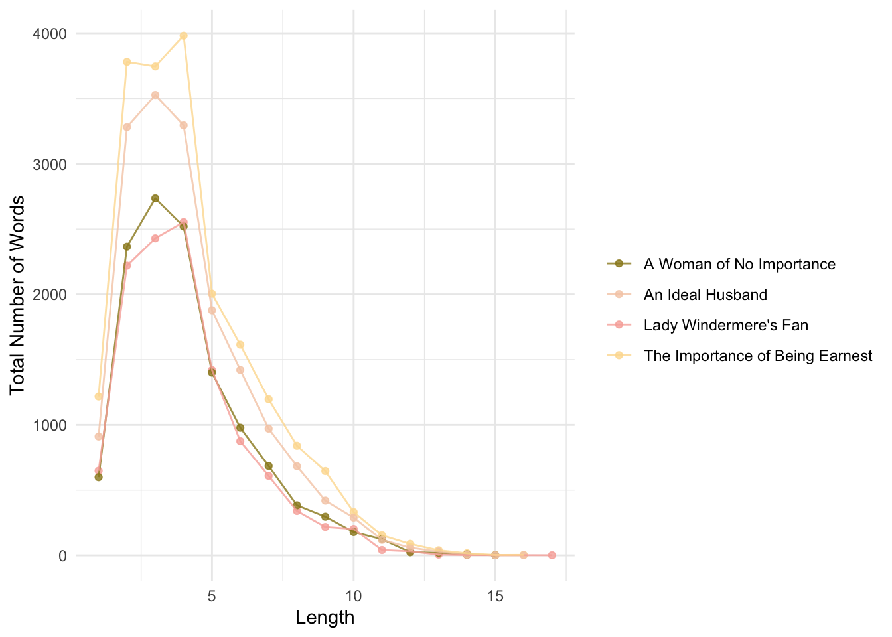
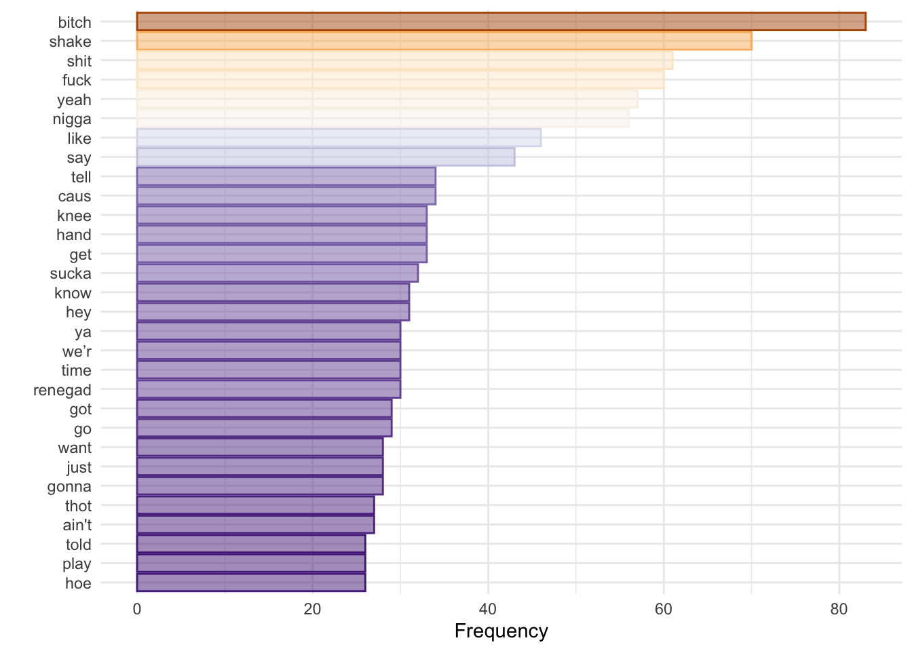
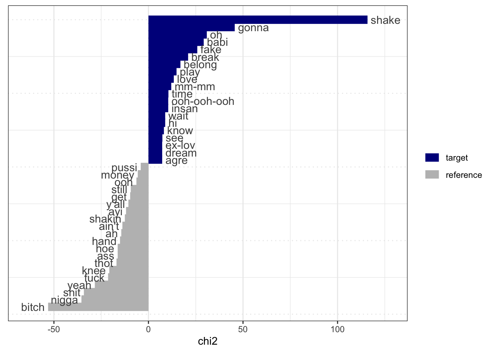
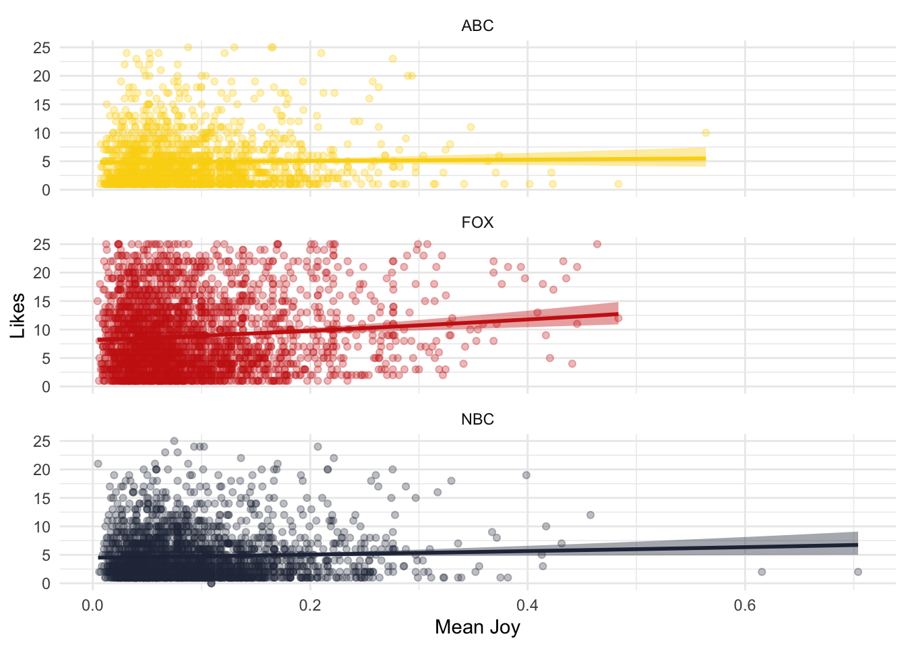
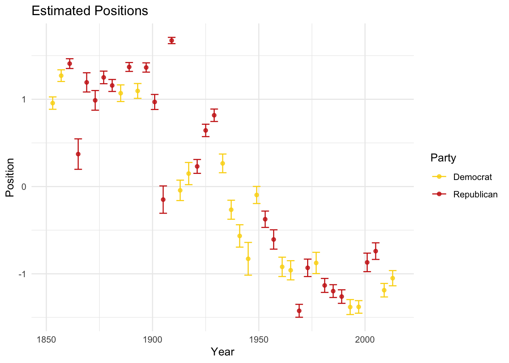
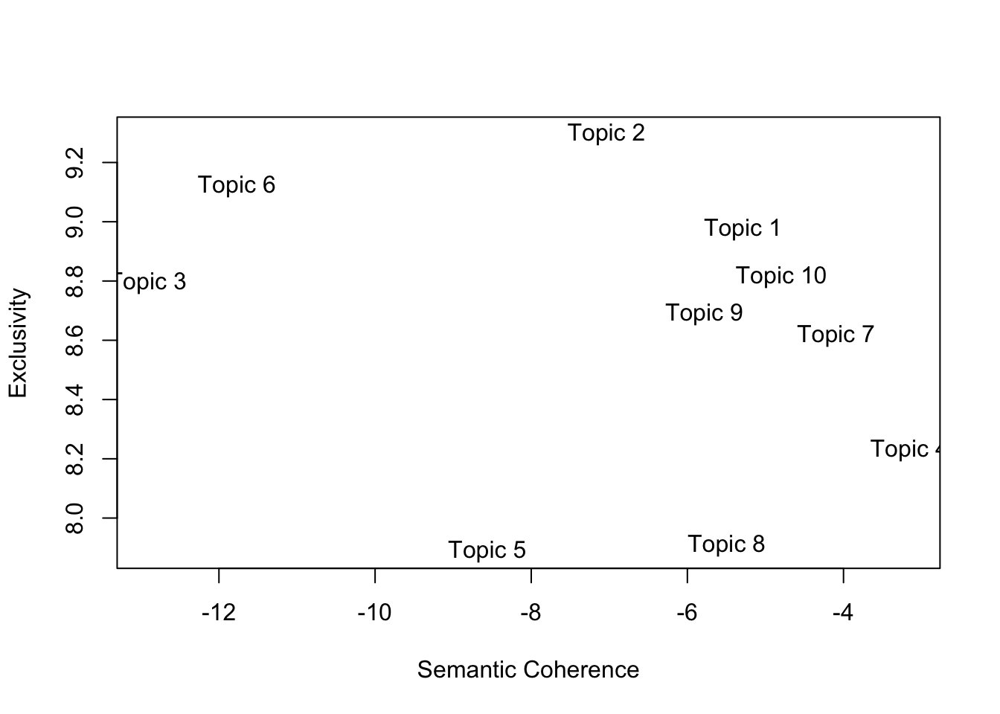

--- 
title: "PS9594A: Computational Text Analysis"
author: "Dr. Sebastián Vallejo Vera | Western University"
date: "2024-01-26"
site: bookdown::bookdown_site
documentclass: book
bibliography: [book.bib, packages.bib]
# url: your book url like https://bookdown.org/yihui/bookdown
# cover-image: path to the social sharing image like images/cover.jpg
description: "Code, exercises, and slides for PS9594A: Computational Text Analysis"
link-citations: yes
github-repo: svallejovera/cpa_uwo
---

# "Computational Text Analysis"{.unnumbered}

&nbsp;

Welcome to the site for the course PS9594A: "Computational Text Analysis" at Western University, taught by Sebastián Vallejo Vera. In each week, you will find the code, exercises, and slides for the corresponding topic. 

Before you start, check the required software and packages below. Also, don't forget to read the [Syllabus](https://svallejovera.github.io/files/9594A__Computational_Text_Analysis.pdf) and check Perusall for the readings for the course. This site will be corrected/updated throughout the semester.

## Software and Packages

For the first part of this course (Weeks 1 - 5), we will be mainly using R. For the second part of the this course (Weeks 6 - 11), we will use a combination of R and Python. I will assume that you are familiar with R language, RStudio, and R packages. If you are not, please come to office hours and I can help you out[^1]. In R, these are the main packages you will need to have installed:

- tidyverse (we will be piping)
- tidylog (helps keep track of what your are pipins)
- tidytext (great for working with text)
- quanteda (stands for "Quantitative Analysis of Textual Data")
  - quanteda.textstats (to obtain stats from our dfm)
  - quanteda.textplots (to obtain plots from our dfm stats)
  - quanteda.dictionaries (to use dictionaries with quanteda)
- gutenbergr (to download texts from [Project Gutenberg](https://www.gutenberg.org/))
- wesanderson (to make things pretty)
- stm (to run Structural Topic Models)

## Datasets

Throughout the class, we will be using a number of sample datasets. Access to these datasets will be provided directly on the code. For your Final Essay, you can use one of the following datasets (or, even better, you can use your own):

- Data from Ventura et al. (2021) - "Connective Effervescence and Streaming Chat During Political Debates": [Link to replication material](https://dataverse.harvard.edu/dataset.xhtml?persistentId=doi:10.7910/DVN/EWEJZN)
- Data from Project Gutenberg: `gutenbergr`
- Open-ended question from the 2021 Canadian Election Study survey: [Link to replication material](https://dataverse.harvard.edu/dataset.xhtml?persistentId=doi:10.7910/DVN/XBZHKC)
- Open-ended questions from ANES surveys: [Link to ANES homepage](https://electionstudies.org/)

## Acknowledgments 

The organization of the first part of this course (Weeks 1 - 5) and the format of the assignments are borrowed from Christopher Barrie's excellent course on ["Computational Text Analysis"](https://cjbarrie.github.io/CTA-ED/), a syllabus from the prolific [Tiago Ventura](https://www.venturatiago.com/), and Grimmer, Roberts, and Stewart's excellent book, ["Text as data: A new framework for machine learning and the social sciences"](https://press.princeton.edu/books/paperback/9780691207551/text-as-data). The code used throughout the course is a patchwork of my own code, but my own code borrows heavily from the internet (but that's true for all code). I try my best to give credit to the original authors of the code (when and if possible).

[^1]: It might even be faster to get one of your classmates or colleagues to help you out.

<!--chapter:end:index.Rmd-->

# Week 1: A Primer on Using Text as Data

## Slides{.unnumbered}

- 1 Introduction to CTA ([link](https://github.com/svallejovera/cpa_uwo/blob/main/slides/1%20Introduction%20to%20CTA.pptx) or in Perusall) 
- 2 Why Computational Text Analysis ([link](https://github.com/svallejovera/cpa_uwo/blob/main/slides/2%20Why%20Computational%20Text%20Analysis.pptx) or in Perusall)

## Setup

For this first example, we will replicate (and extend) Mendenhall's (1887) and Mendenhall's (1901) studies of word-length distribution. 

<div class="figure" style="text-align: center">

<p class="caption">(\#fig:curve)From Mendenhall (1987) - The Characteristic Curves of Composition.</p>
</div>

First we load the packages that we'll be using:


```r
library(tidyverse) # for wrangling data
library(tidylog) # to know what we are wrangling
library(tidytext) # for 'tidy' manipulation of text data
library(wesanderson) # to prettify
library(gutenbergr) # to get some books
library(kableExtra) # for displaying data in html format (relevant for formatting this worksheet mainly)
```

## Get Data

Mendenhall (1887) argued that "every writer makes use of a vocabulary which is peculiar to himself, and the character of which does not materially change from year to
year during his productive," and that one of these characteristics was the length of words. Mendenhall (1901) takes this further, and suggests that, given this assumption, Shakespeare and Bacon were *not* the same person[^2].

Let's get a corpus--a collection of documents--that we can analyze. We can search the Gutenberg repository and create a corpus with some selected work. 


```r
gutenberg_metadata %>%
  filter(author == "Wilde, Oscar")
```

```
## # A tibble: 66 × 8
##    gutenberg_id title    author gutenberg_author_id language gutenberg_bookshelf
##           <int> <chr>    <chr>                <int> <chr>    <chr>              
##  1          174 The Pic… Wilde…                 111 en       "Gothic Fiction/Mo…
##  2          301 The Bal… Wilde…                 111 en       ""                 
##  3          773 Lord Ar… Wilde…                 111 en       "Contemporary Revi…
##  4          774 Essays … Wilde…                 111 en       ""                 
##  5          790 Lady Wi… Wilde…                 111 en       ""                 
##  6          844 The Imp… Wilde…                 111 en       "Plays"            
##  7          854 A Woman… Wilde…                 111 en       "Plays"            
##  8          873 A House… Wilde…                 111 en       "Opera"            
##  9          875 The Duc… Wilde…                 111 en       ""                 
## 10          885 An Idea… Wilde…                 111 en       "Plays"            
## # ℹ 56 more rows
## # ℹ 2 more variables: rights <chr>, has_text <lgl>
```

## Word Length in Wilde's Corpus

That's a lot of Wilde! Let's focus on four plays: "The Importance of Being Earnest", "A Woman of No Importance", "Lady Windermere's Fan", and "An Ideal Husband". We can download all of these plays using their ID number:


```r
wilde <- gutenberg_download(c(790,844, 854, 885), 
                            meta_fields = c("title","author"))
print(n=25,wilde[c(51:75),])
```

```
## # A tibble: 25 × 4
##    gutenberg_id text                                        title         author
##           <int> <chr>                                       <chr>         <chr> 
##  1          790 ""                                          Lady Winderm… Wilde…
##  2          790 ""                                          Lady Winderm… Wilde…
##  3          790 "THE PERSONS OF THE PLAY"                   Lady Winderm… Wilde…
##  4          790 ""                                          Lady Winderm… Wilde…
##  5          790 ""                                          Lady Winderm… Wilde…
##  6          790 "Lord Windermere"                           Lady Winderm… Wilde…
##  7          790 ""                                          Lady Winderm… Wilde…
##  8          790 "Lord Darlington"                           Lady Winderm… Wilde…
##  9          790 ""                                          Lady Winderm… Wilde…
## 10          790 "Lord Augustus Lorton"                      Lady Winderm… Wilde…
## 11          790 ""                                          Lady Winderm… Wilde…
## 12          790 "Mr. Dumby"                                 Lady Winderm… Wilde…
## 13          790 ""                                          Lady Winderm… Wilde…
## 14          790 "Mr. Cecil Graham"                          Lady Winderm… Wilde…
## 15          790 ""                                          Lady Winderm… Wilde…
## 16          790 "Mr. Hopper"                                Lady Winderm… Wilde…
## 17          790 ""                                          Lady Winderm… Wilde…
## 18          790 "Parker, Butler"                            Lady Winderm… Wilde…
## 19          790 ""                                          Lady Winderm… Wilde…
## 20          790 "                                * * * * *" Lady Winderm… Wilde…
## 21          790 ""                                          Lady Winderm… Wilde…
## 22          790 "Lady Windermere"                           Lady Winderm… Wilde…
## 23          790 ""                                          Lady Winderm… Wilde…
## 24          790 "The Duchess of Berwick"                    Lady Winderm… Wilde…
## 25          790 ""                                          Lady Winderm… Wilde…
```

The unit of analysis is something like a line. We are interested in each word---also known as token---and their lengths *in each play*. We will clean some of the unwanted text---text that will only add noise to our analysis---and then count the number of words.


```r
wilde <- wilde %>%
  # Some housekeeping 
  mutate(title = ifelse(str_detect(title,"Importance of Being"),"The Importance of Being Earnest", title)) %>%
  # Filter out all empty rows
  filter(text != "") %>%
  # This is a play. The name of each character before they speak 
  filter(str_detect(text,"[A-Z]{3,}")==FALSE)
```

```
## mutate: changed 3,884 values (27%) of 'title' (0 new NA)
```

```
## filter: removed 4,232 rows (29%), 10,303 rows remaining
```

```
## filter: removed 4,208 rows (41%), 6,095 rows remaining
```

```r
print(n=25,wilde[c(51:75),])
```

```
## # A tibble: 25 × 4
##    gutenberg_id text                                                title author
##           <int> <chr>                                               <chr> <chr> 
##  1          790 "tea-table L._  _Window opening on to terrace L._ … Lady… Wilde…
##  2          790 "home to any one who calls."                        Lady… Wilde…
##  3          790 "                                                 … Lady… Wilde…
##  4          790 "he’s come."                                        Lady… Wilde…
##  5          790 "hands with you.  My hands are all wet with these … Lady… Wilde…
##  6          790 "lovely?  They came up from Selby this morning."    Lady… Wilde…
##  7          790 "table_.]  And what a wonderful fan!  May I look a… Lady… Wilde…
##  8          790 "everything.  I have only just seen it myself.  It… Lady… Wilde…
##  9          790 "present to me.  You know to-day is my birthday?"   Lady… Wilde…
## 10          790 "life, isn’t it?  That is why I am giving this par… Lady… Wilde…
## 11          790 "down.  [_Still arranging flowers_.]"               Lady… Wilde…
## 12          790 "birthday, Lady Windermere.  I would have covered … Lady… Wilde…
## 13          790 "front of your house with flowers for you to walk … Lady… Wilde…
## 14          790 "you."                                              Lady… Wilde…
## 15          790 "                                                 … Lady… Wilde…
## 16          790 "Foreign Office.  I am afraid you are going to ann… Lady… Wilde…
## 17          790 "with her pocket-handkerchief_, _goes to tea-table… Lady… Wilde…
## 18          790 "Won’t you come over, Lord Darlington?"             Lady… Wilde…
## 19          790 "miserable, Lady Windermere.  You must tell me wha… Lady… Wilde…
## 20          790 "table L._]"                                        Lady… Wilde…
## 21          790 "whole evening."                                    Lady… Wilde…
## 22          790 "that the only pleasant things to pay _are_ compli… Lady… Wilde…
## 23          790 "things we _can_ pay."                              Lady… Wilde…
## 24          790 "You mustn’t laugh, I am quite serious.  I don’t l… Lady… Wilde…
## 25          790 "don’t see why a man should think he is pleasing a… Lady… Wilde…
```

Now, we can change our unit of analysis to the **token**:


```r
wilde_words <- wilde %>%
  # take the column text and divide it by words
  unnest_tokens(word, text) %>%
  # Remove some characters that add noise
  mutate(word = str_remove_all(word, "\\_")) 
```

```
## mutate: changed 1,225 values (2%) of 'word' (0 new NA)
```

```r
wilde_words
```

```
## # A tibble: 60,465 × 4
##    gutenberg_id title                 author       word     
##           <int> <chr>                 <chr>        <chr>    
##  1          790 Lady Windermere's Fan Wilde, Oscar by       
##  2          790 Lady Windermere's Fan Wilde, Oscar sixteenth
##  3          790 Lady Windermere's Fan Wilde, Oscar edition  
##  4          790 Lady Windermere's Fan Wilde, Oscar first    
##  5          790 Lady Windermere's Fan Wilde, Oscar published
##  6          790 Lady Windermere's Fan Wilde, Oscar 1893     
##  7          790 Lady Windermere's Fan Wilde, Oscar first    
##  8          790 Lady Windermere's Fan Wilde, Oscar issued   
##  9          790 Lady Windermere's Fan Wilde, Oscar by       
## 10          790 Lady Windermere's Fan Wilde, Oscar methuen  
## # ℹ 60,455 more rows
```

That's a lot of words! We will now create a column for word length, and then count the number of words by length (by play!). 


```r
wilde_words_ct <- wilde_words %>%
  # Length of each word
  mutate(word_length = str_length(word)) %>%
  # Group by word_length and count how many 
  group_by(word_length,title) %>%
  mutate(total_word_length = n()) %>%
  # Keep relevant
  distinct(word_length,title,.keep_all=T) %>%
  select(word_length,title,author,total_word_length)
```

```
## mutate: new variable 'word_length' (integer) with 17 unique values and 0% NA
```

```
## group_by: 2 grouping variables (word_length, title)
```

```
## mutate (grouped): new variable 'total_word_length' (integer) with 58 unique values and 0% NA
```

```
## distinct (grouped): removed 60,403 rows (>99%), 62 rows remaining
```

```
## select: dropped 2 variables (gutenberg_id, word)
```

Let's see the distribution by play:


```r
wilde_words_ct %>%
  ggplot(aes(y=total_word_length,x=word_length,color=title)) +
  geom_point(alpha=0.8) +
  geom_line(alpha=0.8) +
  scale_color_manual(values = wes_palette("Royal2")) +
  theme_minimal() +
  theme(legend.position = "right") +
  labs(x="Length", y = "Total Number of Words", color = "")
```



This is a problem. *Why?*

Here is a solution (proposed by Mendenhall):


```r
wilde_words %>%
  group_by(title) %>%
  slice_sample(n=10000) %>%
  mutate(word_length = str_length(word),
         median_word_length = median(word_length)) %>%
  group_by(word_length,title) %>%
  mutate(total_word_length = n()) %>%
  distinct(word_length,title,.keep_all=T) %>%
  select(word_length,title,author,total_word_length,median_word_length) %>%
  ggplot(aes(y=total_word_length,x=word_length,color=title)) +
  geom_point(alpha=0.8) +
  geom_line(alpha=0.8) +
  geom_vline(aes(xintercept = median_word_length,color=title,linetype = title))+
  scale_color_manual(values = wes_palette("Royal2")) +
  theme_minimal() +
  theme(legend.position = "right") +
  labs(x="Length", y = "Total Number of Words", color = "", linetype = "",
       caption = "Note: Line type shows median word length.")
```

```
## group_by: one grouping variable (title)
```

```
## slice_sample (grouped): removed 20,465 rows (34%), 40,000 rows remaining
```

```
## mutate (grouped): new variable 'word_length' (integer) with 17 unique values and 0% NA
```

```
##                   new variable 'median_word_length' (double) with one unique value and 0% NA
```

```
## group_by: 2 grouping variables (word_length, title)
```

```
## mutate (grouped): new variable 'total_word_length' (integer) with 56 unique values and 0% NA
```

```
## distinct (grouped): removed 39,940 rows (>99%), 60 rows remaining
```

```
## select: dropped 2 variables (gutenberg_id, word)
```


Would you look at that. Mendenhall was into something: an author has a mark in terms of word length distribution. For Wilde, there is no observable change across time (each play was published in different years). But, what happens when we compare Wilde's mark with Shakespeare's? Let's choose four plays (at random) by Shakespeare: A Midsummer Night's Dream, The Merchant of Venice, Much Ado about Nothing, and The Tempest.

## Comparing Shakespeare and Wilde


```r
shakes <- gutenberg_download(c(1520,2242,2243,2235),
                             meta_fields = c("title","author"))
print(n=25,shakes[c(51:75),])
```

```
## # A tibble: 25 × 4
##    gutenberg_id text                                                title author
##           <int> <chr>                                               <chr> <chr> 
##  1         1520 "Leon."                                             Much… Shake…
##  2         1520 "How many gentlemen have you lost in this action?"  Much… Shake…
##  3         1520 ""                                                  Much… Shake…
##  4         1520 "Mess."                                             Much… Shake…
##  5         1520 "But few of any sort, and none of name."            Much… Shake…
##  6         1520 ""                                                  Much… Shake…
##  7         1520 "Leon."                                             Much… Shake…
##  8         1520 "A victory is twice itself when the achiever bring… Much… Shake…
##  9         1520 "numbers.  I find here that Don Pedro hath bestowe… Much… Shake…
## 10         1520 "a young Florentine, called Claudio."               Much… Shake…
## 11         1520 ""                                                  Much… Shake…
## 12         1520 "Mess."                                             Much… Shake…
## 13         1520 "Much deserved on his part, and equally remembered… Much… Shake…
## 14         1520 "He hath borne himself beyond the promise of his a… Much… Shake…
## 15         1520 "in the figure of a lamb, the feats of a lion: he … Much… Shake…
## 16         1520 "better bettered expectation than you must expect … Much… Shake…
## 17         1520 "you how."                                          Much… Shake…
## 18         1520 ""                                                  Much… Shake…
## 19         1520 "Leon."                                             Much… Shake…
## 20         1520 "He hath an uncle here in Messina will be very muc… Much… Shake…
## 21         1520 ""                                                  Much… Shake…
## 22         1520 "Mess."                                             Much… Shake…
## 23         1520 "I have already delivered him letters, and there a… Much… Shake…
## 24         1520 "joy in him; even so much that joy could not show … Much… Shake…
## 25         1520 "enough without a badge of bitterness."             Much… Shake…
```

This text is cleaner than Wilde's corpus, so we will leave it as is. Also, it is harder to systematically remove the name of the person speaking. **Is this a problem? Why? Why not?** 

We can put together both corpora and see differences in the distributions of word length. 


```r
shakes_words <- shakes %>%
  # Filter out all empty rows
  filter(text != "") %>%
  # This is a play. The name of each character before they speak 
  filter(str_detect(text,"[A-Z]{3,}")==FALSE) %>%
  # take the column text and divide it by words
  unnest_tokens(word, text) 
```

```
## filter: removed 3,088 rows (22%), 11,135 rows remaining
```

```
## filter: removed 31 rows (<1%), 11,104 rows remaining
```

```r
# Bind both word dfs
words <- rbind.data.frame(shakes_words,wilde_words)

# Count words etc.
words %>%
  group_by(title,author) %>%
  slice_sample(n=10000) %>%
  mutate(word_length = str_length(word),
         median_word_length = median(word_length)) %>%
  group_by(word_length,title,author) %>%
  mutate(total_word_length = n()) %>%
  distinct(word_length,title,.keep_all=T) %>%
  select(word_length,title,author,total_word_length,median_word_length) %>%
  ggplot(aes(y=total_word_length,x=word_length,color=author,group=title)) +
  geom_point(alpha=0.8) +
  geom_line(alpha=0.8) +
  scale_color_manual(values = wes_palette("Royal2")) +
  # facet_wrap(~author, ncol = 2)+
  theme_minimal() +
  theme(legend.position = "bottom") +
  labs(x="Length", y = "Total Number of Words", color = "", linetype = "",
       caption = "Note: Median word length is 4 for both authors.")
```

```
## group_by: 2 grouping variables (title, author)
```

```
## slice_sample (grouped): removed 61,480 rows (43%), 80,000 rows remaining
```

```
## mutate (grouped): new variable 'word_length' (integer) with 17 unique values and 0% NA
```

```
##                   new variable 'median_word_length' (double) with one unique value and 0% NA
```

```
## group_by: 3 grouping variables (word_length, title, author)
```

```
## mutate (grouped): new variable 'total_word_length' (integer) with 102 unique values and 0% NA
```

```
## distinct (grouped): removed 79,884 rows (>99%), 116 rows remaining
```

```
## select: dropped 2 variables (gutenberg_id, word)
```


Are there any differences? What can we conclude from the evidence? What are the limitations of this approach? Are there alternative approaches to study what Mendenhall was getting at? 

## Exercise (Optional)

1. Extend the current analysis to other authors or to more works from the same author.
2. Are there better ways to compare the distribution of word length? Are there changes across time? Are there differences between different types of works (e.g., fiction vs. non-fiction, prose vs. poetry)?

## Final Words

As will be often the case, we won't be able to cover every single feature that the different packages have to offer, or how some objects that we create look like, or what else we can do with them. My advise is that you go home and explore the code in detail. Try applying the code to a different corpus and come next class with questions (or just show off what you were able to do). 

[^2]: These studies were published in Science and Popular Science Monthly!


<!--chapter:end:01-week1.Rmd-->

# Week 2: Tokenization and Word Frequency

## Slides{.unnumbered}

- 3 Tokenization and Word Frequency ([link](https://github.com/svallejovera/cpa_uwo/blob/main/slides/3%20Tokenization%20and%20Word%20Frequency.pptx) or in Perusall) 

## Setup

As always, we first load the packages that we'll be using:


```r
library(tidyverse) # for wrangling data
library(tidylog) # to know what we are wrangling
library(tidytext) # for 'tidy' manipulation of text data
library(quanteda) # tokenization power house
library(quanteda.textstats)
library(quanteda.textplots)
library(wesanderson) # to prettify
library(readxl) # to read excel
library(kableExtra) # for displaying data in html format (relevant for formatting this worksheet mainly)
```

## Get Data:

For this example, we will be using small corpus of song lyrics. 


```r
sample_lyrics <- read_excel("data/lyrics_sample.xlsx")
head(sample_lyrics)
```

```
## # A tibble: 6 × 5
##   artist                   album                      year song           lyrics
##   <chr>                    <chr>                     <dbl> <chr>          <chr> 
## 1 Rage Against the Machine Evil Empire                1996 Bulls on Para… "Come…
## 2 Rage Against the Machine Rage Against the Machine   1992 Killing in th… "Kill…
## 3 Rage Against the Machine Renegades                  2000 Renegades of … "No m…
## 4 Rage Against the Machine The Battle of Los Angeles  1999 Sleep Now in … "Yeah…
## 5 Rage Against the Machine The Battle of Los Angeles  1999 Guerrilla Rad… "Tran…
## 6 Rage Against the Machine The Battle of Los Angeles  1999 Testify        "Uh!\…
```

Ok, so we have different artists, from different genres and year...


```
## 
##      Megan Thee Stallion Rage Against the Machine         System of a Down 
##                        5                        6                        5 
##             Taylor Swift 
##                        5
```

And we have the lyrics in the following form:


```
## [1] "Yeah\r\n\r\nThe world is my expense\r\nIt’s the cost of my desire\r\nJesus blessed me with its future\r\nAnd I protect it with fire\r\n\r\nSo raise your fists and march around\r\nJust don’t take what you need\r\nI’ll jail and bury those committed\r\nAnd smother the rest in greed\r\n\r\nCrawl with me into tomorrow\r\nOr I’ll drag you to your grave\r\nI’m deep inside your children\r\nThey’ll betray you in my name\r\n\r\nHey, hey, sleep now in the fire\r\nHey, hey, sleep now in the fire\r\n\r\nThe lie is my expense\r\nThe scope of my desire\r\nThe party blessed me with its future\r\nAnd I protect it with fire\r\n\r\nI am the Niña, the Pinta, the Santa María\r\nThe noose and the rapist, the fields overseer\r\nThe Agents of Orange, the Priests of Hiroshima\r\nThe cost of my desire, sleep now in the fire\r\n\r\nHey, hey, sleep now in the fire\r\nHey, hey, sleep now in the fire\r\n\r\nFor it’s the end of history\r\nIt’s caged and frozen still\r\nThere is no other pill to take\r\nSo swallow the one that made you ill\r\n\r\nThe Niña, the Pinta, the Santa María\r\nThe noose and the rapist, the fields overseer\r\nThe Agents of Orange, the Priests of Hiroshima\r\nThe cost of my desire to sleep now in the fire\r\n\r\nYeah\r\n\r\nSleep now in the fire\r\nSleep now in the fire\r\nSleep now in the fire\r\nSleep now in the fire"
```

## Cleaning the Text

Much like music, text comes in different forms and qualities. From the Regex workshop, you might remember that there are special characters that can signal, for example, a new line (`\n`), or carriage return (`\r`). For this example, we can get rid of them [^3]. Before working with text, always check the state of your documents once loaded into your program of choice. 


```r
sample_lyrics <- sample_lyrics %>%
  mutate(lyrics_clean = str_replace_all(lyrics,"\\n", "\\."),
         lyrics_clean = str_replace_all(lyrics_clean,"\\r", "\\.")) %>%
  select(-lyrics)
```

```
## mutate: new variable 'lyrics_clean' (character) with 21 unique values and 0% NA
```

```
## select: dropped one variable (lyrics)
```

```r
sample_lyrics$lyrics_clean[4]
```

```
## [1] "Yeah....The world is my expense..It’s the cost of my desire..Jesus blessed me with its future..And I protect it with fire....So raise your fists and march around..Just don’t take what you need..I’ll jail and bury those committed..And smother the rest in greed....Crawl with me into tomorrow..Or I’ll drag you to your grave..I’m deep inside your children..They’ll betray you in my name....Hey, hey, sleep now in the fire..Hey, hey, sleep now in the fire....The lie is my expense..The scope of my desire..The party blessed me with its future..And I protect it with fire....I am the Niña, the Pinta, the Santa María..The noose and the rapist, the fields overseer..The Agents of Orange, the Priests of Hiroshima..The cost of my desire, sleep now in the fire....Hey, hey, sleep now in the fire..Hey, hey, sleep now in the fire....For it’s the end of history..It’s caged and frozen still..There is no other pill to take..So swallow the one that made you ill....The Niña, the Pinta, the Santa María..The noose and the rapist, the fields overseer..The Agents of Orange, the Priests of Hiroshima..The cost of my desire to sleep now in the fire....Yeah....Sleep now in the fire..Sleep now in the fire..Sleep now in the fire..Sleep now in the fire"
```

## Tokenization

Our goal is to create a document-feature matrix, from which we will later extract information about word frequency. To do that, we start by crating a `corpus` object, from the `quanteda` package. 


```r
corpus_lyrics <- corpus(sample_lyrics,
                     text_field = "lyrics_clean",
                     unique_docnames = TRUE)

summary(corpus_lyrics)
```

```
## Corpus consisting of 21 documents, showing 21 documents:
## 
##    Text Types Tokens Sentences                   artist
##   text1   119    375        35 Rage Against the Machine
##   text2    52    853        83 Rage Against the Machine
##   text3   188    835        91 Rage Against the Machine
##   text4    97    352        38 Rage Against the Machine
##   text5   160    440        50 Rage Against the Machine
##   text6   133    535        67 Rage Against the Machine
##   text7   104    559        53         System of a Down
##   text8    67    365        40         System of a Down
##   text9    68    298        33         System of a Down
##  text10    65    258        32         System of a Down
##  text11   137    558        68         System of a Down
##  text12   131    876        70             Taylor Swift
##  text13   159    465        41             Taylor Swift
##  text14   162    544        62             Taylor Swift
##  text15   196    738        84             Taylor Swift
##  text16   169    549        50             Taylor Swift
##  text17   229    867        55      Megan Thee Stallion
##  text18   193    664        61      Megan Thee Stallion
##  text19   310   1190        87      Megan Thee Stallion
##  text20   198    656        48      Megan Thee Stallion
##  text21   256   1050        73      Megan Thee Stallion
##                       album year                  song
##                 Evil Empire 1996       Bulls on Parade
##    Rage Against the Machine 1992   Killing in the Name
##                   Renegades 2000     Renegades of Funk
##   The Battle of Los Angeles 1999 Sleep Now in the Fire
##   The Battle of Los Angeles 1999       Guerrilla Radio
##   The Battle of Los Angeles 1999               Testify
##                   Mezmerize 2005               B.Y.O.B
##                    Toxicity 2001            Chop Suey!
##                    Toxicity 2001               Aerials
##                    Toxicity 2001               Toxicty
##                    Toxicity 2001                 Sugar
##                        1989 2014          Shake it Off
##                   Midnights 2022             Anti-Hero
##                    Fearless 2008    You Belong With Me
##                        1989 2014           Blank Space
##                    Fearless 2008            Love Story
##                  Traumazine 2022                Plan B
##                        Suga 2020                Savage
##  Something for Thee Hotties 2021             Thot Shit
##                  Traumazine 2022                   Her
##                  Traumazine 2022            Ungrateful
```

Looks good. Now we can tokenize our corpus (and reduce complexity). One benefit of creating a corpus object first is that we maintain all the metadata for every document when we tokenize. This will come in handy in the future. 


```r
lyrics_toks <- tokens(corpus_lyrics,
                   remove_numbers = TRUE, # Thinks about this
                   remove_punct = TRUE, # Remove punctuation!
                   remove_url = TRUE) # Might be helpful
lyrics_toks[c(4,14)]
```

```
## Tokens consisting of 2 documents and 4 docvars.
## text4 :
##  [1] "Yeah"    "The"     "world"   "is"      "my"      "expense" "It’s"   
##  [8] "the"     "cost"    "of"      "my"      "desire" 
## [ ... and 227 more ]
## 
## text14 :
##  [1] "You're"     "on"         "the"        "phone"      "with"      
##  [6] "your"       "girlfriend" "she's"      "upset"      "She's"     
## [11] "going"      "off"       
## [ ... and 385 more ]
```

We got rid of the punctuation. Now let's remove stop words, high and low frequency words, and stem the remaining tokens. Here I am cheating, though. I know that high and low frequency words because I checked my `dfm` (see next code chunk). 


```r
lyrics_toks <- tokens_remove(lyrics_toks,
                          # you can change or add stopwords depending on the 
                          # language(s) of the documents
                          c(stopwords(language = "en"),
                            # Now is high frequency... there are many low
                            # frequency tokens. We will check these later
                            "now"),
                          padding = F)

lyrics_toks_stem <- tokens_wordstem(lyrics_toks, language = "en")

lyrics_toks[c(4,14)]
```

```
## Tokens consisting of 2 documents and 4 docvars.
## text4 :
##  [1] "Yeah"    "world"   "expense" "It’s"    "cost"    "desire"  "Jesus"  
##  [8] "blessed" "future"  "protect" "fire"    "raise"  
## [ ... and 105 more ]
## 
## text14 :
##  [1] "phone"      "girlfriend" "upset"      "going"      "something" 
##  [6] "said"       "Cause"      "get"        "humor"      "like"      
## [11] "room"       "typical"   
## [ ... and 133 more ]
```

```r
lyrics_toks_stem[c(4,14)]
```

```
## Tokens consisting of 2 documents and 4 docvars.
## text4 :
##  [1] "Yeah"    "world"   "expens"  "It’s"    "cost"    "desir"   "Jesus"  
##  [8] "bless"   "futur"   "protect" "fire"    "rais"   
## [ ... and 105 more ]
## 
## text14 :
##  [1] "phone"      "girlfriend" "upset"      "go"         "someth"    
##  [6] "said"       "Caus"       "get"        "humor"      "like"      
## [11] "room"       "typic"     
## [ ... and 133 more ]
```

We can compare the stemmed output and the non-stemmed output. Why did 'future' become 'futur'? Because we are assuming that, for *our* purposes, 'future=futuristic'. This is for the researcher to decide. And finally, we can create our document-feature matrix (`dfm`). 


```r
lyrics_dfm <- dfm(lyrics_toks)
lyrics_dfm_stem <- dfm(lyrics_toks_stem)

head(lyrics_dfm_stem)
```

```
## Document-feature matrix of: 6 documents, 1,165 features (93.12% sparse) and 4 docvars.
##        features
## docs    come wit microphon explod shatter mold either drop hit like
##   text1    4   4         1      1       1    1      1    3   1    1
##   text2    2   0         0      0       0    0      0    0   0    0
##   text3    0   0         0      0       0    0      0    0   0    4
##   text4    0   0         0      0       0    0      0    0   0    0
##   text5    0   0         0      0       0    0      0    0   0    1
##   text6    0   4         0      0       0    0      0    0   0    0
## [ reached max_nfeat ... 1,155 more features ]
```

Note that once we create the `dfm` object, all the tokens become lowercase. Now we can check what are the 15 most frequent tokens. 


```r
lyrics_dfm_stem %>%
  textstat_frequency(n=30) %>%
  ggplot(aes(x = reorder(feature,frequency),y=frequency,fill = (frequency), color = (frequency))) +
  geom_col(alpha=0.5) +
  coord_flip() +
  scale_x_reordered() +
  scale_color_distiller(palette = "PuOr") +
  scale_fill_distiller(palette = "PuOr") +
  theme_minimal() + 
  labs(x="",y="Frequency",color = "", fill = "") +
  theme(legend.position="none") 
```



Does not tell us much, but I used the previous code to check for low-information tokens that I might want to remove from my analysis. We can also see how many tokens appear only once:


```r
only_once <- lyrics_dfm_stem %>%
  textstat_frequency() %>%
  filter(frequency == 1)
```

```
## filter: removed 566 rows (49%), 599 rows remaining
```

```r
length(only_once$feature)
```

```
## [1] 599
```

More interesting for text analysis is to count words over time/space. In this case, our 'space' can be the artist. 


```r
lyrics_dfm_stem %>%
  textstat_frequency(n=15, groups = c(artist)) %>%
  ggplot(aes(x = reorder_within(feature,frequency,group),y=frequency,fill = group, color = group)) +
  geom_col(alpha = 0.5) +
  coord_flip() +
  facet_wrap(~group, scales = "free") +
  scale_x_reordered() +
  scale_color_brewer(palette = "PuOr") +
  scale_fill_brewer(palette = "PuOr") +
  theme_minimal() + 
  labs(x="",y="",color = "", fill = "") +
  theme(legend.position="none") 
```


Interesting. Not a lot of overlap (apart from a token from Megan Thee Stallion and Rage Against the Machine). However, it would be great if we could measure the importance of a word relative to how much it appears across documents (one way to denominate). Enter TF-IDF: "Term-Frequency / Inverse-Document-frequency". TF-IDF weighting up-weights relatively rare words that do not appear in all documents. Using term frequency and inverse document frequency allows us to find words that are characteristic for one document within a collection of documents.  


```r
lyrics_dfm_tfidf <- dfm_tfidf(lyrics_dfm_stem)

lyrics_dfm_tfidf %>%
  textstat_frequency(n=15, groups = c(artist), force=T) %>%
  ggplot(aes(x = reorder_within(feature,frequency,group),y=frequency,fill = group, color = group)) +
  geom_col(alpha = 0.5) +
  coord_flip() +
  facet_wrap(~group, scales = "free") +
  scale_x_reordered() +
  scale_color_brewer(palette = "PuOr") +
  scale_fill_brewer(palette = "PuOr") +
  theme_minimal() + 
  labs(x="",y="TF-IDF",color = "", fill = "") +
  theme(legend.position="none") 
```


If we are building a dictionary, for example, we might want to include words with high TF-IDF values. Another way to think about TF-IDF is in terms of predictive power. Words that are common to all documents do not have any predictive power and receive a TD-IDF value of 0. Words that appear, but only in relatively few document, have greater predictive power and receive a TD-IDF > 0. Very rare words are also penalized, since these might provide only specific information about one document (i.e., high prediction for one document but no information about the rest). As you will read in Chapter 6/7 in Grimmer et al., the idea is to find the right balance. 

Another useful tool (and concept) is keyness. Keyness is a two-by-two association score for features that occur differentially across different categories. We can estimate which features are associated more with one category (in this case, one artist), compared to the other. Let's compare Megan Thee Stallion and Taylor Swift.


```r
lyrics_dfm_ts_mts <- dfm_subset(lyrics_dfm_stem, year > 2006)

lyrics_key <- textstat_keyness(lyrics_dfm_ts_mts, 
                              target = lyrics_dfm_ts_mts$artist == "Taylor Swift")
textplot_keyness(lyrics_key)
```



Similar to what we would have implied from the TF-IDF graphs. Notice that stemming does not always works are expected. Taylor Swift sings about "shake, shake, shake" and Megan Thee Stallion sings about "shaking". However, both words appear as distinct features from both artists. 

## Word Frequency Across Artist

We can do something similar to what we did last week to look at word frequencies. Rather than creating a `dfm`, we can use the dataset as is, and get some information. For example, the average number of tokens by artist.


```r
sample_lyrics %>%
  # take the column lyrics_clean and divide it by words
  # this uses a similar tokenizer to quanteda
  unnest_tokens(word, lyrics_clean) %>%
  group_by(song) %>%
  mutate(total_tk_song = n()) %>%
  distinct(song,.keep_all=T) %>% 
  group_by(artist) %>%
  mutate(mean_tokens = mean(total_tk_song)) %>%
  ggplot(aes(x=song,y=total_tk_song,fill=artist,color=artist)) +
  geom_col(alpha=.8) +
  geom_hline(aes(yintercept = mean_tokens, color = artist), linetype = "dashed")+
  scale_color_manual(values = wes_palette("Royal2")) +
  scale_fill_manual(values = wes_palette("Royal2")) +
  facet_wrap(~artist, scales = "free_x", nrow = 1) + 
  theme_minimal() +
  theme(legend.position="none",
        axis.text.x = element_text(angle = 90, size = 5,vjust = 0.5, hjust=1)) +
  labs(x="", y = "Total Tokens", color = "", fill = "",
       caption = "Note: Mean token length in dashed line.")
```

```
## group_by: one grouping variable (song)
```

```
## mutate (grouped): new variable 'total_tk_song' (integer) with 20 unique values and 0% NA
```

```
## distinct (grouped): removed 8,958 rows (>99%), 21 rows remaining
```

```
## group_by: one grouping variable (artist)
```

```
## mutate (grouped): new variable 'mean_tokens' (double) with 4 unique values and 0% NA
```


Alternatively, we can estimate the frequency of a specific token by song. 


```r
lyrics_totals <- sample_lyrics %>%
  # take the column lyrics_clean and divide it by words
  # this uses a similar tokenizer to quanteda
  unnest_tokens(word, lyrics_clean) %>%
  group_by(song) %>%
  mutate(total_tk_song = n()) %>%
  distinct(song,.keep_all=T) 
```

```
## group_by: one grouping variable (song)
```

```
## mutate (grouped): new variable 'total_tk_song' (integer) with 20 unique values and 0% NA
```

```
## distinct (grouped): removed 8,958 rows (>99%), 21 rows remaining
```


```r
# let's look for "like"
lyrics_like <- sample_lyrics %>%
  # take the column lyrics_clean and divide it by words
  # this uses a similar tokenizer to quanteda
  unnest_tokens(word, lyrics_clean) %>%
  filter(word=="like") %>%
  group_by(song) %>%
  mutate(total_like_song = n()) %>%
  distinct(song,total_like_song) 
```

```
## filter: removed 8,934 rows (99%), 45 rows remaining
```

```
## group_by: one grouping variable (song)
```

```
## mutate (grouped): new variable 'total_like_song' (integer) with 7 unique values and 0% NA
```

```
## distinct (grouped): removed 33 rows (73%), 12 rows remaining
```

We can now join these two data frames together with the `left_join()` function and join by the “song” column. We can then pipe the joined data into a plot.


```r
lyrics_totals %>%
  left_join(lyrics_like, by = "song") %>%
  ungroup() %>%
  mutate(like_prop = total_like_song/total_tk_song) %>%
  ggplot(aes(x=song,y=like_prop,fill=artist,color=artist)) +
  geom_col(alpha=.8) +
  scale_color_manual(values = wes_palette("Royal2")) +
  scale_fill_manual(values = wes_palette("Royal2")) +
  facet_wrap(~artist, scales = "free_x", nrow = 1) + 
  theme_minimal() +
  theme(legend.position="none",
        axis.text.x = element_text(angle = 90, size = 5,vjust = 0.5, hjust=1)) +
  labs(x="", y = "Prop. of \'Like\'", color = "", fill = "")
```

```
## left_join: added one column (total_like_song)
```

```
##            > rows only in x    9
```

```
##            > rows only in y  ( 0)
```

```
##            > matched rows     12
```

```
##            >                 ====
```

```
##            > rows total       21
```

```
## ungroup: no grouping variables
```

```
## mutate: new variable 'like_prop' (double) with 13 unique values and 43% NA
```


## Final Words

As will be often the case, we won't be able to cover every single feature that the different packages have to offer, or how some objects that we create look like, or what else we can do with them. My advise is that you go home and explore the code in detail. Try applying the code to a different corpus and come next class with questions (or just show off what you were able to do). 

[^3]: This is not always the case. Sometimes, we can use this characters to change our unit of analysis. For example, is we want our unit of analysis to be the paragraph, rather than the whole text, then these markers can aid when separating the text. 


<!--chapter:end:02-week2.Rmd-->

# Week 3: Dictionary-Based Approaches

## Slides{.unnumbered}

- 4 Dictionary-Based Approaches ([link](https://github.com/svallejovera/cpa_uwo/blob/main/slides/4%20Dictionary%20Based%20Approaches.pptx) or in Perusall) 

## Setup

As always, we first load the packages that we'll be using:


```r
library(tidyverse) # for wrangling data
library(tidylog) # to know what we are wrangling
library(tidytext) # for 'tidy' manipulation of text data
library(textdata) # text datasets
library(quanteda) # tokenization power house
library(quanteda.textstats)
library(quanteda.dictionaries)
library(wesanderson) # to prettify
library(knitr) # for displaying data in html format (relevant for formatting this worksheet mainly)
```

## Get Data:

For this example, we will be using data from *Ventura et al. (2021) - Connective effervescence and streaming chat during political debates*.


```r
load("data/ventura_etal_df.Rdata")
head(ventura_etal_df)
```

```
##   text_id
## 1       1
## 2       2
## 3       3
## 4       4
## 5       5
## 6       6
##                                                                                                                                                                                                                                       comments
## 1 MORE:\n The coronavirus pandemic's impact on the race will be on display as the\n two candidates won't partake in a handshake, customary at the top of \nsuch events. The size of the audience will also be limited. https://abcn.ws/3kVyl16
## 2                                                                                                                                                           God please bless all Trump supporters. They need it for they know not what they do
## 3                                                                                                                               Trump  is  a  living  disaster!    What  an embarrassment  to  all  human  beings!    The  man  is  dangerous!
## 4                                                                                                                                                   This debate is why other counties laugh at us. School yard class president debate at best.
## 5                                                                    OMG\n ... shut up tRump ... so rude and out of control.  Obviously freaking \nout.  This is a debate NOT a convention or a speech or your platform.  \nLearn some manners
## 6                                                                                                      It’s\n hard to see what this country has become.  The Presidency is no longer a\n respected position it has lost all of it’s integrity.
##                      id likes                  debate
## 1              ABC News   100 abc_first_debate_manual
## 2            Anita Hill    61 abc_first_debate_manual
## 3          Dave Garland    99 abc_first_debate_manual
## 4              Carl Roy    47 abc_first_debate_manual
## 5 Lynda Martin-Chambers   154 abc_first_debate_manual
## 6         Nica Merchant   171 abc_first_debate_manual
```

## Tokenization etc.

The comments are mostly clean, but you can check (on your own) if they require more cleaning. In the previous code, I showed you how to lower, remove stopwords, etc., using quanteda. We can also do this using tidytext [^4]:


```r
tidy_ventura <- ventura_etal_df %>% 
  # to lower:
  mutate(comments = tolower(comments)) %>%
  # tokenize
  unnest_tokens(word, comments) %>%
  # keep only words (check regex)
  filter(str_detect(word, "[a-z]")) %>%
  # remove stop words
  filter(!word %in% stop_words$word)
```

```
## mutate: changed 29,261 values (99%) of 'comments' (0 new NA)
```

```
## filter: removed 3,374 rows (1%), 494,341 rows remaining
```

```
## filter: removed 296,793 rows (60%), 197,548 rows remaining
```

```r
head(tidy_ventura, 20)
```

```
##    text_id         id likes                  debate        word
## 1        1   ABC News   100 abc_first_debate_manual coronavirus
## 2        1   ABC News   100 abc_first_debate_manual  pandemic's
## 3        1   ABC News   100 abc_first_debate_manual      impact
## 4        1   ABC News   100 abc_first_debate_manual        race
## 5        1   ABC News   100 abc_first_debate_manual     display
## 6        1   ABC News   100 abc_first_debate_manual  candidates
## 7        1   ABC News   100 abc_first_debate_manual     partake
## 8        1   ABC News   100 abc_first_debate_manual   handshake
## 9        1   ABC News   100 abc_first_debate_manual   customary
## 10       1   ABC News   100 abc_first_debate_manual         top
## 11       1   ABC News   100 abc_first_debate_manual      events
## 12       1   ABC News   100 abc_first_debate_manual        size
## 13       1   ABC News   100 abc_first_debate_manual    audience
## 14       1   ABC News   100 abc_first_debate_manual     limited
## 15       1   ABC News   100 abc_first_debate_manual       https
## 16       1   ABC News   100 abc_first_debate_manual     abcn.ws
## 17       1   ABC News   100 abc_first_debate_manual     3kvyl16
## 18       2 Anita Hill    61 abc_first_debate_manual         god
## 19       2 Anita Hill    61 abc_first_debate_manual       bless
## 20       2 Anita Hill    61 abc_first_debate_manual       trump
```

## Keywords

We can detect the occurrence of the words **trump** and **biden** in each comment (`text_id`). 


```r
trump_biden <- tidy_ventura %>%
  # create a dummy
  mutate(trump_token = ifelse(word=="trump", 1, 0),
         biden_token = ifelse(word=="biden", 1, 0)) %>%
  # see which comments have the word trump / biden
  group_by(text_id) %>%
  mutate(trump_cmmnt = ifelse(sum(trump_token)>0, 1, 0),
         biden_cmmnt = ifelse(sum(biden_token)>0, 1, 0)) %>%
  # reduce to our unit of analysis (comment) 
  distinct(text_id, .keep_all = T) %>%
  select(text_id,trump_cmmnt,biden_cmmnt,likes,debate)
```

```
## mutate: new variable 'trump_token' (double) with 2 unique values and 0% NA
```

```
##         new variable 'biden_token' (double) with 2 unique values and 0% NA
```

```
## group_by: one grouping variable (text_id)
```

```
## mutate (grouped): new variable 'trump_cmmnt' (double) with 2 unique values and 0% NA
```

```
##                   new variable 'biden_cmmnt' (double) with 2 unique values and 0% NA
```

```
## distinct (grouped): removed 168,013 rows (85%), 29,535 rows remaining
```

```
## select: dropped 4 variables (id, word, trump_token, biden_token)
```

```r
head(trump_biden, 20)
```

```
## # A tibble: 20 × 5
## # Groups:   text_id [20]
##    text_id trump_cmmnt biden_cmmnt likes debate                 
##      <int>       <dbl>       <dbl> <int> <chr>                  
##  1       1           0           0   100 abc_first_debate_manual
##  2       2           1           0    61 abc_first_debate_manual
##  3       3           1           0    99 abc_first_debate_manual
##  4       4           0           0    47 abc_first_debate_manual
##  5       5           1           0   154 abc_first_debate_manual
##  6       6           0           0   171 abc_first_debate_manual
##  7       7           0           0    79 abc_first_debate_manual
##  8       8           0           0    39 abc_first_debate_manual
##  9       9           0           0    53 abc_first_debate_manual
## 10      10           0           0    36 abc_first_debate_manual
## 11      11           1           0    41 abc_first_debate_manual
## 12      12           0           0    28 abc_first_debate_manual
## 13      13           1           0    54 abc_first_debate_manual
## 14      14           0           0    30 abc_first_debate_manual
## 15      15           1           0    27 abc_first_debate_manual
## 16      16           1           1    31 abc_first_debate_manual
## 17      17           1           0    35 abc_first_debate_manual
## 18      18           1           1    32 abc_first_debate_manual
## 19      19           0           0    34 abc_first_debate_manual
## 20      20           1           0    37 abc_first_debate_manual
```

Rather than replicating the results from Figure 3 in Ventura et al. (2021), we will  estimate the median number of likes a comment mentioning Trump, Biden, Both, and None get:


```r
trump_biden %>%
  # Create categories
  mutate(mentions_cat = ifelse(trump_cmmnt==0 & biden_cmmnt==0, "1. None", NA),
         mentions_cat = ifelse(trump_cmmnt==1 & biden_cmmnt==0, "2. Trump", mentions_cat),
         mentions_cat = ifelse(trump_cmmnt==0 & biden_cmmnt==1, "3. Biden", mentions_cat),
         mentions_cat = ifelse(trump_cmmnt==1 & biden_cmmnt==1, "4. Both", mentions_cat)) %>%
  group_by(mentions_cat) %>%
  mutate(likes_mean = median(likes, na.rm = T)) %>%
  ungroup() %>%
  # Remove the ones people like too much
  filter(likes < 26) %>%
  # Plot
  ggplot(aes(x=likes,fill = mentions_cat, color = mentions_cat)) +
  geom_density(alpha = 0.3) +
  scale_color_manual(values = wes_palette("BottleRocket2")) +
  scale_fill_manual(values = wes_palette("BottleRocket2")) +
  facet_wrap(~mentions_cat, ncol = 1) + 
  theme_minimal() +
  geom_vline(aes(xintercept = likes_mean, color = mentions_cat), linetype = "dashed")+
  theme(legend.position="none") +
  labs(x="", y = "Density", color = "", fill = "",
       caption = "Note: Median likes in dashed lines.")
```

```
## mutate (grouped): new variable 'mentions_cat' (character) with 4 unique values and 0% NA
```

```
## group_by: one grouping variable (mentions_cat)
```

```
## mutate (grouped): new variable 'likes_mean' (double) with 4 unique values and 0% NA
```

```
## ungroup: no grouping variables
```

```
## filter: removed 8,136 rows (28%), 21,399 rows remaining
```


And we can also see if there are differences across news media:


```r
trump_biden %>%
  # Create categories
  mutate(mentions_cat = ifelse(trump_cmmnt==0 & biden_cmmnt==0, "1. None", NA),
         mentions_cat = ifelse(trump_cmmnt==1 & biden_cmmnt==0, "2. Trump", mentions_cat),
         mentions_cat = ifelse(trump_cmmnt==0 & biden_cmmnt==1, "3. Biden", mentions_cat),
         mentions_cat = ifelse(trump_cmmnt==1 & biden_cmmnt==1, "4. Both", mentions_cat),
         media = ifelse(str_detect(debate, "abc"), "ABC", NA),
         media = ifelse(str_detect(debate, "nbc"), "NBC", media),
         media = ifelse(str_detect(debate, "fox"), "FOX", media)) %>%
  group_by(mentions_cat,media) %>%
  mutate(median_like = median(likes,na.rm = T)) %>%
  ungroup() %>%
  # Remove the ones people like too much
  filter(likes < 26) %>%
  # Plot
  ggplot(aes(x=likes,fill = mentions_cat, color = mentions_cat)) +
  geom_density(alpha = 0.3) +
  scale_color_manual(values = wes_palette("BottleRocket2")) +
  scale_fill_manual(values = wes_palette("BottleRocket2")) +
  facet_wrap(~media, ncol = 1) + 
  geom_vline(aes(xintercept = median_like, color = mentions_cat), linetype = "dashed")+
  theme_minimal() +
  theme(legend.position="bottom") +
  labs(x="", y = "Density", color = "", fill = "",
       caption = "Note: Median likes in dashed lines.")
```

```
## mutate (grouped): new variable 'mentions_cat' (character) with 4 unique values and 0% NA
```

```
##                   new variable 'media' (character) with 3 unique values and 0% NA
```

```
## group_by: 2 grouping variables (mentions_cat, media)
```

```
## mutate (grouped): new variable 'median_like' (double) with 6 unique values and 0% NA
```

```
## ungroup: no grouping variables
```

```
## filter: removed 8,136 rows (28%), 21,399 rows remaining
```


Similar to Young and Soroka (2012), we can also explore our keywords of interest in context. This is a good way to validate our proposed measure (e.g., Is mentioning *trump* a reflection of interest? Of relevance?). 


```r
corpus_ventura <- corpus(ventura_etal_df,
                     text_field = "comments",
                     unique_docnames = TRUE)

toks_ventura <- tokens(corpus_ventura)
kw_trump <- kwic(toks_ventura, pattern = "Trump")

## The number determines the size of the window: how many tokens before and after
head(kw_trump, 20)
```

```
## Keyword-in-context with 20 matches.                                                 
##    [text2, 5]      God please bless all | Trump |
##    [text3, 1]                           | Trump |
##    [text5, 7]               ... shut up | tRump |
##  [text11, 11] a bad opiate problem then | trump |
##   [text13, 4]                 This is a | TRUMP |
##   [text15, 1]                           | Trump |
##   [text16, 8]  this SO much better than | Trump |
##   [text17, 3]                    I love | Trump |
##   [text18, 4]            Biden is right | Trump |
##   [text20, 1]                           | Trump |
##  [text22, 12]     being a decent human. | Trump |
##   [text23, 1]                           | Trump |
##  [text27, 11]          for once, i wish | trump |
##  [text28, 10]             it America... | Trump |
##   [text30, 1]                           | Trump |
##   [text31, 1]                           | Trump |
##   [text32, 1]                           | Trump |
##  [text32, 15]    People open your eyes. | Trump |
##   [text34, 1]                           | Trump |
##   [text36, 1]                           | Trump |
##                                 
##  supporters. They need it       
##  is a living disaster!          
##  ... so rude                    
##  brings up about bidens son     
##  all about ME debate and        
##  is looking pretty flushed right
##  and I wasn’t even going        
##  ! He is the best               
##  doesn’t have a plan for        
##  worse president EVER 😡 thank  
##  doesn't know the meaning of    
##  such a hateful person he       
##  would shut his trap for        
##  IS NOT smarter than a          
##  has improved our economy and   
##  has done so much harm          
##  is a clown and after           
##  is evil.                       
##  is so broke that is            
##  is literally making this debate
```

We can also look for more than one word at the same time:


```r
kw_best <- kwic(toks_ventura, pattern = c("best","worst"))
head(kw_best, 20)
```

```
## Keyword-in-context with 20 matches.                                                       
##    [text4, 17] yard class president debate at | best  |
##    [text10, 1]                                | Worst |
##    [text17, 8]               Trump! He is the | best  |
##    [text43, 6]           This is gonna be the | best  |
##   [text81, 31]  an incompetent President, the | worst |
##   [text81, 33]          President, the worst, | worst |
##   [text81, 35]              the worst, worst, | worst |
##   [text82, 11]         was totally one sided! | Worst |
##    [text86, 8]           right - Trump is the | worst |
##   [text100, 9]             !! BRAVO BRAVO THE | BEST  |
##   [text102, 4]                  Obama was the | worst |
##  [text119, 10]            he said he would do | Best  |
##  [text138, 13]               think. He is the | worst |
##  [text141, 22]           puppet could be? The | worst |
##   [text143, 6]           Trump may not be the | best  |
##  [text158, 15]              This man is a the | worst |
##   [text167, 3]                         He the | worst |
##  [text221, 34]           by far have been the | worst |
##  [text221, 36]           have been the worst, | WORST |
##  [text221, 38]              the worst, WORST, | WORST |
##                                     
##  .                                  
##  debate I’ve ever seen!             
##  president ever! Thank you          
##  show on TV in 4                    
##  , worst, worst in                  
##  , worst in history.                
##  in history.                        
##  ever! Our president kept           
##  president America ever had!        
##  PRESIDENT OF THE WORLD.            
##  president ever!!!                  
##  President ever Crybabies don't like
##  president ever                     
##  president in our time ever         
##  choice but I will choose           
##  thing that has ever happened       
##  president we had in the            
##  , WORST, WORST PRESIDENT           
##  , WORST PRESIDENT!!                
##  PRESIDENT!!!
```

Alternatively, we can see what are the most common words that happen together. These are called collocations (which is a similar concept to n-grams). We want to see the most common names mentioned (first and last name). 


```r
toks_ventura <- tokens(corpus_ventura, remove_punct = TRUE)
col_ventura <- tokens_select(toks_ventura, 
                                # Keep only tokens that start with a capital letter
                                pattern = "^[A-Z]", 
                                valuetype = "regex", 
                                case_insensitive = FALSE, 
                                padding = TRUE) %>% 
                  textstat_collocations(min_count = 20) # Minimum number of collocations to be taken into account.
head(col_ventura, 20)
```

```
##          collocation count count_nested length    lambda         z
## 1      chris wallace  1693            0      2  6.753757 128.18781
## 2    president trump   831            0      2  3.752001  84.18127
## 3          joe biden   430            0      2  3.387851  59.35890
## 4           fox news   267            0      2  8.946604  53.79136
## 5       mr president   152            0      2  4.991810  45.90814
## 6      united states   144            0      2 12.106625  36.13436
## 7       donald trump   141            0      2  4.737341  35.49434
## 8         mike pence    40            0      2  8.952702  34.74382
## 9       jo jorgensen    78            0      2 10.969527  34.45630
## 10             HE IS    43            0      2  6.211846  34.14875
## 11    vice president   343            0      2  8.415032  33.26922
## 12  democratic party    38            0      2  9.093730  31.88339
## 13     CHRIS WALLACE    38            0      2  9.634206  31.78885
## 14   PRESIDENT TRUMP    37            0      2  5.852576  30.58102
## 15          TRUMP IS    42            0      2  5.197507  30.15495
## 16       white house    46            0      2 11.318748  29.41979
## 17 african americans    35            0      2  7.749976  29.38678
## 18         JOE BIDEN    25            0      2  7.541467  28.86445
## 19           YOU ARE    27            0      2  6.656140  28.82971
## 20            IS NOT    34            0      2  5.512521  28.74916
```

(The $\lambda$ score is something like the likelihood of, for example, *chris* and *wallace* happening one next to the other. For a complete explanation, you can [read this paper](http://web.science.mq.edu.au/~mjohnson/papers/2001/dpb-colloc01.pdf).)

We can also discover collocations longer than two words. In the example below we identify collocations consisting of three words.


```r
col_ventura <- tokens_select(toks_ventura, 
                                case_insensitive = FALSE, 
                                padding = TRUE) %>% 
              textstat_collocations(min_count = 100, size = 3)
head(col_ventura, 20)
```

```
##            collocation count count_nested length      lambda            z
## 1          know how to   115            0      3 3.098900337 11.327580933
## 2  the american people   220            0      3 2.601543689 10.158047857
## 3          this is the   158            0      3 1.393091382  9.012926334
## 4           to do with   108            0      3 4.011182538  7.217176889
## 5       this debate is   167            0      3 0.997383245  6.159091461
## 6             is not a   139            0      3 0.796582289  6.084664757
## 7     wallace needs to   172            0      3 1.634217570  4.628866454
## 8         is the worst   110            0      3 1.840591657  3.639602823
## 9         trump is the   153            0      3 0.283527984  2.554551024
## 10           is such a   107            0      3 0.776224121  2.541279959
## 11           is a joke   247            0      3 2.091736055  2.524522767
## 12      trump has done   105            0      3 0.646275113  2.285231341
## 13          trump is a   322            0      3 0.202976986  2.002649763
## 14         this is not   119            0      3 0.446372828  1.986517242
## 15      trump needs to   131            0      3 0.580848241  1.941689788
## 16         what a joke   141            0      3 2.379466544  1.672336835
## 17   the united states   132            0      3 0.738367705  1.431647428
## 18         going to be   122            0      3 1.914497779  1.348587450
## 19         is going to   210            0      3 0.101463083  0.603531369
## 20          biden is a   164            0      3 0.001198663  0.009724797
```

## Dictionary Approaches 

We can extend the previous analysis by using dictionaries. You can create you own, you can use previously validates dictionaries, or you can use previously validates dictionaries that are already included with `tidytext` or `quanteda` (for sentiment analysis).

### Sentiment Analysis

Let's look at some pre-loaded sentiment dictionaries in `tidytext`:

- `AFFIN`: measures sentiment with a numeric score between -5 and 5, and were validated in [this paper](http://www2.imm.dtu.dk/pubdb/edoc/imm6006.pdf).


```r
get_sentiments("afinn")
```

```
## # A tibble: 2,477 × 2
##    word       value
##    <chr>      <dbl>
##  1 abandon       -2
##  2 abandoned     -2
##  3 abandons      -2
##  4 abducted      -2
##  5 abduction     -2
##  6 abductions    -2
##  7 abhor         -3
##  8 abhorred      -3
##  9 abhorrent     -3
## 10 abhors        -3
## # ℹ 2,467 more rows
```

- `bing`: sentiment words found in online forums. More information [here](https://www.cs.uic.edu/~liub/FBS/sentiment-analysis.html).


```r
get_sentiments("bing")
```

```
## # A tibble: 6,786 × 2
##    word        sentiment
##    <chr>       <chr>    
##  1 2-faces     negative 
##  2 abnormal    negative 
##  3 abolish     negative 
##  4 abominable  negative 
##  5 abominably  negative 
##  6 abominate   negative 
##  7 abomination negative 
##  8 abort       negative 
##  9 aborted     negative 
## 10 aborts      negative 
## # ℹ 6,776 more rows
```

- `nrc`: underpaid workers from Amazon mechanical Turk coded the emotional valence of a long list of terms, which were validated in [this paper](https://arxiv.org/pdf/1308.6297.pdf).


```r
get_sentiments("nrc")
```

```
## # A tibble: 13,872 × 2
##    word        sentiment
##    <chr>       <chr>    
##  1 abacus      trust    
##  2 abandon     fear     
##  3 abandon     negative 
##  4 abandon     sadness  
##  5 abandoned   anger    
##  6 abandoned   fear     
##  7 abandoned   negative 
##  8 abandoned   sadness  
##  9 abandonment anger    
## 10 abandonment fear     
## # ℹ 13,862 more rows
```

Each dictionary classifies and quantifies words in a different way. Let's use the `nrc` sentiment dictionary to analyze our comments dataset. `nrc` classifies words as whether having *positive* or *negative* sentiment. 

Each dictionary classifies and quantifies words in a different way. Let's use the `nrc` sentiment dictionary to analyze our comments dataset. `nrc` classifies words as whether reflecting: 


```r
nrc <- get_sentiments("nrc") 
table(nrc$sentiment)
```

```
## 
##        anger anticipation      disgust         fear          joy     negative 
##         1245          837         1056         1474          687         3316 
##     positive      sadness     surprise        trust 
##         2308         1187          532         1230
```

We will focus solely on *positive* or *negative* sentiment:


```r
nrc_pos_neg <- get_sentiments("nrc") %>% 
  filter(sentiment == "positive" | sentiment == "negative")
```

```
## filter: removed 8,248 rows (59%), 5,624 rows remaining
```

```r
ventura_pos_neg <- tidy_ventura %>%
  left_join(nrc_pos_neg)
```

```
## Joining with `by = join_by(word)`
```

```
## left_join: added one column (sentiment)
```

```
##            > rows only in x   147,204
```

```
##            > rows only in y  (  3,402)
```

```
##            > matched rows      52,059    (includes duplicates)
```

```
##            >                 =========
```

```
##            > rows total       199,263
```

Let's check the top *positive* words and the top *negative* words:


```r
ventura_pos_neg %>%
  group_by(sentiment) %>%
  count(word, sort = TRUE)
```

```
## group_by: one grouping variable (sentiment)
```

```
## count: now 14,242 rows and 3 columns, one group variable remaining (sentiment)
```

```
## # A tibble: 14,242 × 3
## # Groups:   sentiment [3]
##    sentiment word          n
##    <chr>     <chr>     <int>
##  1 <NA>      trump     11676
##  2 <NA>      biden      7847
##  3 positive  president  4920
##  4 <NA>      wallace    4188
##  5 positive  debate     2693
##  6 <NA>      people     2591
##  7 <NA>      chris      2559
##  8 <NA>      joe        2380
##  9 <NA>      country    1589
## 10 <NA>      time       1226
## # ℹ 14,232 more rows
```

Some make sense: 'love' is *positive*, 'bully' is *negative*. Some, not so much: 'talk' is positive? 'joke' is negative? Some are out of context: A 'vice' is negative, but THE 'vice'-president is not (especially since presidente is considered 'positive', which... really?). And then 'vote' is both positive and negative which... what? Let's turn a blind eye for now (but, once again, go back to Grimmer et al. Ch. 15 for best practices). 

Are people watching different news media using different language? Let's see what the data tells us. As always, check the unit of analysis of your dataset. In this case, each observation is a word, but we have the grouping variable of the comment (`text_id`), so we can count how many *positive* and *negative* words per comment. We will calculate a net sentiment score by subtracting the number of negative words from positive word (in each comment).


```r
comment_pos_neg <- ventura_pos_neg %>%
  # Create dummies of pos and neg for counting
  mutate(pos_dum = ifelse(sentiment == "positive", 1, 0),
         neg_dum = ifelse(sentiment == "negative", 1, 0)) %>%
  # Estimate total number of tokens per comment, pos , and negs
  group_by(text_id) %>%
  mutate(total_words = n(),
         total_pos = sum(pos_dum, na.rm = T),
         total_neg = sum(neg_dum, na.rm = T)) %>%
  # These values are aggregated at the text_id level so we can eliminate repeated text_id
  distinct(text_id,.keep_all=TRUE) %>%
  # Now we estimate the net sentiment score. You can change this and get a different way to measure the ratio of positive to negative
  mutate(net_sent = total_pos - total_neg) %>%
  ungroup() 
```

```
## mutate: new variable 'pos_dum' (double) with 3 unique values and 74% NA
```

```
##         new variable 'neg_dum' (double) with 3 unique values and 74% NA
```

```
## group_by: one grouping variable (text_id)
```

```
## mutate (grouped): new variable 'total_words' (integer) with 25 unique values and 0% NA
```

```
##                   new variable 'total_pos' (double) with 14 unique values and 0% NA
```

```
##                   new variable 'total_neg' (double) with 10 unique values and 0% NA
```

```
## distinct (grouped): removed 169,728 rows (85%), 29,535 rows remaining
```

```
## mutate (grouped): new variable 'net_sent' (double) with 21 unique values and 0% NA
```

```
## ungroup: no grouping variables
```

```r
# Note that the `word` and `sentiment` columns are meaningless now
head(comment_pos_neg, 10)
```

```
## # A tibble: 10 × 12
##    text_id id           likes debate word  sentiment pos_dum neg_dum total_words
##      <int> <chr>        <int> <chr>  <chr> <chr>       <dbl>   <dbl>       <int>
##  1       1 ABC News       100 abc_f… coro… <NA>           NA      NA          17
##  2       2 Anita Hill      61 abc_f… god   positive        1       0           4
##  3       3 Dave Garland    99 abc_f… trump <NA>           NA      NA           6
##  4       4 Carl Roy        47 abc_f… deba… positive        1       0           8
##  5       5 Lynda Marti…   154 abc_f… omg   <NA>           NA      NA          12
##  6       6 Nica Mercha…   171 abc_f… it’s  <NA>           NA      NA           9
##  7       7 Connie Sage     79 abc_f… happ… <NA>           NA      NA           7
##  8       8 Tammy Eisen     39 abc_f… expe… <NA>           NA      NA           4
##  9       9 Susan Weyant    53 abc_f… smart <NA>           NA      NA          13
## 10      10 Dana Spencer    36 abc_f… worst <NA>           NA      NA          15
## # ℹ 3 more variables: total_pos <dbl>, total_neg <dbl>, net_sent <dbl>
```

Ok, now we can plot the differences:


```r
comment_pos_neg %>%
    # Create categories
  mutate(media = ifelse(str_detect(debate, "abc"), "ABC", NA),
         media = ifelse(str_detect(debate, "nbc"), "NBC", media),
         media = ifelse(str_detect(debate, "fox"), "FOX", media)) %>%
  group_by(media) %>%
  mutate(median_sent = mean(net_sent)) %>%
  ggplot(aes(x=net_sent,color=media,fill=media)) +
  geom_histogram(alpha = 0.4,
                 binwidth = 1) +
  scale_color_manual(values = wes_palette("BottleRocket2")) +
  scale_fill_manual(values = wes_palette("BottleRocket2")) +
  facet_wrap(~media, ncol = 1) + 
  geom_vline(aes(xintercept = median_sent, color = media), linetype = "dashed")+
  theme_minimal() +
  theme(legend.position="bottom") +
  coord_cartesian(xlim = c(-5,5)) +
  labs(x="", y = "Count", color = "", fill = "",
       caption = "Note: Mean net sentiment in dashed lines.")
```

```
## mutate: new variable 'media' (character) with 3 unique values and 0% NA
```

```
## group_by: one grouping variable (media)
```

```
## mutate (grouped): new variable 'median_sent' (double) with 3 unique values and 0% NA
```


### Domain-Specific Dictionaries

Sentiment dictionaries are common. But you can make a dictionary of whatever concept you are interested in. After all, as long as you can create a lexicon (and validate it), then you can conduct an analysis similar to the one we just carried out. This time, rather than using an off-the-shelf (sentiment) dictionary, we will create our own. Let's try a dictionary for two topics: the economy and migration. 

As long as the dictionary has the same shape as our `nrc_pos_neg` object, we can follow the same process that we followed for the sentiment dictionaries. 


```r
# First, we define the economy and migration as a concept, and then find words that signal that concept:
economy <- cbind.data.frame(c("economy","taxes","inflation","debt","employment","jobs"),"economy")
colnames(economy) <- c("word","topic")
migration <- cbind.data.frame(c("immigrants","border","wall","alien","migrant","visa","daca","dreamer"),"migration") 
colnames(migration) <- c("word","topic")

dict <- rbind.data.frame(economy,migration)
dict
```

```
##          word     topic
## 1     economy   economy
## 2       taxes   economy
## 3   inflation   economy
## 4        debt   economy
## 5  employment   economy
## 6        jobs   economy
## 7  immigrants migration
## 8      border migration
## 9        wall migration
## 10      alien migration
## 11    migrant migration
## 12       visa migration
## 13       daca migration
## 14    dreamer migration
```

Let's see if we find some of these words in our comments:


```r
ventura_topic <- tidy_ventura %>%
  left_join(dict)
```

```
## Joining with `by = join_by(word)`
## left_join: added one column (topic)
## > rows only in x 196,175
## > rows only in y ( 3)
## > matched rows 1,373
## > =========
## > rows total 197,548
```

```r
ventura_topic %>%
  filter(!is.na(topic)) %>%
  group_by(topic) %>%
  count(word, sort = TRUE)
```

```
## filter: removed 196,175 rows (99%), 1,373 rows remaining
## group_by: one grouping variable (topic)
## count: now 11 rows and 3 columns, one group variable remaining (topic)
```

```
## # A tibble: 11 × 3
## # Groups:   topic [2]
##    topic     word           n
##    <chr>     <chr>      <int>
##  1 economy   taxes        680
##  2 economy   economy      328
##  3 economy   jobs         273
##  4 migration wall          34
##  5 economy   debt          32
##  6 migration immigrants    12
##  7 migration border         7
##  8 economy   employment     3
##  9 migration alien          2
## 10 migration daca           1
## 11 migration visa           1
```

Not that many. Note that we did not stem or lemmatized our corpus, so in order to get 'job' *and* 'jobs' we must have both in our dictionary. That means that the same pre-processing step that we carry our in our corpus, we must also carry our in our dictionary. 

If you are a bit more versed in R language, you will notice that dictionaries are actually lists. `quanteda` understand dictionaries as lists so we can actually build them as such and use its function `likcalike()` to find words in text. The added benefit is that we can use [glob](https://linuxhint.com/bash_globbing_tutorial/) to find variations of the same word (e.g., `job*` will match 'job' and 'jobs' and 'jobless'). 


```r
dict <- dictionary(list(economy = c("econom*","tax*","inflation","debt*","employ*","job*"),
                        immigration = c("immigrant*","border","wall","alien","migrant*","visa*","daca","dreamer*"))) 

# liwcalike lowercases input text
ventura_topics <- liwcalike(ventura_etal_df$comments,
                               dictionary = dict)

# liwcalike keeps the order so we can cbind them directly
topics <- cbind.data.frame(ventura_etal_df,ventura_topics) 

# Look only at the comments that mention the economy and immigration
head(topics[topics$economy>0 & topics$immigration>0,])
```

```
##       text_id
## 4998     4999
## 6475     6477
## 8098     8113
## 12331   32211
## 14345   34225
## 19889   62164
##                                                                                                                                              comments
## 4998                           Trump is going to create jobs to finish that wall,  hows that working for ya?  I don’t see Mexico paying for it either
## 6475                           Trump is trash illegal immigrants pay more taxes than this man and you guys support this broke failure con billionaire
## 8098                                  $750.00 in taxes in two years?????   BUT HE'S ALL OVER THE PLACE INSULTING IMMIGRANTS WHO PAID MORE IN TAXES!!!
## 12331    Ask\n Biden how much he will raise taxes to pay for all the things he says he\n is going to provide everyone - including illegal immigrants!
## 14345 Trump has been living the life and does not care for the hard working American...His taxes are not the only rip off...Investigate Wall Money...
## 19889                                                               Vote trump out. He needs to pay taxes too ... immigrants pay more than that thief
##                        id likes                  debate   docname Segment
## 4998         Ellen Lustic    NA abc_first_debate_manual  text4998    4998
## 6475      Kevin G Vazquez     1 abc_first_debate_manual  text6475    6475
## 8098      Prince M Dorbor     1 abc_first_debate_manual  text8098    8098
## 12331 Lynne Basista Shine     6 fox_first_debate_manual text12331   12331
## 14345          RJ Jimenez     4 fox_first_debate_manual text14345   14345
## 19889      Nicole Brennan    13 nbc_first_debate_manual text19889   19889
##            WPS WC Sixltr   Dic economy immigration AllPunc Period Comma Colon
## 4998  12.50000 25   4.00  8.00    4.00        4.00   12.00   0.00     4     0
## 6475  20.00000 20  25.00 10.00    5.00        5.00    0.00   0.00     0     0
## 8098  14.00000 28   7.14 10.71    7.14        3.57   35.71   3.57     0     0
## 12331 27.00000 27  18.52  7.41    3.70        3.70    7.41   0.00     0     0
## 14345 11.66667 35   8.57  5.71    2.86        2.86   25.71  25.71     0     0
## 19889  9.50000 19   5.26 10.53    5.26        5.26   21.05  21.05     0     0
##       SemiC QMark Exclam Dash Quote Apostro Parenth OtherP
## 4998      0  4.00   0.00  0.0  4.00    4.00       0   8.00
## 6475      0  0.00   0.00  0.0  0.00    0.00       0   0.00
## 8098      0 17.86  10.71  0.0  3.57    3.57       0  35.71
## 12331     0  0.00   3.70  3.7  0.00    0.00       0   3.70
## 14345     0  0.00   0.00  0.0  0.00    0.00       0  25.71
## 19889     0  0.00   0.00  0.0  0.00    0.00       0  21.05
```

The output provides some interesting information. First, `economy` and `immigration` gives us the *percentage* of words in the text that are about the economy or immigration. In general, we would not expect too many words in a sentence to mention, for example, 'jobs' to argue that the sentences talks about the economy. So, any number above 0% can be counted as mentioning the economy (unless you have some theoretical grounds where 3% of words mentioning the economy > 2% of words mentioning the economy). For the rest of variables:

- `WPS`: Words per sentence. 
- `WC`: Word count.
- `Sixltr`: Six-letter words (%).
- `Dic`: % of words in the dictionary.
- `Allpunct`: % of all punctuation marks. 
- `Period` to `OtherP`: % of specific punctuation marks. 

With the information obtained, we can find which users were focused more on what topic:


```
## mutate: new variable 'media' (character) with 3 unique values and 0% NA
```

```
##         new variable 'economy_dum' (double) with 2 unique values and 0% NA
```

```
##         new variable 'immigration_dum' (double) with 2 unique values and 0% NA
```

```
## group_by: one grouping variable (media)
```

```
## mutate (grouped): new variable 'pct_econ' (double) with 3 unique values and 0% NA
```

```
##                   new variable 'pct_migr' (double) with 3 unique values and 0% NA
```

```
## distinct (grouped): removed 29,544 rows (>99%), 3 rows remaining
```

<table>
<caption>(\#tab:unnamed-chunk-50)% of mentions by topic and media outlet.</caption>
 <thead>
  <tr>
   <th style="text-align:left;"> media </th>
   <th style="text-align:right;"> pct_econ </th>
   <th style="text-align:right;"> pct_migr </th>
  </tr>
 </thead>
<tbody>
  <tr>
   <td style="text-align:left;"> ABC </td>
   <td style="text-align:right;"> 0.0641299 </td>
   <td style="text-align:right;"> 0.0030441 </td>
  </tr>
  <tr>
   <td style="text-align:left;"> FOX </td>
   <td style="text-align:right;"> 0.0856325 </td>
   <td style="text-align:right;"> 0.0008175 </td>
  </tr>
  <tr>
   <td style="text-align:left;"> NBC </td>
   <td style="text-align:right;"> 0.0708661 </td>
   <td style="text-align:right;"> 0.0018171 </td>
  </tr>
</tbody>
</table>

### Using Pre-Built Dictionaries

So far we have seen how to apply pre-loaded dictionaries (e.g., sentiment) and our own dictionaries. What if you have a pre-built dictionary that you want to apply to your corpus? As long as the pre-built dictionary has the correct shape, we can use the techniques we have applied so far. This also means that you will need to do some data-wrangling as pre-built dictionaries will come in different shapes. 

Let's use the NRC Affect Intensity Lexicon (created by the same people who made the pre-loaded `nrc` sentiment dictionary). The NRC Affect Intensity Lexicon measure the intensity of an emotion in a scale of 0 (low) to 1 (high). For example, 'defiance' has an anger intensity of 0.51 and 'hate' an anger intensity of 0.83. 


```r
intense_lex <- read.table(file = "data/NRC-AffectIntensity-Lexicon.txt", fill = TRUE,
                          header = TRUE)
head(intense_lex)
```

```
##         term score AffectDimension
## 1   outraged 0.964           anger
## 2  brutality 0.959           anger
## 3     hatred 0.953           anger
## 4    hateful 0.940           anger
## 5  terrorize 0.939           anger
## 6 infuriated 0.938           anger
```

This is more than a dictionary, and the best use of it to include the intensity of each word to obtain more variation in our analysis of the text (e.g., rather than showing anger-no anger, we can analyze a degree of anger). We will use the `tidytext` approach to analyze the degrees of 'joy' in our corpus.  


```r
joy_lex <- intense_lex %>%
  filter(AffectDimension=="joy") %>%
  mutate(word=term) %>%
  select(word,AffectDimension,score)
```

```
## filter: removed 4,546 rows (78%), 1,268 rows remaining
```

```
## mutate: new variable 'word' (character) with 1,268 unique values and 0% NA
```

```
## select: dropped one variable (term)
```

```r
ventura_joy <- tidy_ventura %>%
  left_join(joy_lex) %>%
  ## Most of the comments have no joy words so we will change these NAs to 0 but this is an ad-hoc decision. This decision must be theoretically motivated and justified
  mutate(score = ifelse(is.na(score),0,score))
```

```
## Joining with `by = join_by(word)`
```

```
## left_join: added 2 columns (AffectDimension, score)
```

```
##            > rows only in x   184,943
```

```
##            > rows only in y  (    769)
```

```
##            > matched rows      12,605
```

```
##            >                 =========
```

```
##            > rows total       197,548
```

```
## mutate: changed 184,943 values (94%) of 'score' (184943 fewer NA)
```

```r
head(ventura_joy[ventura_joy$score>0,])
```

```
##    text_id           id likes                  debate       word
## 18       2   Anita Hill    61 abc_first_debate_manual        god
## 19       2   Anita Hill    61 abc_first_debate_manual      bless
## 23       3 Dave Garland    99 abc_first_debate_manual     living
## 30       4     Carl Roy    47 abc_first_debate_manual      laugh
## 64       8  Tammy Eisen    39 abc_first_debate_manual experience
## 65       8  Tammy Eisen    39 abc_first_debate_manual      share
##    AffectDimension score
## 18             joy 0.545
## 19             joy 0.561
## 23             joy 0.312
## 30             joy 0.891
## 64             joy 0.375
## 65             joy 0.438
```

Now, we can see the relationship between `likes` and `joy`:


```r
library(MASS) # To add the negative binomial fitted line
```

```
## 
## Attaching package: 'MASS'
```

```
## The following object is masked from 'package:tidylog':
## 
##     select
```

```
## The following object is masked from 'package:dplyr':
## 
##     select
```

```r
ventura_joy %>%
  mutate(media = ifelse(str_detect(debate, "abc"), "ABC", NA),
         media = ifelse(str_detect(debate, "nbc"), "NBC", media),
         media = ifelse(str_detect(debate, "fox"), "FOX", media)) %>%
  # Calculate mean joy in each comment
  group_by(text_id) %>%
  mutate(mean_joy = mean(score)) %>%
  distinct(text_id,mean_joy,likes,media) %>%
  ungroup() %>%
  # Let's only look at comments that had SOME joy in them
  filter(mean_joy > 0) %>%
  # Remove the ones people like too much
  filter(likes < 26) %>%
  # Plot
  ggplot(aes(x=mean_joy,y=likes,color=media,fill=media)) +
  geom_point(alpha = 0.3) +
  geom_smooth(method = "glm.nb") +
  scale_color_manual(values = wes_palette("BottleRocket2")) +
  scale_fill_manual(values = wes_palette("BottleRocket2")) +
  facet_wrap(~media, ncol = 1) + 
  theme_minimal() +
  theme(legend.position="none") +
  labs(x="Mean Joy", y = "Likes", color = "", fill = "")
```

```
## mutate: new variable 'media' (character) with 3 unique values and 0% NA
```

```
## group_by: one grouping variable (text_id)
```

```
## mutate (grouped): new variable 'mean_joy' (double) with 3,118 unique values and 0% NA
```

```
## distinct (grouped): removed 168,013 rows (85%), 29,535 rows remaining
```

```
## ungroup: no grouping variables
```

```
## filter: removed 20,355 rows (69%), 9,180 rows remaining
```

```
## filter: removed 2,518 rows (27%), 6,662 rows remaining
```

```
## `geom_smooth()` using formula = 'y ~ x'
```



Finally, for the sake of showing the process, I will write the code to load the dictionary using `quanteda`, but note that this approach loses all the intensity information.  


```r
affect_dict <- dictionary(list(anger = intense_lex$term[intense_lex$AffectDimension=="anger"],
                        fear = intense_lex$term[intense_lex$AffectDimension=="fear"],
                        joy = intense_lex$term[intense_lex$AffectDimension=="joy"],
                        sadness = intense_lex$term[intense_lex$AffectDimension=="sadness"])) 

ventura_affect <- liwcalike(ventura_etal_df$comments,
                               dictionary = affect_dict)

# liwcalike keeps the order so we can cbind them directly
affect <- cbind.data.frame(ventura_etal_df,ventura_affect) 

# Look only at the comments that have anger and fear
head(affect[affect$anger>0 & affect$fear>0,])
```

```
##    text_id
## 3        3
## 7        7
## 9        9
## 11      11
## 12      12
## 23      23
##                                                                                                                                                                                       comments
## 3                                                                               Trump  is  a  living  disaster!    What  an embarrassment  to  all  human  beings!    The  man  is  dangerous!
## 7                                                                                  What happened to the days when it was a debate not a bully session! I am so ashamed of this administration!
## 9  ......\n a smart president?  A thief, a con man, and a liar that has taken tax \npayers money to his own properties.  A liar that knew the magnitude of \nthe virus and did not address it.
## 11                             with\n the usa having such a bad opiate problem then trump brings up about \nbidens son is the most disgraceful thing any human being could do...vote\n him out
## 12   Trump’s\n only recourse in the debate is to demean his opponent and talk about \nwhat a great man he, himself is. Turn his mic off when it’s not his turn\n to speak. Nothing but babble!
## 23                                                                                           Trump such a hateful person he has no moral or respect in a debate he blames everyone except him.
##              id likes                  debate docname Segment       WPS WC
## 3  Dave Garland    99 abc_first_debate_manual   text3       3  6.333333 19
## 7   Connie Sage    79 abc_first_debate_manual   text7       7 11.500000 23
## 9  Susan Weyant    53 abc_first_debate_manual   text9       9 15.333333 46
## 11  Lynn Kohler    41 abc_first_debate_manual  text11      11 32.000000 32
## 12     Jim Lape    28 abc_first_debate_manual  text12      12 13.000000 39
## 23   Joe Sonera    65 abc_first_debate_manual  text23      23 20.000000 20
##    Sixltr   Dic anger  fear  joy sadness AllPunc Period Comma Colon SemiC QMark
## 3   15.79 36.84  5.26 15.79 5.26   10.53   15.79   0.00  0.00     0     0  0.00
## 7   17.39 17.39  4.35  4.35 0.00    8.70    8.70   0.00  0.00     0     0  0.00
## 9    8.70 13.04  4.35  2.17 2.17    4.35   23.91  17.39  4.35     0     0  2.17
## 11   6.25 28.12  9.38  6.25 3.12    9.38    9.38   9.38  0.00     0     0  0.00
## 12  12.82  5.13  2.56  2.56 0.00    0.00   15.38   5.13  2.56     0     0  0.00
## 23  15.00 25.00 10.00  5.00 5.00    5.00    5.00   5.00  0.00     0     0  0.00
##    Exclam Dash Quote Apostro Parenth OtherP
## 3   15.79    0  0.00    0.00       0  15.79
## 7    8.70    0  0.00    0.00       0   8.70
## 9    0.00    0  0.00    0.00       0  23.91
## 11   0.00    0  0.00    0.00       0   9.38
## 12   2.56    0  5.13    5.13       0  10.26
## 23   0.00    0  0.00    0.00       0   5.00
```

## Homework

1. Replicate the results from the left-most column of Figure 3 in Ventura et al. (2021)
2. Look at the keywords in context for *Biden* in the `ventura_etal_df` dataset, and compare the results with the same data, but pre-processed (i.e., lower-case, remove stopwords, etc.). Which provides more information about the context in which *Biden* appears in the comments?
3. Do a different collocation approach with the `ventura_etal_df` dataset, but pre-process the data (i.e., lower-case, remove stopwords, etc.). Which approach (pre-processed and not pre-processed) provides a better picture of the corpus or of the collocations you found?
4. Compare the **positive** sentiments of comments mentioning *trump* and comments mentioning *biden* obtained using `bing` and `afinn`. Note that `afinn` gives a numeric value, so you will need to choose a threshold to determine **positive** sentiment.
5. Using `bing`, compare the sentiment of comments mentioning *trump* and comments mentioning *biden* using different metrics (e.g., Young and Soroka 2012, Martins and Baumard 2020, Ventura et al. 2021). 
6. Create your own domain-specific dictionary and apply it to the `ventura_etal_df` dataset. Show the limitation of your dictionary (e.g., false positives) and comment on how much of a problem this would be if you wanted to conduct an analysis of this corpus. 


[^4]: This code is adapted from Christopher Barrie’s course on [Computational Text Analysis](https://cjbarrie.github.io/CTA-ED/exercise-2-dictionary-based-methods.html). 


<!--chapter:end:03-week3.Rmd-->

# Week 4: Complexity and Similarity

## Slides{.unnumbered}

- 5 Complexity and Similarity ([link](https://github.com/svallejovera/cpa_uwo/blob/main/slides/5%20Complexity%20and%20Similarity.pptx) or in Perusall) 

## Setup

As always, we first load the packages that we'll be using:


```r
library(tidyverse) # for wrangling data
library(tidylog) # to know what we are wrangling
library(tidytext) # for 'tidy' manipulation of text data
library(textdata) # text datasets
library(quanteda) # tokenization power house
library(quanteda.textstats)
library(quanteda.textplots)
library(wesanderson) # to prettify
library(stringdist) # measure string distance
library(reshape2)
```

## Replicating the Lecture

In this weeks [lecture](https://github.com/svallejovera/cpa_uwo/blob/main/slides/5%20Complexity%20and%20Similarity.pptx), we learned about similarity and complexity measures at the word- and document-level. We will follow the same order from the lecture slides.

## Comparing Text

There are different ways to compare text, depending on the unit of analysis:
- Character-level comparisons
- Token-level comparison

### Character-Level Comparisons:

Let's start by using character-level comparisons tools to evaluate two documents (in this case, two statements made by me on any given Ontario winter day):


```r
doc_1 <- "By the professor’s standards, the weather in Ontario during the Winter term is miserable."
doc_2 <- "By the professor’s high standards, the weather in London during the Winter term is depressive."
```

From `?stringdist`, we know that "the longest common substring distance is defined as the number of unpaired characters. The distance is equivalent to the edit distance allowing only deletions and insertions, each with weight one." We also learned about *Levenshtein* distance and *Jaro* distance. We can easily implement these using the `stringdist` function:


```r
stringdist(doc_1,doc_2,method = "lcs")
```

```
## [1] 27
```

```r
stringdist(doc_1,doc_2,method = "lv")
```

```
## [1] 20
```

```r
stringdist(doc_1,doc_2,method = "jw")
```

```
## [1] 0.1768849
```

Each distance provides slightly different information about the relation between both documents. There are other distances that the `stringdist` function can compute. If this is something that interests you, there is more information about each measure in this [paper](https://www.dcc.uchile.cl/TR/1999/TR_DCC-1999-005.pdf_a). 

Have *I* ever used these measure in my own work? Actually, yes. When combining a corpus of legislative speeches from the Ecuadorian Congress with a data set of Ecuadorian legislators, I matched the names of both data set using *fuzzy matching* or matching names that were closely related (even if they were not a perfect match). Here is an example of the code:


```r
# I have a dataframe df_a and df_b. I want to match names from b to a. I run a loop that goes through all the names b and gives a Jaro distance score for a name in a. I assume that the names are a match when the Jaro distance score is highest AND it is above a threshold (0.4).
for(i in 1:length(df_a$CANDIDATO_to_MATCH)){
  score_temp <- stringdist(df_a$CANDIDATO_to_MATCH[i],df_b$CANDIDATO_MERGE,method = "jw") 
  if(max(score_temp)>.4 & length(which(score_temp == max(score_temp)))<2){
    df_a$CANDIDATO_MERGE[i] <- df_b$CANDIDATO_MERGE[which(score_temp == max(score_temp))]}
  else{
    df_a$CANDIDATO_MERGE[i] <- NA}
}
```

It saved me a lot of time. I still needed to **validate** all the matches and manually match the unmatched names. 

### Token-Level Comparisons:

To compare documents at the token level (i.e., how many and how often to token coincide), we can think of each document as a row/column in a matrix and each word as a row/column in a matrix. We call these matrices, document-feature matrices or `dfm`. To do that using `quanteda` we first need to tokenize our corpus:


```r
doc_3 <- "The professor has strong evidence that the weather in London (Ontario) is miserable and depressive."

docs_toks <- tokens(rbind(doc_1,doc_2,doc_3),
                            remove_punct = T)
docs_toks <- tokens_remove(docs_toks,
                           stopwords(language = "en"))
docs_toks
```

```
## Tokens consisting of 3 documents.
## text1 :
## [1] "professor’s" "standards"   "weather"     "Ontario"     "Winter"     
## [6] "term"        "miserable"  
## 
## text2 :
## [1] "professor’s" "high"        "standards"   "weather"     "London"     
## [6] "Winter"      "term"        "depressive" 
## 
## text3 :
## [1] "professor"  "strong"     "evidence"   "weather"    "London"    
## [6] "Ontario"    "miserable"  "depressive"
```

Now we are ready to create a `dfm`:


```r
docs_dmf <- dfm(docs_toks)
docs_dmf
```

```
## Document-feature matrix of: 3 documents, 13 features (41.03% sparse) and 0 docvars.
##        features
## docs    professor’s standards weather ontario winter term miserable high london
##   text1           1         1       1       1      1    1         1    0      0
##   text2           1         1       1       0      1    1         0    1      1
##   text3           0         0       1       1      0    0         1    0      1
##        features
## docs    depressive
##   text1          0
##   text2          1
##   text3          1
## [ reached max_nfeat ... 3 more features ]
```

Just a matrix (are really sparse matrix which becomes even more sparse as the corpus grows). Now we can measure the similarity or distance between these two text. The most straightforward way is to just correlate the occurrence of 1s and 0s across texts. An intuitive way to see this is by transposing the `dfm` and presenting it in a shape that you are more familiar with:


```r
dfm_df <- convert(docs_dmf, to = "matrix")
dfm_df_t <- t(dfm_df)
dfm_df_t
```

```
##              docs
## features      text1 text2 text3
##   professor’s     1     1     0
##   standards       1     1     0
##   weather         1     1     1
##   ontario         1     0     1
##   winter          1     1     0
##   term            1     1     0
##   miserable       1     0     1
##   high            0     1     0
##   london          0     1     1
##   depressive      0     1     1
##   professor       0     0     1
##   strong          0     0     1
##   evidence        0     0     1
```

Ok, now we just use a simple correlation test: 


```r
cor(dfm_df_t[,c(1:3)])
```

```
##            text1      text2      text3
## text1  1.0000000  0.2195775 -0.4147575
## text2  0.2195775  1.0000000 -0.6250000
## text3 -0.4147575 -0.6250000  1.0000000
```

From this we can see that text1 is more highly correlated to text2 than to text 3. Alternatively, we can use the built-in functions in `quanteda` to obtain similar results without having to transform our `dfm`:


```r
textstat_simil(docs_dmf, margin = "documents", method = "correlation")
```

```
## textstat_simil object; method = "correlation"
##        text1  text2  text3
## text1  1.000  0.220 -0.415
## text2  0.220  1.000 -0.625
## text3 -0.415 -0.625  1.000
```

We can use `textstat_simil` for the a whole bunch of similarity/distance methods:


```r
textstat_simil(docs_dmf, margin = "documents", method = "cosine")
```

```
## textstat_simil object; method = "cosine"
##       text1 text2 text3
## text1 1.000 0.668 0.401
## text2 0.668 1.000 0.375
## text3 0.401 0.375 1.000
```


```r
textstat_simil(docs_dmf, margin = "documents", method = "jaccard")
```

```
## textstat_simil object; method = "jaccard"
##       text1 text2 text3
## text1  1.00 0.500 0.250
## text2  0.50 1.000 0.231
## text3  0.25 0.231 1.000
```


```r
textstat_dist(docs_dmf, margin = "documents", method = "euclidean")
```

```
## textstat_dist object; method = "euclidean"
##       text1 text2 text3
## text1     0  2.24  3.00
## text2  2.24     0  3.16
## text3  3.00  3.16     0
```


```r
textstat_dist(docs_dmf, margin = "documents", method = "manhattan")
```

```
## textstat_dist object; method = "manhattan"
##       text1 text2 text3
## text1     0     5     9
## text2     5     0    10
## text3     9    10     0
```

We can also present these matrices as nice plots:


```r
cos_sim_doc <- textstat_simil(docs_dmf, margin = "documents", method = "cosine")
cos_sim_doc <- as.matrix(cos_sim_doc)
  
# We do this to use ggplot
cos_sim_doc_df <- as.data.frame(cos_sim_doc)
cos_sim_doc_df %>%
    rownames_to_column() %>%
  # ggplot prefers 
    melt() %>%
    ggplot(aes(x = as.character(variable),y = as.character(rowname), col = value)) +
    geom_tile(col="black", fill="white") + 
    # coord_fixed() +
    labs(x="",y="",col = "Cosine Sim", fill="") +
    theme_minimal() +
    theme(axis.text.x = element_text(
      angle = 90,
      vjust = 1,
      hjust = 1)) +
    geom_point(aes(size = value)) + 
    scale_size(guide = 'none') +
    scale_color_gradient2(mid="#A63446",low= "#A63446",high="#0C6291") +
    scale_x_discrete(expand=c(0,0)) +
    scale_y_discrete(expand=c(0,0))
```

```
## Using rowname as id variables
```


Noise!

## Complexity

From this week's lecture (and one of the readings) we know that another way of analyzing text is by computing its complexity. In *Schoonvelde et al. (2019) - Liberals lecture, conservatives communicate: Analyzing complexity and ideology in 381,609 political speeches*, the authors use Flesch's Reading Ease Score as a measure of "complexity" or readability of a text (see `??textstat_readability` for the formula and other readability measures). Flesch's Reading Ease Score ranges from 0 to 100, where higher values suggest less complex/more readable text (e.g., a score between 90 and 100 is a text that can be understood by a 5th grade; a score between 0 and 30 is a text that can be understood by a college graduate and professional). It obtains the score taking into consideration the average length of a sentence, the number of words, and the number of syllables.

Let's apply the readability score to some open-ended questions from the 2020 ANES survey, and see how these correlate to the characteristics of the respondents. 


```r
load("data/anes_sample.Rdata")
head(open_srvy)
```

```
## # A tibble: 6 × 9
##   V200001 like_dem_pres   dislike_dem_pres like_rep_pres dislike_rep_pres income
##     <dbl> <chr>           <chr>            <chr>         <chr>             <int>
## 1  200015 <NA>            nothing about s… belife in a … <NA>                 21
## 2  200022 <NA>            He wants to tak… <NA>          <NA>                 13
## 3  200039 He is not Dona… <NA>             <NA>          He is a racist,…     17
## 4  200046 he look honest… <NA>             <NA>          racism, equalit…      7
## 5  200053 <NA>            Open borders, l… No war, No o… Ridiculous Covi…     22
## 6  200060 he is NOT Dona… <NA>             <NA>          He is a crimina…      3
## # ℹ 3 more variables: pid <int>, edu <int>, age <int>
```

We have open-ended survey questions that ask respondents what they like and dislike about the Democratic (Joe Biden) and Republican (Donald Trump) 2020 US presidential candidates before the election. Note that survey respondent could opt out of the question and are given an *NA*. 

Let's check:


```r
read_like_dem_pres <- textstat_readability(open_srvy$like_dem_pres,measure = "Flesch")
```

```
## Warning: NA is replaced by empty string
```

```r
open_srvy$read_like_dem_pres <- read_like_dem_pres$Flesch
head(open_srvy[,c(2,10)],15)
```

```
## # A tibble: 15 × 2
##    like_dem_pres                                              read_like_dem_pres
##    <chr>                                                                   <dbl>
##  1 <NA>                                                                     NA  
##  2 <NA>                                                                     NA  
##  3 He is not Donald Trump.                                                 100. 
##  4 he look honest and his politics history.                                 54.7
##  5 <NA>                                                                     NA  
##  6 he is NOT Donald Trump !!!!!!                                           100. 
##  7 he has been in gov for almost 50 yrs and was vice for 8 a…               89.6
##  8 <NA>                                                                     NA  
##  9 he is wanting to do things to help the people of the US.                 96.0
## 10 <NA>                                                                     NA  
## 11 Candidato adecuado para liderar un pais.                                -10.8
## 12 <NA>                                                                     NA  
## 13 <NA>                                                                     NA  
## 14 Everything he stands for.                                                75.9
## 15 He is very intuned with his voters and their point of view               81.9
```

Makes sense: the third row is quite easy to ready, the fourth row is a bit more complex, and the eleventh row is impossible to read because it is in Spanish. 


```r
open_srvy %>%
  # Remove people who did not answer
  filter(edu>0) %>%
  # Remove negative scores
  filter(read_like_dem_pres>0) %>%
  ggplot(aes(x=as.factor(edu),y=read_like_dem_pres)) +
  geom_boxplot(alpha=0.6) +
  # scale_color_manual(values = wes_palette("BottleRocket2")) +
  # scale_fill_manual(values = wes_palette("BottleRocket2")) +
  theme_minimal() +
  theme(legend.position="bottom") +
  labs(x="Education", y = "Flesch Score", 
       caption = "Note: Education goes from 1 - Less the high school credentials to 5 - Graduate Degree")
```

```
## filter: removed 131 rows (2%), 8,149 rows remaining
```

```
## filter: removed 4,413 rows (54%), 3,736 rows remaining
```


Look at that... having a degree makes you speak more complicated. 

## Exercise (Optional)

1. Extend the analysis of the ANES data using other readiability scores and/or other variables.
2. If you wanted to use a similarity/distance measure to explore the ANES data, how would you go about it? What would you be able to compare using only the data provided?


<!--chapter:end:04-week4.Rmd-->

# Week 5: Scaling Techniques and Topic Modeling

## Slides{.unnumbered}

- 6 Scaling Techniques and Topic Modeling ([link](https://github.com/svallejovera/cpa_uwo/blob/main/slides/6%20Scaling%20Techniques%20and%20Topic%20Modeling.pptx) or in Perusall) 

## Setup

As always, we first load the packages that we'll be using:


```r
# devtools::install_github("conjugateprior/austin")
library(austin) # just for those sweet wordscores
library(tidyverse) # for wrangling data
library(tidylog) # to know what we are wrangling
library(tidytext) # for 'tidy' manipulation of text data
library(quanteda) # tokenization power house
library(quanteda.textmodels)
library(stm) # run structural topic models
library(wesanderson) # to prettify
```

## Wordscores

Laver et al. (2003) propose a supervised scaling technique called *wordscores*. We learned about the intuition in this weeks lecture. We will now replicate Table 1 from Laver and Benoit (2003) using the `austin` package. The package includes some sample data we will be using:


```r
data(lbg)
```

Let's keep only the reference documents:


```r
ref <- getdocs(lbg, 1:5)
ref
```

```
##      docs
## words  R1  R2  R3  R4  R5
##    A    2   0   0   0   0
##    B    3   0   0   0   0
##    C   10   0   0   0   0
##    D   22   0   0   0   0
##    E   45   0   0   0   0
##    F   78   2   0   0   0
##    G  115   3   0   0   0
##    H  146  10   0   0   0
##    I  158  22   0   0   0
##    J  146  45   0   0   0
##    K  115  78   2   0   0
##    L   78 115   3   0   0
##    M   45 146  10   0   0
##    N   22 158  22   0   0
##    O   10 146  45   0   0
##    P    3 115  78   2   0
##    Q    2  78 115   3   0
##    R    0  45 146  10   0
##    S    0  22 158  22   0
##    T    0  10 146  45   0
##    U    0   3 115  78   2
##    V    0   2  78 115   3
##    W    0   0  45 146  10
##    X    0   0  22 158  22
##    Y    0   0  10 146  45
##    Z    0   0   3 115  78
##    ZA   0   0   2  78 115
##    ZB   0   0   0  45 146
##    ZC   0   0   0  22 158
##    ZD   0   0   0  10 146
##    ZE   0   0   0   3 115
##    ZF   0   0   0   2  78
##    ZG   0   0   0   0  45
##    ZH   0   0   0   0  22
##    ZI   0   0   0   0  10
##    ZJ   0   0   0   0   3
##    ZK   0   0   0   0   2
```

This is the same matrix from Figure 1, where we have a count for the count of each word (in this case, letters) by reference document (the documents that have been previously labelled). We can give scores `A_scores` to each reference text to place them in a ideological scale (or whatever scale we want). We then estimate the wordscores for each word. 


```r
# We do this in the order of the reference texts:
A_score <- c(-1.5,-0.75,0,0.75,1.5)
ws <- classic.wordscores(ref, scores=A_score)
ws$pi
```

```
##         Score
## A  -1.5000000
## B  -1.5000000
## C  -1.5000000
## D  -1.5000000
## E  -1.5000000
## F  -1.4812500
## G  -1.4809322
## H  -1.4519231
## I  -1.4083333
## J  -1.3232984
## K  -1.1846154
## L  -1.0369898
## M  -0.8805970
## N  -0.7500000
## O  -0.6194030
## P  -0.4507576
## Q  -0.2992424
## R  -0.1305970
## S   0.0000000
## T   0.1305970
## U   0.2992424
## V   0.4507576
## W   0.6194030
## X   0.7500000
## Y   0.8805970
## Z   1.0369898
## ZA  1.1846154
## ZB  1.3232984
## ZC  1.4083333
## ZD  1.4519231
## ZE  1.4809322
## ZF  1.4812500
## ZG  1.5000000
## ZH  1.5000000
## ZI  1.5000000
## ZJ  1.5000000
## ZK  1.5000000
```

Now we get the virgin text and predict the textscore by estimating the average of the weighted wordscores for the virgin document:


```r
vir <- getdocs(lbg, 'V1')
vir
```

```
##      docs
## words  V1
##    A    0
##    B    0
##    C    0
##    D    0
##    E    0
##    F    0
##    G    0
##    H    2
##    I    3
##    J   10
##    K   22
##    L   45
##    M   78
##    N  115
##    O  146
##    P  158
##    Q  146
##    R  115
##    S   78
##    T   45
##    U   22
##    V   10
##    W    3
##    X    2
##    Y    0
##    Z    0
##    ZA   0
##    ZB   0
##    ZC   0
##    ZD   0
##    ZE   0
##    ZF   0
##    ZG   0
##    ZH   0
##    ZI   0
##    ZJ   0
##    ZK   0
```


```r
# predict textscores for the virgin documents
predict(ws, newdata=vir)
```

```
## 37 of 37 words (100%) are scorable
## 
##     Score Std. Err. Rescaled  Lower  Upper
## V1 -0.448    0.0119   -0.448 -0.459 -0.437
```

Cool. 

## Wordfish

Slapin and Proksch (2008) propose an unsupervised scaling model that places texts in a one-dimensional scale. The underlying assumption is that in

$$w_{ik} ∼ Poisson(\lambda _{ik})$$
$$\lambda_{ik} = exp(α_i +ψ_k +β_k ×θ_i)$$

$\lambda_{ik}$ is generated by $α_i$ (the “loquaciousness” of politician $i$ or document fixed-effects), $ψ_k$ (the frequency of word k), $β_k$ (the discrimination parameter of word $k$) and, most importantly, $θ_i$ (the politician's ideological position). Let's believe for a moment that the peer-review system works and use the `textmodel_wordfish()` function to estimate the ideological positions of U.S. Presidents using their inaugural speeches.


```r
us_pres <- readxl::read_xlsx(path = "data/inaugTexts.xlsx")
head(us_pres)
```

```
## # A tibble: 6 × 4
##   inaugSpeech                                               Year President party
##   <chr>                                                    <dbl> <chr>     <chr>
## 1 "My Countrymen, It a relief to feel that no heart but m…  1853 Pierce    Demo…
## 2 "Fellow citizens, I appear before you this day to take …  1857 Buchanan  Demo…
## 3 "Fellow-Citizens of the United States: In compliance wi…  1861 Lincoln   Repu…
## 4 "Fellow-Countrymen:\r\n\r\nAt this second appearing to …  1865 Lincoln   Repu…
## 5 "Citizens of the United States:\r\n\r\nYour suffrages h…  1869 Grant     Repu…
## 6 "Fellow-Citizens:\r\n\r\nUnder Providence I have been c…  1873 Grant     Repu…
```

The text is pretty clean, so we can change it into a corpus object and then a `dfm` and apply `textmodel_wordfish()`:


```r
corpus_us_pres <- corpus(us_pres,
                     text_field = "inaugSpeech",
                     unique_docnames = TRUE)

summary(corpus_us_pres)
```

```
## Corpus consisting of 41 documents, showing 41 documents:
## 
##    Text Types Tokens Sentences Year    President      party
##   text1  1164   3631       104 1853       Pierce   Democrat
##   text2   944   3080        89 1857     Buchanan   Democrat
##   text3  1074   3992       135 1861      Lincoln Republican
##   text4   359    774        26 1865      Lincoln Republican
##   text5   484   1223        40 1869        Grant Republican
##   text6   551   1469        43 1873        Grant Republican
##   text7   830   2698        59 1877        Hayes Republican
##   text8  1020   3206       111 1881     Garfield Republican
##   text9   675   1812        44 1885    Cleveland   Democrat
##  text10  1351   4720       157 1889     Harrison Republican
##  text11   821   2125        58 1893    Cleveland   Democrat
##  text12  1231   4345       130 1897     McKinley Republican
##  text13   854   2437       100 1901     McKinley Republican
##  text14   404   1079        33 1905  T Roosevelt Republican
##  text15  1437   5821       158 1909         Taft Republican
##  text16   658   1882        68 1913       Wilson   Democrat
##  text17   548   1648        59 1917       Wilson   Democrat
##  text18  1168   3717       148 1921      Harding Republican
##  text19  1220   4440       196 1925     Coolidge Republican
##  text20  1089   3855       158 1929       Hoover Republican
##  text21   742   2052        85 1933 FD Roosevelt   Democrat
##  text22   724   1981        96 1937 FD Roosevelt   Democrat
##  text23   525   1494        68 1941 FD Roosevelt   Democrat
##  text24   274    619        27 1945 FD Roosevelt   Democrat
##  text25   780   2495       116 1949       Truman   Democrat
##  text26   899   2729       119 1953   Eisenhower Republican
##  text27   620   1883        92 1957   Eisenhower Republican
##  text28   565   1516        52 1961      Kennedy   Democrat
##  text29   567   1697        93 1965      Johnson   Democrat
##  text30   742   2395       103 1969        Nixon Republican
##  text31   543   1978        68 1973        Nixon Republican
##  text32   527   1363        52 1977       Carter   Democrat
##  text33   901   2771       129 1981       Reagan Republican
##  text34   924   2897       124 1985       Reagan Republican
##  text35   794   2666       141 1989         Bush Republican
##  text36   642   1833        81 1993      Clinton   Democrat
##  text37   772   2423       111 1997      Clinton   Democrat
##  text38   620   1804        97 2001         Bush Republican
##  text39   773   2321       100 2005         Bush Republican
##  text40   937   2667       110 2009        Obama   Democrat
##  text41   814   2317        88 2013        Obama   Democrat
```


```r
# We do the whole tokenization sequence
toks_us_pres <- tokens(corpus_us_pres,
                   remove_numbers = TRUE, # Thinks about this
                   remove_punct = TRUE, # Remove punctuation!
                   remove_url = TRUE) # Might be helpful

toks_us_pres <- tokens_remove(toks_us_pres,
                              # Should we though? See Denny and Spirling (2018)
                              c(stopwords(language = "en")),
                              padding = F)

toks_us_pres <- tokens_wordstem(toks_us_pres, language = "en")

dfm_us_pres <- dfm(toks_us_pres)

wfish_us_pres <- textmodel_wordfish(dfm_us_pres, dir = c(28,30)) #Does not really matter what the starting values are, they just serve as anchors for the relative position of the rest of the texts. In this case, I chose Kennedy and Nixon.  
summary(wfish_us_pres)
```

```
## 
## Call:
## textmodel_wordfish.dfm(x = dfm_us_pres, dir = c(28, 30))
## 
## Estimated Document Positions:
##           theta      se
## text1  -0.95629 0.03619
## text2  -1.27077 0.03413
## text3  -1.40878 0.02863
## text4  -0.37189 0.08907
## text5  -1.19374 0.05617
## text6  -0.98770 0.05747
## text7  -1.25058 0.03681
## text8  -1.15827 0.03506
## text9  -1.06959 0.04866
## text10 -1.37028 0.02601
## text11 -1.09563 0.04336
## text12 -1.36432 0.02716
## text13 -0.96921 0.04392
## text14  0.14969 0.07992
## text15 -1.67350 0.01837
## text16  0.04362 0.05968
## text17 -0.14872 0.06481
## text18 -0.23053 0.04050
## text19 -0.64321 0.03619
## text20 -0.81689 0.03636
## text21 -0.26532 0.05470
## text22  0.26579 0.05564
## text23  0.56628 0.06543
## text24  0.82820 0.09574
## text25  0.09676 0.04999
## text26  0.37480 0.04777
## text27  0.60678 0.05655
## text28  0.92039 0.05651
## text29  0.95967 0.05604
## text30  1.42421 0.03773
## text31  0.93162 0.05098
## text32  0.87564 0.06215
## text33  1.13335 0.04084
## text34  1.19832 0.03745
## text35  1.26112 0.03960
## text36  1.38125 0.04374
## text37  1.37962 0.03680
## text38  0.86932 0.05416
## text39  0.74023 0.04862
## text40  1.18811 0.03946
## text41  1.05044 0.04446
## 
## Estimated Feature Scores:
##      countrymen  relief    feel   heart    can   know  person  regret   bitter
## beta    -0.5490 -0.9578 -0.4909 0.80654 0.1395 0.9422 -0.1117 -0.2531  0.00357
## psi     -0.5455 -1.8438 -0.3950 0.08677 2.1155 0.6955 -0.1544 -2.8008 -2.01944
##       sorrow    born   posit suitabl  other    rather   desir circumst   call
## beta  0.5176  0.7626 -0.9823  -4.120 0.3938  0.005296 -0.6213  -0.6355 0.3744
## psi  -2.0333 -0.8259 -1.2129  -6.134 0.1718 -0.591942 -0.5404  -1.3620 0.5610
##         limit    period presid destini   republ    fill profound    sens
## beta -0.07365 -0.004602 0.4897  0.2596 -0.27095  0.6832 -0.05067 -0.1156
## psi  -0.02462 -1.040467 0.4726 -0.2598  0.08116 -1.6845 -1.52213 -0.2337
##      respons     noth    like  shrink
## beta  0.2263 -0.08437 0.01591  0.1689
## psi   0.8392 -0.25100 0.19881 -1.7082
```
  
Let's see if this made any sense. Since we have the party of the president, we should see the Republican cluster together and apart from Democrats (or something):


```r
# Get predictions:
wfish_preds <- predict(wfish_us_pres, interval = "confidence")

# Tidy everything up:
posi_us_pres <- data.frame(docvars(corpus_us_pres),
                      wfish_preds$fit) %>%
  arrange(fit)

# Plot
posi_us_pres %>%
  ggplot(aes(x = fit, y = reorder(President,fit), xmin = lwr, xmax = upr, color = party)) +
  geom_point(alpha = 0.8) +
  geom_errorbarh(height = 0) +
  labs(x = "Position", y = "", color = "Party") +
  scale_color_manual(values = wes_palette("BottleRocket2")) +
  theme_minimal() +
  ggtitle("Estimated Positions")
```


Two things to note. First, the *direction* of the scale is a theoretically-based decision that the researcher has to make (not the algorithm). In our case, based on the results, we could say that the positive values are more left-leaning and the negative values are more right-leaning. We can switch that (for visualization purposes) just by multiplying by -1:


```r
# Plot inverse
posi_us_pres %>%
  ggplot(aes(x = -fit, y = reorder(President,fit), xmin = -lwr, xmax = -upr, color = party)) +
  geom_point(alpha = 0.8) +
  geom_errorbarh(height = 0) +
  labs(x = "Position", y = "", color = "Party") +
  scale_color_manual(values = wes_palette("BottleRocket2")) +
  theme_minimal() +
  ggtitle("Estimated Positions")
```


Second, there seems to be a mismatch between our theoretical expectations and our empirical observations. We would assume that Republicans (Democrats) will talk similarly to other Republicans (Democrats) and different from Democrats (Republicans). However, this is not the case. *What could be happening?*

One answer could be that language changes over time or that issues change over time or that what it meant to be a Democrat and Republican changed over time, and that change is being picked up by the model:


```r
# Plot time
posi_us_pres %>%
  ggplot(aes(y = -fit, x = Year, ymin = -lwr, ymax = -upr, color = party)) +
  geom_point(alpha = 0.8) +
  geom_errorbar() +
  labs(x = "Year", y = "Position", color = "Party") +
  scale_color_manual(values = wes_palette("BottleRocket2")) +
  theme_minimal() +
  ggtitle("Estimated Positions")
```



That seems to be one possible explanation. The other could be that the pre-processing steps substantively modified the texts (see Denny and Spirling 2018). We can estimate the model again using a different pre-processed text:


```r
# Tokenization only removing punctuation
toks_us_pres2 <- tokens(corpus_us_pres,
                   remove_punct = TRUE) 

dfm_us_pres2 <- dfm(toks_us_pres2)
wfish_us_pres <- textmodel_wordfish(dfm_us_pres2, dir = c(28,30))  

# Get predictions:
wfish_preds <- predict(wfish_us_pres, interval = "confidence")

# Tidy everything up:
posi_us_pres <- data.frame(docvars(corpus_us_pres),
                      wfish_preds$fit) %>%
  arrange(fit)

# Plot
posi_us_pres %>%
  ggplot(aes(x = -fit, y = reorder(President,fit), xmin = -lwr, xmax = -upr, color = party)) +
  geom_point(alpha = 0.8) +
  geom_errorbarh(height = 0) +
  labs(x = "Position", y = "", color = "Party") +
  scale_color_manual(values = wes_palette("BottleRocket2")) +
  theme_minimal() +
  ggtitle("Estimated Positions (No Pre-Processing")
```


At the very least, the within president differences in estimates have narrowed, but time seems to still be the best predictor: 


```r
# Plot time
posi_us_pres %>%
  ggplot(aes(y = -fit, x = Year, ymin = -lwr, ymax = -upr, color = party)) +
  geom_point(alpha = 0.8) +
  geom_errorbar() +
  labs(x = "Year", y = "Position", color = "Party") +
  scale_color_manual(values = wes_palette("BottleRocket2")) +
  theme_minimal() +
  ggtitle("Estimated Positions")
```


If time is the main predictor, then maybe we need to think about periods of time that are comparable for both parties (e.g., after the Civil Rights Act).

## Structural Topic Models

STM provides two ways to include contextual information to "guide" the estimation of the model. First, topic prevalence can vary by metadata (e.g. Republicans talk about military issues more than Democrats). Second, topic content can vary by metadata (e.g. Republicans talk about military issues differently from Democrats). 

We can run STM using the `stm` package. The `stm` package includes the complete workflow (i.e. from raw text to figures), and if you are planning to use it in the future I highly encourage you to check [this](https://cran.r-project.org/web/packages/stm/vignettes/stmVignette.pdf) and [this](https://www.jstor.org/stable/pdf/24363543.pdf?casa_token=b_rJjIOUUScAAAAA:KXNQeVBQMzB7-kIEhl-1qo6uyD7vHvRTHhMinMdZVT6G3M3olzKzPv00XMJQd7mRw9Nm9UqJDmWHv3N_0cXBmbdeu2XZv8-jy1RYxvpm7Ab3WEOmApXP) and [this](https://juliasilge.com/blog/evaluating-stm/) and [this](https://juliasilge.com/blog/sherlock-holmes-stm/). `stm()` takes our *dfm* and produces topics. If we do not specify any prevalence terms, then it will estimate an LDA. Since this is a Bayesian approach, it is recommended you set a seed value for future replication. We also need to set $K$ number of topics. How many topics are the right number of topics? There is no good number. Too many pre-specified topics and the categories might be meaningless. Too few, and you might be piling together two or more topics. Note that changes to a) the number of topics, b) the prevalence term, c) the omitted words, d) the seed value, can (greatly) change the outcome. Here is where validation becomes crucial (for a review see [Wilkerson and Casas 2017](https://www.researchgate.net/profile/Andreu_Casas/publication/317140610_Large-Scale_Computerized_Text_Analysis_in_Political_Science_Opportunities_and_Challenges/links/59285e6f0f7e9b9979a35ec4/Large-Scale-Computerized-Text-Analysis-in-Political-Science-Opportunities-and-Challenges.pdf)).

Using our presidential speeches data, I will use `stm` to estimate the topics surrounding the inaugural addresses. As my prevalence term, I add the party of the speaker. I set my number of topics at 10 (but with a corpus this big I should probably set it at ~30 and work my way up from there).


```r
stm_us_pres <- stm(dfm_us_pres, K = 10, seed = 1984,
                   prevalence = ~party,
                   init.type = "Spectral")
```

```
## Beginning Spectral Initialization 
## 	 Calculating the gram matrix...
## 	 Finding anchor words...
##  	..........
## 	 Recovering initialization...
##  	..............................................
## Initialization complete.
## .........................................
## Completed E-Step (0 seconds). 
## Completed M-Step. 
## Completing Iteration 1 (approx. per word bound = -7.071) 
## .........................................
## Completed E-Step (0 seconds). 
## Completed M-Step. 
## Completing Iteration 2 (approx. per word bound = -6.881, relative change = 2.689e-02) 
## .........................................
## Completed E-Step (0 seconds). 
## Completed M-Step. 
## Completing Iteration 3 (approx. per word bound = -6.819, relative change = 8.961e-03) 
## .........................................
## Completed E-Step (0 seconds). 
## Completed M-Step. 
## Completing Iteration 4 (approx. per word bound = -6.790, relative change = 4.253e-03) 
## .........................................
## Completed E-Step (0 seconds). 
## Completed M-Step. 
## Completing Iteration 5 (approx. per word bound = -6.780, relative change = 1.521e-03) 
## Topic 1: us, new, world, nation, let 
##  Topic 2: new, can, us, nation, work 
##  Topic 3: constitut, state, union, can, law 
##  Topic 4: nation, must, us, peopl, can 
##  Topic 5: govern, peopl, upon, state, law 
##  Topic 6: nation, freedom, america, govern, peopl 
##  Topic 7: us, america, must, nation, american 
##  Topic 8: upon, nation, govern, peopl, shall 
##  Topic 9: world, nation, peopl, peac, can 
##  Topic 10: us, nation, govern, must, peopl 
## .........................................
## Completed E-Step (0 seconds). 
## Completed M-Step. 
## Completing Iteration 6 (approx. per word bound = -6.775, relative change = 6.929e-04) 
## .........................................
## Completed E-Step (0 seconds). 
## Completed M-Step. 
## Completing Iteration 7 (approx. per word bound = -6.771, relative change = 5.320e-04) 
## .........................................
## Completed E-Step (0 seconds). 
## Completed M-Step. 
## Completing Iteration 8 (approx. per word bound = -6.768, relative change = 5.267e-04) 
## .........................................
## Completed E-Step (0 seconds). 
## Completed M-Step. 
## Completing Iteration 9 (approx. per word bound = -6.765, relative change = 4.328e-04) 
## .........................................
## Completed E-Step (0 seconds). 
## Completed M-Step. 
## Completing Iteration 10 (approx. per word bound = -6.763, relative change = 3.022e-04) 
## Topic 1: us, new, world, let, nation 
##  Topic 2: us, new, can, nation, work 
##  Topic 3: constitut, state, union, can, shall 
##  Topic 4: nation, must, peopl, us, world 
##  Topic 5: govern, peopl, upon, law, state 
##  Topic 6: nation, freedom, america, peopl, govern 
##  Topic 7: us, america, must, nation, american 
##  Topic 8: upon, nation, govern, peopl, can 
##  Topic 9: nation, world, peopl, peac, can 
##  Topic 10: us, govern, nation, peopl, must 
## .........................................
## Completed E-Step (0 seconds). 
## Completed M-Step. 
## Completing Iteration 11 (approx. per word bound = -6.762, relative change = 2.094e-04) 
## .........................................
## Completed E-Step (0 seconds). 
## Completed M-Step. 
## Completing Iteration 12 (approx. per word bound = -6.760, relative change = 1.745e-04) 
## .........................................
## Completed E-Step (0 seconds). 
## Completed M-Step. 
## Completing Iteration 13 (approx. per word bound = -6.759, relative change = 1.485e-04) 
## .........................................
## Completed E-Step (0 seconds). 
## Completed M-Step. 
## Completing Iteration 14 (approx. per word bound = -6.759, relative change = 1.147e-04) 
## .........................................
## Completed E-Step (0 seconds). 
## Completed M-Step. 
## Completing Iteration 15 (approx. per word bound = -6.758, relative change = 1.018e-04) 
## Topic 1: us, new, let, world, nation 
##  Topic 2: us, new, can, nation, work 
##  Topic 3: constitut, state, union, can, shall 
##  Topic 4: nation, must, peopl, us, world 
##  Topic 5: govern, peopl, upon, law, state 
##  Topic 6: nation, freedom, america, peopl, govern 
##  Topic 7: us, america, must, nation, american 
##  Topic 8: upon, nation, govern, peopl, can 
##  Topic 9: nation, peopl, world, can, peac 
##  Topic 10: us, govern, nation, peopl, must 
## .........................................
## Completed E-Step (0 seconds). 
## Completed M-Step. 
## Completing Iteration 16 (approx. per word bound = -6.757, relative change = 9.728e-05) 
## .........................................
## Completed E-Step (0 seconds). 
## Completed M-Step. 
## Completing Iteration 17 (approx. per word bound = -6.757, relative change = 8.328e-05) 
## .........................................
## Completed E-Step (0 seconds). 
## Completed M-Step. 
## Completing Iteration 18 (approx. per word bound = -6.756, relative change = 7.150e-05) 
## .........................................
## Completed E-Step (0 seconds). 
## Completed M-Step. 
## Completing Iteration 19 (approx. per word bound = -6.756, relative change = 5.364e-05) 
## .........................................
## Completed E-Step (0 seconds). 
## Completed M-Step. 
## Completing Iteration 20 (approx. per word bound = -6.756, relative change = 3.903e-05) 
## Topic 1: us, new, let, world, nation 
##  Topic 2: us, new, can, nation, work 
##  Topic 3: constitut, state, govern, shall, union 
##  Topic 4: nation, must, peopl, us, world 
##  Topic 5: govern, peopl, upon, law, state 
##  Topic 6: nation, freedom, america, peopl, govern 
##  Topic 7: us, america, must, nation, american 
##  Topic 8: upon, nation, govern, peopl, can 
##  Topic 9: nation, peopl, world, can, peac 
##  Topic 10: us, govern, nation, peopl, must 
## .........................................
## Completed E-Step (0 seconds). 
## Completed M-Step. 
## Completing Iteration 21 (approx. per word bound = -6.755, relative change = 3.678e-05) 
## .........................................
## Completed E-Step (0 seconds). 
## Completed M-Step. 
## Completing Iteration 22 (approx. per word bound = -6.755, relative change = 3.378e-05) 
## .........................................
## Completed E-Step (0 seconds). 
## Completed M-Step. 
## Completing Iteration 23 (approx. per word bound = -6.755, relative change = 3.008e-05) 
## .........................................
## Completed E-Step (0 seconds). 
## Completed M-Step. 
## Completing Iteration 24 (approx. per word bound = -6.755, relative change = 3.311e-05) 
## .........................................
## Completed E-Step (0 seconds). 
## Completed M-Step. 
## Completing Iteration 25 (approx. per word bound = -6.754, relative change = 3.247e-05) 
## Topic 1: us, new, let, world, nation 
##  Topic 2: us, new, can, nation, work 
##  Topic 3: constitut, state, govern, peopl, shall 
##  Topic 4: nation, must, peopl, us, world 
##  Topic 5: govern, peopl, upon, law, state 
##  Topic 6: nation, freedom, america, govern, peopl 
##  Topic 7: us, must, america, nation, american 
##  Topic 8: upon, nation, govern, peopl, can 
##  Topic 9: nation, peopl, world, can, peac 
##  Topic 10: us, govern, nation, peopl, must 
## .........................................
## Completed E-Step (0 seconds). 
## Completed M-Step. 
## Completing Iteration 26 (approx. per word bound = -6.754, relative change = 2.886e-05) 
## .........................................
## Completed E-Step (0 seconds). 
## Completed M-Step. 
## Completing Iteration 27 (approx. per word bound = -6.754, relative change = 2.778e-05) 
## .........................................
## Completed E-Step (0 seconds). 
## Completed M-Step. 
## Completing Iteration 28 (approx. per word bound = -6.754, relative change = 2.814e-05) 
## .........................................
## Completed E-Step (0 seconds). 
## Completed M-Step. 
## Completing Iteration 29 (approx. per word bound = -6.754, relative change = 4.342e-05) 
## .........................................
## Completed E-Step (0 seconds). 
## Completed M-Step. 
## Completing Iteration 30 (approx. per word bound = -6.753, relative change = 2.111e-05) 
## Topic 1: us, new, let, nation, world 
##  Topic 2: us, new, can, nation, work 
##  Topic 3: constitut, state, govern, peopl, shall 
##  Topic 4: nation, peopl, must, us, world 
##  Topic 5: govern, peopl, upon, law, state 
##  Topic 6: nation, freedom, america, govern, peopl 
##  Topic 7: us, must, america, nation, american 
##  Topic 8: upon, nation, govern, peopl, can 
##  Topic 9: nation, peopl, world, can, peac 
##  Topic 10: us, govern, nation, peopl, world 
## .........................................
## Completed E-Step (0 seconds). 
## Completed M-Step. 
## Completing Iteration 31 (approx. per word bound = -6.753, relative change = 1.621e-05) 
## .........................................
## Completed E-Step (0 seconds). 
## Completed M-Step. 
## Completing Iteration 32 (approx. per word bound = -6.753, relative change = 1.678e-05) 
## .........................................
## Completed E-Step (0 seconds). 
## Completed M-Step. 
## Completing Iteration 33 (approx. per word bound = -6.753, relative change = 1.686e-05) 
## .........................................
## Completed E-Step (0 seconds). 
## Completed M-Step. 
## Completing Iteration 34 (approx. per word bound = -6.753, relative change = 1.705e-05) 
## .........................................
## Completed E-Step (0 seconds). 
## Completed M-Step. 
## Completing Iteration 35 (approx. per word bound = -6.753, relative change = 1.793e-05) 
## Topic 1: us, new, let, nation, world 
##  Topic 2: us, new, can, nation, work 
##  Topic 3: constitut, state, govern, peopl, shall 
##  Topic 4: nation, peopl, must, us, world 
##  Topic 5: govern, peopl, upon, law, state 
##  Topic 6: nation, freedom, america, govern, peopl 
##  Topic 7: us, must, america, nation, american 
##  Topic 8: upon, nation, govern, peopl, can 
##  Topic 9: nation, peopl, world, can, peac 
##  Topic 10: us, govern, nation, peopl, world 
## .........................................
## Completed E-Step (0 seconds). 
## Completed M-Step. 
## Completing Iteration 36 (approx. per word bound = -6.753, relative change = 2.033e-05) 
## .........................................
## Completed E-Step (0 seconds). 
## Completed M-Step. 
## Completing Iteration 37 (approx. per word bound = -6.753, relative change = 2.216e-05) 
## .........................................
## Completed E-Step (0 seconds). 
## Completed M-Step. 
## Completing Iteration 38 (approx. per word bound = -6.752, relative change = 1.878e-05) 
## .........................................
## Completed E-Step (0 seconds). 
## Completed M-Step. 
## Completing Iteration 39 (approx. per word bound = -6.752, relative change = 1.591e-05) 
## .........................................
## Completed E-Step (0 seconds). 
## Completed M-Step. 
## Completing Iteration 40 (approx. per word bound = -6.752, relative change = 1.384e-05) 
## Topic 1: us, new, let, nation, world 
##  Topic 2: us, new, can, nation, work 
##  Topic 3: constitut, state, govern, peopl, shall 
##  Topic 4: nation, peopl, must, us, world 
##  Topic 5: govern, peopl, upon, law, state 
##  Topic 6: nation, freedom, america, govern, peopl 
##  Topic 7: us, must, america, nation, american 
##  Topic 8: upon, nation, govern, peopl, can 
##  Topic 9: nation, peopl, world, can, peac 
##  Topic 10: us, govern, nation, peopl, world 
## .........................................
## Completed E-Step (0 seconds). 
## Completed M-Step. 
## Completing Iteration 41 (approx. per word bound = -6.752, relative change = 1.337e-05) 
## .........................................
## Completed E-Step (0 seconds). 
## Completed M-Step. 
## Completing Iteration 42 (approx. per word bound = -6.752, relative change = 1.381e-05) 
## .........................................
## Completed E-Step (0 seconds). 
## Completed M-Step. 
## Completing Iteration 43 (approx. per word bound = -6.752, relative change = 1.388e-05) 
## .........................................
## Completed E-Step (0 seconds). 
## Completed M-Step. 
## Completing Iteration 44 (approx. per word bound = -6.752, relative change = 1.720e-05) 
## .........................................
## Completed E-Step (0 seconds). 
## Completed M-Step. 
## Completing Iteration 45 (approx. per word bound = -6.752, relative change = 1.363e-05) 
## Topic 1: us, new, let, nation, world 
##  Topic 2: us, new, can, nation, work 
##  Topic 3: constitut, state, govern, peopl, shall 
##  Topic 4: nation, peopl, must, us, world 
##  Topic 5: govern, peopl, upon, law, state 
##  Topic 6: nation, freedom, america, peopl, govern 
##  Topic 7: us, must, america, nation, american 
##  Topic 8: upon, nation, govern, peopl, can 
##  Topic 9: nation, peopl, world, can, peac 
##  Topic 10: us, govern, nation, peopl, world 
## .........................................
## Completed E-Step (0 seconds). 
## Completed M-Step. 
## Completing Iteration 46 (approx. per word bound = -6.752, relative change = 1.725e-05) 
## .........................................
## Completed E-Step (0 seconds). 
## Completed M-Step. 
## Completing Iteration 47 (approx. per word bound = -6.752, relative change = 1.410e-05) 
## .........................................
## Completed E-Step (0 seconds). 
## Completed M-Step. 
## Model Converged
```

The nice thing about the `stm()` function is that it allows us to see in "real-time" what is going on within the black box. We can summarize the process in the following way (this is similar to a collapsed Gibbs sampling, which the `stm()` function sort of uses):

1. Go through each document, and randomly assign each word in the document to one of the topics $\displaystyle t\in k$.

2. Notice that this random assignment already gives both topic representations of all the documents and word distributions of all the topics (albeit not very good ones).

3. So to improve on them, for each document $\displaystyle W$ do the following:
  
3.1 Go through each word $\displaystyle w$ in $\displaystyle W$
    
3.1.1 And for each topic $\displaystyle t$, compute two things: 
      
3.1.1.1 $\displaystyle p(t|W)$ = the proportion of words in document $\displaystyle W$ that are currently assigned to topic $\displaystyle t$, and
      
3.1.1.2 $\displaystyle p(w|t)$ = the proportion of assignments to topic $\displaystyle t$ over all documents that come from this word $\displaystyle w$. Reassign $\displaystyle w$ a new topic, where we choose topic $\displaystyle t$ with probability $\displaystyle p(t|W)*p(w|t)$. It is worth noting that according to our generative model, this is essentially the probability that topic $\displaystyle t$ generated word $\displaystyle w$, so it makes sense that we resample the current word’s topic with this probability. (Also, I’m glossing over a couple of things here, in particular the use of priors/pseudocounts in these probabilities.)
      
3.1.1.3 In other words, in this step, we’re assuming that all topic assignments except for the current word in question are correct, and then updating the assignment of the current word using our model of how documents are generated.

4. After repeating the previous step a large number of times, you'll eventually reach a roughly steady state where your assignments are pretty good. So use these assignments to estimate the topic mixtures of each document (by counting the proportion of words assigned to each topic within that document) and the words associated with each topic (by counting the proportion of words assigned to each topic overall).

(This explanation was taken from [here](https://wiki.ubc.ca/Course:CPSC522/Latent_Dirichlet_Allocation#cite_note-rcode-4)). Let's explore the topics produced:
                                        

```r
labelTopics(stm_us_pres)
```

```
## Topic 1 Top Words:
##  	 Highest Prob: us, new, let, nation, world, can, america 
##  	 FREX: let, centuri, togeth, dream, new, promis, weak 
##  	 Lift: 200th, 20th, micah, rhetor, 18th, 19th, accident 
##  	 Score: role, dream, abroad, third, explor, shape, proud 
## Topic 2 Top Words:
##  	 Highest Prob: us, new, can, nation, work, world, great 
##  	 FREX: friend, mr, thing, breez, word, blow, fact 
##  	 Lift: breez, crucial, addict, alloc, assistanc, bacteria, bicentenni 
##  	 Score: breez, crucial, blow, page, manger, thank, sometim 
## Topic 3 Top Words:
##  	 Highest Prob: constitut, state, govern, peopl, shall, can, law 
##  	 FREX: case, constitut, slave, union, territori, slaveri, minor 
##  	 Lift: alleg, anarchi, besid, compulsori, constru, cover, dissatisfi 
##  	 Score: case, slaveri, territori, slave, invas, provis, fli 
## Topic 4 Top Words:
##  	 Highest Prob: nation, peopl, must, us, world, can, govern 
##  	 FREX: activ, republ, task, confid, industri, inspir, normal 
##  	 Lift: abnorm, acclaim, aright, changer, comiti, frugal, gaze 
##  	 Score: normal, activ, amid, readjust, self-reli, relationship, unshaken 
## Topic 5 Top Words:
##  	 Highest Prob: govern, peopl, upon, law, state, countri, nation 
##  	 FREX: revenu, tariff, offic, appoint, busi, consider, proper 
##  	 Lift: ampli, antitrust, board, box, boycott, congression, dakota 
##  	 Score: revenu, legisl, enforc, polici, negro, interst, tariff 
## Topic 6 Top Words:
##  	 Highest Prob: nation, freedom, america, peopl, govern, know, democraci 
##  	 FREX: democraci, ideal, million, liberti, freedom, came, seen 
##  	 Lift: paint, >, aught, autocrat, baffl, baggag, beli 
##  	 Score: democraci, paint, million, magna, excus, seen, encount 
## Topic 7 Top Words:
##  	 Highest Prob: us, must, america, nation, american, world, peopl 
##  	 FREX: journey, stori, generat, storm, america, job, ideal 
##  	 Lift: afghanistan, aids, alongsid, anchor, anybodi, apathi, appalachia 
##  	 Score: stori, journey, job, capitol, storm, thank, drift 
## Topic 8 Top Words:
##  	 Highest Prob: upon, nation, govern, peopl, can, shall, great 
##  	 FREX: enforc, counsel, organ, island, thought, upon, integr 
##  	 Lift: cuba, eighteenth, adapt, aspect, creation, cuban, dilig 
##  	 Score: enforc, island, cuba, counsel, organ, eighteenth, adapt 
## Topic 9 Top Words:
##  	 Highest Prob: nation, peopl, world, can, peac, must, free 
##  	 FREX: resourc, contribut, repres, everywher, result, free, europ 
##  	 Lift: display, joint, likewis, mockeri, philosophi, array, barter 
##  	 Score: europ, philosophi, commun, contribut, precept, tax, program 
## Topic 10 Top Words:
##  	 Highest Prob: us, govern, nation, peopl, world, must, american 
##  	 FREX: weapon, tax, believ, hero, man, reduc, dream 
##  	 Lift: 50th, absent, adam, alamo, anger, ant, artilleri 
##  	 Score: weapon, hero, monument, nuclear, spend, tax, soviet
```
                                        
*FREX* weights words by their overall frequency and how exclusive they are to the topic. *Lift* weights words by dividing by their frequency in other topics, therefore giving higher weight to words that appear less frequently in other topics. Similar to Lift, *Score* divides the log frequency of the word in the topic by the log frequency of the word in other topics [(Roberts et al. 2013)](https://cran.r-project.org/web/packages/stm/vignettes/stmVignette.pdf). [Bischof and Airoldi (2012)](https://icml.cc/2012/papers/113.pdf) show the value of using **FREX** over the other measures. 

You can use the `plot()` function to show the topics.
 

```r
plot(stm_us_pres, type = "summary", labeltype = "frex") # or prob, lift score
```


Topic 5 seems to be about the economy: revenue, tariffs, etc. Topic 3 about slavery adn the Civil War. If you want to see a sample of a specific topic:
   

```r
findThoughts(stm_us_pres, texts = as.character(corpus_us_pres)[docnames(dfm_us_pres)], topics = 3)  
```

That is a long speech.
 
We can (should/must) run some diagnostics. There are two qualities that were are looking for in our model: semantic coherence and exclusivity. Exclusivity is based on the FREX labeling matrix. Semantic coherence is a criterion developed by Mimno et al. (2011) and it maximizes when the most probable words in a given topic frequently co-occur together. Mimno et al. (2011) show that the metric correlates well with human judgement of topic quality. Yet, it is fairly easy to obtain high semantic coherence so it is important to see it in tandem with exclusivity. Let's see how exclusive are the words in each topic:
 

```r
dotchart(exclusivity(stm_us_pres), labels = 1:10)
```


We can also see the semantic coherence of our topics --words a topic generates should co-occur often in the same document--:
 

```r
dotchart(semanticCoherence(stm_us_pres,dfm_us_pres), labels = 1:10)
```


 
We can also see the overall quality of our topic model:


```r
topicQuality(stm_us_pres,dfm_us_pres)
```

```
##  [1]  -5.287875  -7.035510 -12.913601  -3.154439  -8.562729 -11.770514
##  [7]  -4.095783  -5.495206  -5.782951  -4.794982
##  [1] 8.975188 9.296784 8.794789 8.229003 7.886663 9.119321 8.616780 7.907198
##  [9] 8.689432 8.813805
```


On their own, both metrics are not really useful (what do those numbers even mean?). They are useful when we are looking for the "optimal" number of topics. 


```r
stm_us_pres_10_15_20 <- manyTopics(dfm_us_pres,
                       prevalence = ~ party,
                       K = c(10,15,20), runs=2,
                       # max.em.its = 100, 
                       init.type = "Spectral") # It takes around 250 iterations for the model to converge. Depending on your computer, this can take a while.
```

We can now compare the performance of each model based on their semantic coherence and exclusivity. We are looking for high exclusivity and high coherence (top-right corner): 


```r
k_10 <- stm_us_pres_10_15_20$out[[1]] # k_10 is an stm object which can be explored and used like any other topic model. 
k_15 <- stm_us_pres_10_15_20$out[[2]]
k_20 <- stm_us_pres_10_15_20$out[[3]]

# I will just graph the 'quality' of each model:
topicQuality(k_10,dfm_us_pres)
```

```
##  [1]  -5.287875  -7.035510 -12.913601  -3.154439  -8.562729 -11.770514
##  [7]  -4.095783  -5.495206  -5.782951  -4.794982
##  [1] 8.975188 9.296784 8.794789 8.229003 7.886663 9.119321 8.616780 7.907198
##  [9] 8.689432 8.813805
```



```r
topicQuality(k_15,dfm_us_pres)
```

```
##  [1]  -8.282551 -10.661122  -9.146329  -6.243444 -10.002100 -11.315179
##  [7]  -3.107797  -4.907182  -5.059424  -4.905652  -7.864316 -13.149897
## [13]  -6.834348 -11.917696  -4.182962
##  [1] 9.225426 9.359212 9.252890 9.186251 9.037698 9.150213 8.615448 8.497762
##  [9] 8.545416 9.139213 8.183189 9.136856 8.467946 9.642172 8.453394
```


```r
topicQuality(k_20,dfm_us_pres)
```

```
##  [1]  -8.136428 -22.245476 -21.390006  -6.602534 -11.543624 -10.272049
##  [7]  -3.923380  -5.506620  -7.188791 -12.486262 -10.086060 -13.443443
## [13] -15.978725 -12.256070 -10.137597 -11.231218  -6.177453  -4.358259
## [19]  -5.246579  -2.209688
##  [1] 9.489401 9.872037 9.761442 9.184861 9.370893 9.330946 9.019413 8.522081
##  [9] 8.633818 9.649097 8.307636 9.125968 8.957859 9.644505 9.533281 8.824664
## [17] 9.488938 9.220756 8.596374 8.727104
```


Maybe we have some theory about the difference in topic prevalence across parties. We can see the topic proportions in our topic model object:
 

```r
head(stm_us_pres$theta)
```

```
##              [,1]         [,2]         [,3]         [,4]         [,5]
## [1,] 0.0001965139 8.910433e-05 8.224181e-05 1.366525e-04 0.0003038924
## [2,] 0.0004943115 6.694931e-05 9.823350e-01 1.233605e-04 0.0162390724
## [3,] 0.0002929573 4.935711e-05 9.988060e-01 1.794408e-05 0.0005358752
## [4,] 0.1143189826 9.475844e-04 8.765515e-01 2.637466e-04 0.0030686131
## [5,] 0.0117265212 2.101959e-04 6.658082e-03 1.163485e-03 0.9768804322
## [6,] 0.0254848264 3.421690e-04 4.654306e-03 1.751075e-03 0.9609666414
##              [,6]         [,7]         [,8]         [,9]        [,10]
## [1,] 2.109828e-04 1.271428e-04 9.985770e-01 1.726828e-04 1.037666e-04
## [2,] 1.673617e-04 1.837545e-04 2.369797e-04 9.412580e-05 5.907198e-05
## [3,] 6.424073e-05 5.105122e-05 6.933715e-05 6.752421e-05 4.572869e-05
## [4,] 7.946389e-04 8.965244e-04 7.116956e-04 1.080859e-03 1.365866e-03
## [5,] 5.210418e-04 4.736609e-04 8.391293e-04 8.456329e-04 6.818197e-04
## [6,] 7.226817e-04 6.610786e-04 1.740575e-03 1.314907e-03 2.361741e-03
```

Note that the prevalence terms $\theta$ will add to 1 within a document. That is, the term tells us the proportion of (words associated with) topics for each document:


```r
sum(stm_us_pres$theta[1,])
```

```
## [1] 1
```

```r
sum(stm_us_pres$theta[2,])
```

```
## [1] 1
```

What about connecting this info to our dfm and seeing if there are differences in the proportion topic 5 (economy) is addressed by each side. 
 

```r
library(fixest)
library(sjPlot)
```

```
## #refugeeswelcome
```

```r
us_pres_prev <- data.frame(topic5 = stm_us_pres$theta[,5], docvars(dfm_us_pres))
feols_topic5 <- feols(topic5 ~ party , data = us_pres_prev)
plot_model(feols_topic5, type = "pred", term = "party") +
  theme_minimal() +
  labs(caption = "Stat. Sig. at p<0.1", x="", y="Topic Prevalence")
```


Seems that Republican presidents address more the economy in their speeches. Let's plot the proportion of by president:


```r
us_pres_prev %>%
  # Going to log the prev of topic 5 because is quite skewed but you should probably leave as is if you want to explore how topics are addressed. 
  ggplot(aes(x = log(topic5), y = reorder(President,topic5), color = party)) +
  geom_point(alpha = 0.8) +
  labs(x = "log(Theta)", y = "", color = "Party") +
  scale_color_manual(values = wes_palette("BottleRocket2")) +
  theme_minimal() 
```


We can do something similar with the `stm` function directly. We just need to specify the functional form and add the document variables. 
 

```r
topics_us_pres <- estimateEffect(c(3,5) ~ party, stm_us_pres, docvars(dfm_us_pres)) # You can compare other topics by changing c(6,9). 
plot(topics_us_pres, "party", method = "difference",
     cov.value1 = "Democrat", 
     cov.value2 = "Republican",
     labeltype = "custom",
     xlim = c(-.75,.25),
     custom.labels = c('Topic 3: Slavery', 'Topic 5: Economy'),
     model = stm_us_pres)
```


Same results, Republicans mention more Topic 5: Economy.

## Exercise 2:

1. We had a hard time scaling our text. Why looked at some possible problems. What are possible solutions if we want to position U.S. presidents in a ideological scale using text?
2. Use the `data/candidate-tweets.csv` data to run a STM. Decide what your covariates are going. Decide whether you will use all the data or a sample of the data. Decide if you are going to aggregate/divide in some way the text (i.e., decide your unit of analysis). Decide the number of topics you will look for (try more than one option). What can you tell me about the topics tweeted out by the 2015 U.S. primaries candidates?
3. Choose three topics. Can you place the candidates in an ideological scale within each topic (determine the $theta$ threshold for when you can say that a tweet is *mostly* about a topic)? Does it make sense? Why or why not?


<!--chapter:end:05-week5.Rmd-->

# Week 6: Word Embeddings

## Slides{.unnumbered}

- 7 Word Embeddings ([link](https://github.com/svallejovera/cpa_uwo/blob/main/slides/7%20Word%20Embeddings.pptx) or in Perusall) 

## Setup

Today we work in python. You can access the jupyter notebook [here](https://github.com/svallejovera/cpa_uwo/blob/main/06-week6.ipynb).

<!--chapter:end:06-week6.Rmd-->


# References {-}


<!--chapter:end:07-references.Rmd-->

